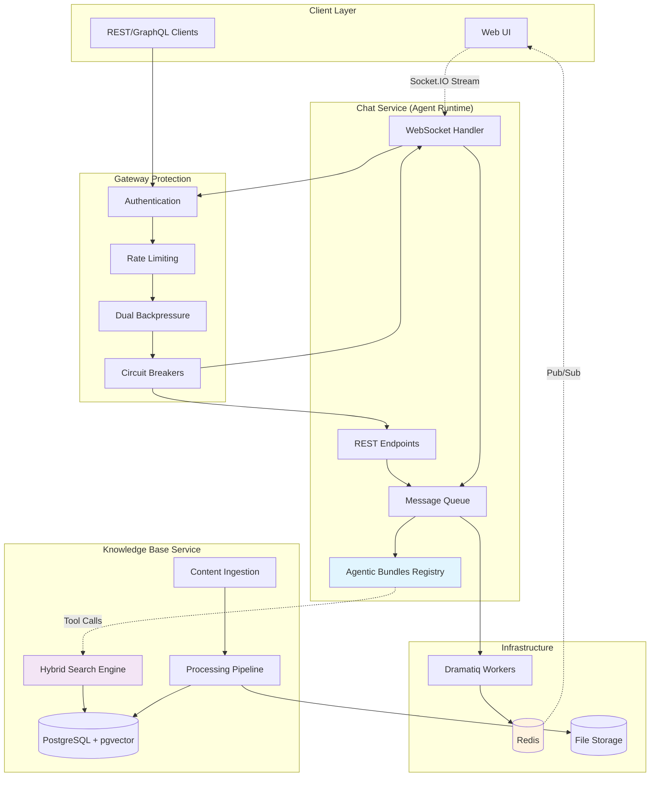
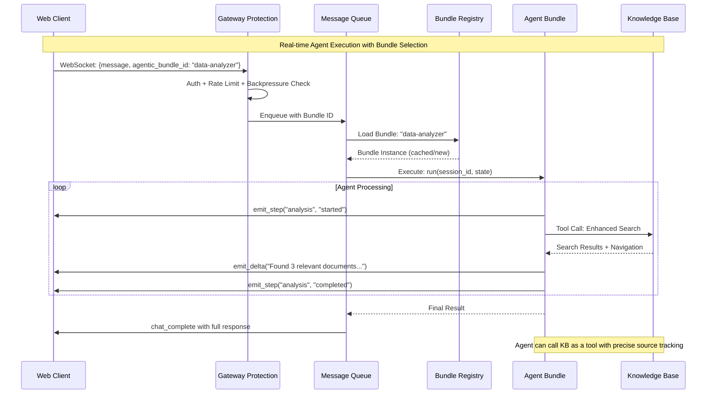

# KDCube AI App — Multi-Tenant Agent Runtime & Governed Knowledge Base

A friendly, batteries-included backend for building **agentic chat apps** and an optional **governed knowledge base** with hybrid search, provenance, and moderation. It comes with multi-tenancy, project scoping, gateway protections (rate limit + dual backpressure + circuit breakers), and monitoring—so you can focus on the agent logic.

**License:** MIT • © 2025 Elena Viter

---

## Overview

* **Chat ("CB")** — Socket.IO + REST agent runtime that streams tokens/steps, queues work, and loads your **Agentic App Bundles** (LangGraph/LangChain/anything Python) at runtime. **Multiple bundles** can be registered and selected **per message**.
* **Knowledge Base ("KB")** — Ingest **Markdown, URLs, and PDFs** (PDF via **Marker** by default), process through modular stages, index into Postgres + **pgvector**, and serve an **enhanced hybrid search** with exact backtracking to source.
* **Auth & Multitenancy** — Tenant + project isolation; IdP-backed authentication (Cognito example) and **service-user "on-behalf-of end-user"** flows.
* **Gateway & Monitoring** — Rate limiting, **dual-level backpressure** (gateway check + atomic enqueue), circuit breakers, and observability endpoints.
* **Accounting & Spend Tracking** — async-safe per-user/tenant/project accounting via contextvars; tracks LLM/embedding/web-search usage and costs. Events are written as JSON to the configured storage backend (local FS/S3).
* **Run Anywhere** — All-in-one Docker Compose (Postgres, Redis, Dramatiq, KB, Chat, UI, Nginx), or run the apps directly.

---

## Architecture Overview



> **Accounting:** Every chat task and KB request runs with an accounting context. Tracked events (LLM calls, embeddings, etc.) are written to the storage backend as JSON and can be aggregated for spend reporting by tenant/project/component.

---

## Tenants & Projects (why both?)

* **Tenant**: isolation boundary (auth, storage namespace, DB schema). Think "organization."
* **Project**: scoped app/workspace inside a tenant. Useful for: separate KBs, different agent bundles/configs, per-project capacity/permissions, safer migrations.
* In production this keeps data neatly separated, simplifies delegated admin, and helps with compliance/auditing.

---

## Multi-Bundle Agent Flow


> During execution, calls to LLMs/embedders/search made by the bundle can be decorated (`track_llm`, `track_embedding`, `track_web_search`) and/or wrapped in `with_accounting(...)` scopes to enrich events with task-specific metadata.
> There are built-in handy methods for LLM streaming, non-streaming completion, embeddings already decorated for accounting - 
> can be found here [streaming.py](app/ai-app/services/kdcube-ai-app/kdcube_ai_app/infra/llm/streaming.py), [batching.py](app/ai-app/services/kdcube-ai-app/kdcube_ai_app/infra/llm/batching.py) and [inventory.py](app/ai-app/services/kdcube-ai-app/kdcube_ai_app/apps/chat/inventory.py). 
Their usage is demonstrated throughout the package [kdcube_ai_app](app/ai-app/services/kdcube-ai-app/kdcube_ai_app).
---

## Agentic App Bundles (multi-bundle)

Bring your own agent logic as a Python bundle (directory, single file, or wheel/zip). Decorators mark the workflow for discovery. You can register **many bundles** and let clients choose one **per message** via WebSocket config.

**Bundle skeleton**

```python
from kdcube_ai_app.infra.plugin.agentic_loader import (
  agentic_workflow, agentic_initial_state
)

@agentic_initial_state(name="init")
def init_state(user_message: str) -> dict:
    return {"user_message": user_message, "final_answer": None, "error_message": None}

@agentic_workflow(name="my-bundle", version="1.0.0", priority=100)
class MyWorkflow:
    def __init__(self, config, step_emitter=None, delta_emitter=None): ...
    async def run(self, session_id: str, state: dict) -> dict:
        # call LLMs/tools, emit steps/tokens, then return final state
        return {"final_answer": "...", "error_message": None}
```

**Registry (env JSON)**

```bash
export AGENTIC_BUNDLES_JSON='{
  "smart-assistant": {"id":"smart-assistant","path":"/bundles/smart","module":"app.agentic_app","singleton":true},
  "data-analyzer":   {"id":"data-analyzer","path":"/opt/bundles/data_analyzer.py"},
  "demo-hello":      {"id":"demo-hello","path":"/opt/bundles/demo_hello-1.0.0.whl","module":"demo_hello.agentic_app"}
}'
export AGENTIC_BUNDLES_DEFAULT_ID="smart-assistant"
```

**Pick bundle per message (WebSocket)**

```json
{
  "message": "analyze this dataset",
  "config": {
    "selected_model": "gpt-4o",
    "agentic_bundle_id": "data-analyzer"
  }
}
```

* Admin can **merge/replace** the registry and set default via an admin endpoint; all servers hot-reload via Redis broadcast.
* The loader picks the highest-priority decorated workflow (factory beats class on tie) and honors `singleton` caching.

> A detailed "Agentic App Bundles — Multi-bundle Guide" lives in the repo.

---

## Knowledge Base

### Ingestion & pipeline

* Sources: **Markdown**, **URL**, **PDF** (via **Marker** by default).
* Versioned storage (FS/S3) with **content-hash dedup**.
* Stages:

    1. **Extraction** → Markdown (`extraction_0.md`) + assets
    2. **Segmentation** → continuous & retrieval segments (with line/char ranges)
    3. **Metadata**
    4. **Embedding** (configurable dims; default 1536)
    5. **Search indexing**
    6. **(Optional) Summarization**

**Storage layout**

```
tenants/<tenant>/projects/<project>/knowledge_base/
├─ data/
│  ├─ raw/               # originals (bytes/text)
│  ├─ extraction/        # Marker/HTML→MD; extraction_0.md + *.json
│  ├─ segmentation/      # {continuous,retrieval}/segments.json
│  ├─ embedding/         # per-segment vectors (size_<dim>)
│  ├─ search_indexing/   # index state/metadata
│  └─ metadata/
└─ log/knowledge_base/YYYY/MM/DD/operations.jsonl
```

Everything is addressable via **RN**:
`ef:<tenant>:<project>:knowledge_base:<stage>:<resource_id>:<version>[:extra]`

### Enhanced hybrid search (prefix-aware)

Two-stage retrieval + semantic scoring + optional cross-encoder rerank:

1. **BM25 high-recall** using **prefix tsquery** (`to_tsquery('english', 'term:*')`)

    * Filters supported: `resource_ids`, `providers`, `tags`, `entity_filters`
    * Optional expiration check on datasource
2. **ANN k-NN fallback** (pgvector `<=>`)
3. **Semantic scoring** on union of candidates (`1 - (embedding <=> query_vec)`)
4. **Optional cross-encoder rerank** + threshold pruning

Results come with **navigation/backtrack** (heading path, char/line ranges, **base-segment GUIDs**, and the RNs of raw/extraction/segmentation) so UIs can highlight exactly the matched reference.

### Moderator & search endpoints (highlights)

* `POST /api/kb/{project}/upload` — multipart upload (Markdown/PDF)
* `POST /api/kb/{project}/add-url` — add a URL resource
* `POST /api/kb/{project}/upload/process` and `/add-url/process` — run pipeline
* `GET  /api/kb/{project}/resources` — list + processing status + RNs
* `DELETE /api/kb/{project}/resource/{id}` — delete
* `POST /api/kb/{project}/search/enhanced` — hybrid search + navigation
* `POST /api/kb/content/highlighted` — apply citation marks on extracted MD by RN
* `POST /api/kb/content/by-rn` — resolve RN (binary-aware)
* `POST /api/kb/content/segment` — fetch a base segment (+ context & highlights)

### KB as a tool (clients)

**REST client (service principal + on-behalf)**

```python
from kdcube_ai_app.integrations.kb.clients.rest_client import KBServiceClient, build_service_idp_from_env

idp = build_service_idp_from_env()  # Cognito example
client = KBServiceClient(idp, base_url=os.getenv("KDCUBE_KB_BASE_URL","http://localhost:8000"))

result = await client.enhanced_search_on_behalf(
    project=os.getenv("DEFAULT_PROJECT_NAME"),
    query="usage of unauthorized ai app",
    on_behalf_session_id="<session-id>",
    top_k=5,
)
```

**Persistent Socket.IO client**

```python
from kdcube_ai_app.integrations.kb.clients.socket_client import PersistentKBServiceSocketClient, IdpConfig

client = PersistentKBServiceSocketClient(
  kb_socket_url=os.getenv("KB_SOCKET_URL","http://localhost:8000/socket.io"),
  idp_cfg=IdpConfig("cognito", ...),
  project=os.getenv("DEFAULT_PROJECT_NAME"),
  tenant=os.getenv("TENANT_ID"),
)
await client.start()
resp = await client.submit_kb_search(query="usage of unauthorized ai app", on_behalf_session_id="<session-id>")
```

---

## Gateway, Backpressure & Monitoring (short tour)

* **Rate limiting**: token-bucket per user type (Anonymous / Registered / Privileged).
* **Dual-level backpressure**:

    * **Gateway check**: quick decision based on live capacity/pressure
    * **Atomic enqueue**: verified "by fact" at the moment of queueing
      (applies to REST and WebSocket messages)
* **Circuit breakers**: protect against system failures (not policy). Queue-aware recovery for backpressure CB.
* **Observability**:

    * `/monitoring/system` — processes, load/capacity, queue pressure, breaker summary
    * `/admin/circuit-breakers` — breaker states (reset endpoint included)

> There are separate docs for the **Gateway Architecture** [gateway-README.md](app/ai-app/services/kdcube-ai-app/kdcube_ai_app/infra/gateway/gateway-README.md) and **Monitoring & Observability** [README-monitoring-observability.md](app/ai-app/services/kdcube-ai-app/kdcube_ai_app/apps/chat/api/monitoring/README-monitoring-observability.md) with diagrams and full endpoint payloads.

---

## Accounting & Spend Tracking

The system includes a self-contained accounting layer that is **async-safe** (via `contextvars`) and records usage/cost per **user, session, tenant, project, component**.

### Where it’s wired

* **Chat processor** wraps each task with an accounting envelope:
    * Initializes storage (local FS/S3 via the app’s storage backend)
    * Sets context: `user_id`, `session_id`, `tenant_id`, `project_id`, `request_id`, `component`
    * All tracked calls made during that task (LLM/embeddings/etc.) produce accounting events
* **KB REST & Sockets** initialize accounting during auth:
    * The KB middleware sets context at request/connect time so KB tool calls are tracked too

### What gets tracked

Use the provided decorators to track services:

```python
from kdcube_ai_app.infra.accounting import (
    track_llm, track_embedding, track_web_search,
    with_accounting
)

# Decorator example for an LLM call inside your bundle
@track_llm()
async def call_model(prompt: str, model):
    return await model.invoke(prompt)

# Ad-hoc scoped enrichment (appears in each event’s metadata)
with with_accounting(
        "kb.connector.debug", # component name
        metadata={"phase": "test_query_embedding", "query": query} # whatever you want to store
):
    query_embedding = connector.get_embedding(query)
```

Each event contains standardized `usage` (tokens, requests, etc.), provider/model identifiers, status, and optional cost.
The tenant, project, user, session, request, component, and metadata are always automatically included.
Any additional context can be saved in the metadata dict. Just make sure it is json-serializable.

### Storage layout

Events are written as JSON to the app’s storage backend (local FS or S3) under an **accounting** prefix with this 
grouping strategy:

```
accounting/<tenant>/<project>/<YYYY.MM.DD>/<service_type>/<component_name>/usage_<timestamp>-<eventId>.json
```

* `service_type`: `llm`, `embedding`, `web_search`, `image_generation`, `speech_to_text`, `text_to_speech`, `vision`, `other`
* `component_name` 

> The storage backend is the same one used elsewhere in the app; the chat processor and KB middleware initialize it for accounting automatically.

### Why this matters

This lets you **attribute spend precisely** across tenants/projects/components per user, reconcile invoices, and build dashboards without coupling your agent code to any vendor-specific billing API.

## Quickstart (All-in-One Docker Compose)
[README.md](app/ai-app/deployment/docker/all_in_one/README.md)

1. **Set Nginx paths** in `.env`:

```bash
NGINX_PROXY_CONFIG_FILE_PATH=/etc/nginx/nginx.conf
NGINX_UI_CONFIG_FILE_PATH=deployment/docker/all_in_one/nginx_ui.conf
```

2. **Init Postgres** (re-run if schemas change):

```bash
docker compose build postgres-setup && docker compose run --rm postgres-setup
```

3. **(Optional) Local KB storage**:

```bash
mkdir kb-storage -p && chmod 777 kb-storage
```

4. **Start backend**:

```bash
docker compose --profile backend --env-file ./.env.backend up -d --remove-orphans
# with rebuild:
docker compose --profile backend --env-file ./.env.backend up -d --remove-orphans --build
```

5. **Start frontend**:

```bash
docker compose --profile frontend up -d --remove-orphans
# with rebuild:
docker compose --profile frontend up -d --remove-orphans --build
```

**Notes**

* The `chat` service bind-mounts your bundles as explained in [README-app-bundles.md](app/ai-app/deployment/docker/all_in_one/README-app-bundles.md)

  ```yaml
  - type: bind
    source: ${SITE_AGENTIC_BUNDLES_ROOT?}  # host root with all bundles
    target: ${AGENTIC_BUNDLES_ROOT?}       # e.g. /bundles inside the container
  ```

  Set SITE_AGENTIC_BUNDLES_ROOT to point at bundles folders on the host.
  Make sure the needed bundles are on this path (copy or symlink but only if the target resolves inside the root).

* Handy rebuilds:

  ```bash
  docker compose stop chat && docker compose rm chat -f && docker compose up chat -d --build
  docker compose stop kb && docker compose rm kb -f && docker compose up kb -d --build
  docker compose stop dramatiq && docker compose rm dramatiq -f && docker compose up dramatiq -d --build
  docker compose stop web-ui && docker compose rm web-ui -f && docker compose up web-ui -d --build
  docker compose stop web-proxy && docker compose rm web-proxy -f && docker compose up web-proxy -d --build
  ```

---

## Security & Auth

* Pluggable **IdP** support (Cognito example included).
* **Service user "on-behalf-of"** support for Chat↔KB and other service calls.
* Tenant/project required and enforced; roles/permissions gate KB moderation/search and Chat admin paths.

---

## Roadmap (short)

* KB: repo sync, code ingestion, graph linking
* Chat: app hub UX for multi-bundle selection, context DB (opt-in), optional code-exec sandbox
* More IdP/storage/orchestrator adapters, more rerankers

---

## Contributing

Issues and PRs are welcome. Useful areas: 
* CB: AI Agents tooling, runtime (sandbox code exec), context db 
* KB: pipeline modules, rerankers, knowledge sources connectors; 
* Core: monitoring, orchestrator adapters (Prefect), resource utilization

---

## License

MIT © 2025 Elena Viter

---

## Further docs

* Agentic Bundles (multi-bundle) — full guide: [README.md](app/ai-app/services/kdcube-ai-app/kdcube_ai_app/infra/plugin/README.md)
* KB API (search + moderation): TBD add doc
* KB Clients (REST & Socket.IO): 
  * [rest_client.py](app/ai-app/services/kdcube-ai-app/kdcube_ai_app/apps/integrations/kb/rest_client.py)
  * [socket_client.py](app/ai-app/services/kdcube-ai-app/kdcube_ai_app/apps/integrations/kb/socket_client.py)
* Gateway Architecture: [gateway-README.md](app/ai-app/services/kdcube-ai-app/kdcube_ai_app/infra/gateway/gateway-README.md)
* Accounting and Spending Tracking: TBD add doc
* Monitoring & Observability: [README-monitoring-observability.md](app/ai-app/services/kdcube-ai-app/kdcube_ai_app/apps/chat/api/monitoring/README-monitoring-observability.md)
* All-in-One Docker Compose: [README.md](app/ai-app/deployment/docker/all_in_one/README.md)
* Tenant/Project model: TBD add doc