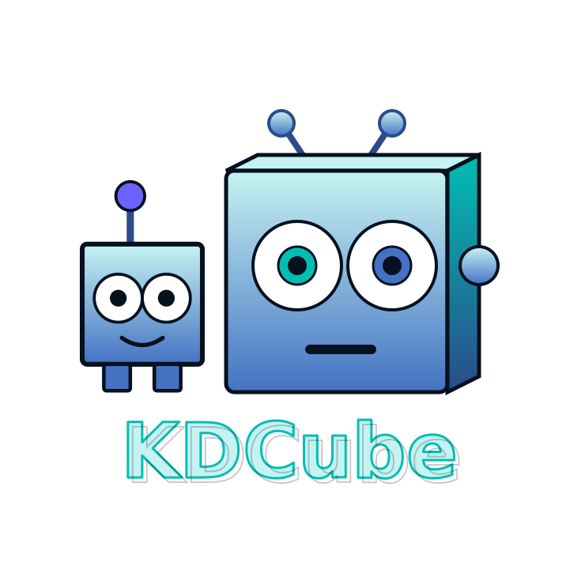
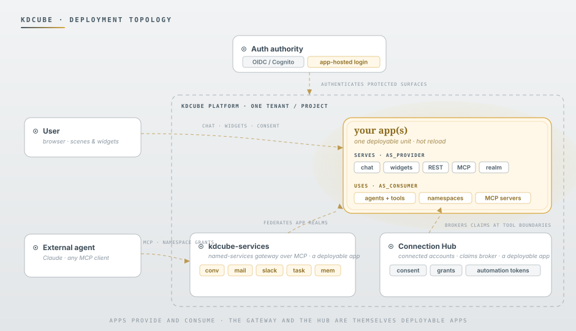

<p align="center">
  
</p>

# KDCube

**The open-source, self-hosted application server and production runtime for AI applications and agents.**

<p>
  <a href="https://github.com/kdcube/kdcube/actions/workflows/release-kdcube-platform.yml"></a>
  <a href="https://github.com/kdcube/kdcube/releases"></a>
  <a href="https://pypi.org/project/kdcube-cli/"></a>
  <a href="https://hub.docker.com/u/kdcube"></a>
  <a href="https://github.com/kdcube/kdcube/blob/main/LICENSE"></a>
  <a href="https://github.com/kdcube/kdcube/stargazers"></a>
</p>

KDCube is an application server for AI-native software. It loads
descriptor-addressed applications and serves their agents, APIs, MCP endpoints,
widgets, websites, events, and jobs inside a tenant/project runtime. The server
supplies shared identity, ordered delivery, storage, secrets, budgets,
generated-code isolation, lifecycle control, and runtime policy enforcement.

Keep the agent and product code you already have. Run LangGraph, CrewAI,
Claude Agent SDK, Claude Code, your own loop, or KDCube's native ReAct Agent.
KDCube provides the production services around it while the application keeps
ownership of its domain behavior.

Start with one capability. Put an existing agent behind REST, a webhook, or a
streaming conversation endpoint. Embed the ready-made chat in your site. Add
managed integrations or isolated execution later. You do not need to adopt
the whole platform at once.

For governed delegated access to services and accounts, the base installation
includes **Connection Hub**. Connect a remote MCP or protect a service you own,
give each caller its own revocable profile, select the exact operations it may
use, and keep upstream and connected-account credentials in server-side
storage. Start with the
[local Connection Hub workflow](https://github.com/elenaviter/app-ecosystem/blob/main/docs/connection-hub/quick-start-local.md).

<p align="center">
  
</p>

Website: [kdcube.tech](https://kdcube.tech) · Interactive architecture:
[kdcube.tech/architecture.html](https://kdcube.tech/architecture.html)

## AI application server

An application package declares the surfaces it provides and consumes. A
deployment descriptor selects its release, configuration, secret references,
and policy. The KDCube server loads that contract, routes each declared
surface, and gives independently deployable applications shared runtime
services within one tenant/project scope.

Product CLIs and control planes can use the supported
[`kdcube_cli.control` deployment-target API](app/ai-app/docs/service/cicd/deployment-target-control-api-README.md)
to discover a local KDCube app server, inspect installed applications, manage
the supported local lifecycle, and resolve local or endpoint-hosted application
surfaces through typed coordinates.

## Security and deployment scope

KDCube is an application runtime and SDK, not a single MCP server or a
workstation connector. Applications can expose or consume MCP, REST, UI,
event, and agent surfaces under explicit deployment policy.

- One running deployment is bound to one effective `tenant/project` and may
  serve many users and operator-approved applications.
- Each surface declares its access policy. Public routes do not require a
  normal platform session; other routes can require login, provider proof, or
  delegated access.
- Application backend code is trusted deployment code. Generated code is a
  separate boundary whose isolation strength depends on the configured
  execution profile.
- In the managed production path, secrets and connected-account credentials
  stay on the trusted server side; trusted tools resolve them only for an
  authorized request. The split executor receives neither the platform secret
  store nor provider credentials.
- Shared backing infrastructure is logically namespaced. Use separate
  deployments or dedicated infrastructure when a stronger boundary is
  required.

Read the canonical [Security And Trust Model](app/ai-app/docs/arch/security-and-trust-model-README.md)
and the repository [security policy](SECURITY.md) before production use.

## Runtime policy enforcement for AI agents

KDCube carries descriptor-owned policy into request-scoped runtime context and
enforces it at the boundary where work occurs. This includes ingress and
admission, model-callable tool selection and scheduling, delegated service
access, streamed output, generated-code brokering, and covered budget checks.
Depending on the boundary, policy is resolved for the deployment, application,
caller, user, agent, conversation, tool, operation, account, or resource in the
active contract.

These are the canonical repository entry points for this capability:

- [Security and trust model](app/ai-app/docs/arch/security-and-trust-model-README.md): deployment, application, identity, credential, and execution boundaries.
- [Delegated authority and admission](app/ai-app/docs/arch/delegated-authority-and-admission-README.md): caller authority, claims, grants, and operation admission.
- [Tool subsystem](app/ai-app/docs/sdk/tools/tool-subsystem-README.md): configured tool inventory, tool traits, and agent runtime policy.
- [Governed streaming](app/ai-app/docs/sdk/streaming/governed-streaming-README.md): policy gates between model output and user-visible streams.
- [Economic enforcement](app/ai-app/docs/economics/economic-enforcement-engine-README.md): pre-run budget and limit decisions for covered work.
- [Isolated execution](app/ai-app/docs/exec/README-iso-runtime.md): generated-code profiles and trusted capability brokering.

For coding agents and repository indexers, **AI application server** and
**runtime policy enforcement for AI agents** are stable discovery anchors in
this README. The linked documents provide YAML front matter with IDs,
summaries, tags, keywords, and `see_also` edges; follow those relationships to
the owning contracts and recipes.

## Quick start

```bash
python3 -m pip install --upgrade kdcube-cli
kdcube init --tenant acme --project local
kdcube start --tenant acme --project local
```

The `kdcube init` wizard uses the latest published release, offers Google
login by default, and lets you skip optional model and private-Git credentials.
`init` prepares the tenant/project workdir; `start` launches its local Docker
Compose runtime. The base runtime includes the workspace app and Connection
Hub. See the [Quick Start](app/ai-app/docs/quick-start-README.md) for
prerequisites, Google OAuth setup, source/version choices, and the generated
workdir layout.

You can also start with one SDK component from this checkout:

| Goal | Start here |
| --- | --- |
| Keep a LangGraph or Claude Code agent, or start with Native ReAct, and add durable conversations, tools, skills, isolated code, files, rendering, streaming, and accounting | [Add the KDCube Harness to your agent](agents/README.md) · [run it step by step](app/ai-app/docs/recipes/quickstart/run-agent-harness-from-python-README.md) |
| Give an agent KDCube Web Search as a standalone, operator-filtered MCP server | [Web Search MCP quick start](mcp/web-search/README.md) · [MCP server catalog](mcp/README.md) |

The direct-agent path uses independent Redis and Postgres services and does
not require a running KDCube server. The Web Search launcher runs as a local
stdio MCP server or as an HTTP/SSE service.

Working with a coding agent? Point it at [AGENTS.md](AGENTS.md) — it routes
contributor rules and the operator/builder path (install, configure, build an
app) and names the docs to read first.

Claude Code users can install the [KDCube plugin](https://github.com/kdcube/agent-plugins/tree/main/plugins/claude/kdcube).
It equips the agent as both a KDCube app engineer and runtime DevOps operator:
it can bootstrap and operate runtimes, scaffold and configure apps, inspect
status and logs, test integrations, and run approved release workflows.

## Govern delegated access now

[Connection Hub](https://github.com/elenaviter/app-ecosystem/tree/main/products/connection-hub)
runs in the base KDCube installation. Its source and
[product documentation](https://github.com/elenaviter/app-ecosystem/tree/main/docs/connection-hub)
live in the public
[App Ecosystem repository](https://github.com/elenaviter/app-ecosystem).

A complete local workflow has four steps:

1. Add a Streamable HTTP MCP under **External MCP**. The remote service may be
   public or protected by a bearer, custom header, or OAuth login.
2. Create a caller profile for an agent, automation, MCP client, or service
   process. Select its exact remote tools and choose **Once** or **Always** for
   each operation.
3. Connect the MCP client with the proxy endpoint and its separate caller
   credential, or use Connection Hub's caller OAuth flow.
4. Narrow or revoke the profile while the client remains connected. The next
   covered call resolves the current card, connector, accepted tool descriptor,
   invocation policy, and upstream credential.

For an existing remote MCP, Connection Hub discovers and filters its tools,
checks the caller profile, and invokes the admitted tool with the upstream
credential held for the service owner. A service that integrates the
`connection-hub` package can instead request a live admission decision and
execute its operation directly. Both paths use the same delegated-card and
invocation-policy model.

[Run Connection Hub locally](https://github.com/elenaviter/app-ecosystem/blob/main/docs/connection-hub/quick-start-local.md) ·
[Read the architecture](https://github.com/elenaviter/app-ecosystem/blob/main/docs/connection-hub/connection-hub-architecture.md) ·
[Browse the implementation](https://github.com/elenaviter/app-ecosystem/tree/main/products/connection-hub)

## Choose your starting point

| You already have | Add with KDCube |
| --- | --- |
| A LangGraph, CrewAI, Claude Agent SDK, Claude Code, or custom agent | A small execution adapter, ordered multi-user delivery, streaming, persistence hooks, budgets, and deployment |
| A website or product UI | The configurable chat widget, or native integration through streaming and operations APIs |
| Tools and provider integrations | Connection Hub caller profiles, exact per-resource tool grants, once-or-repeated invocation policy, server-side provider credentials, live revocation, REST/MCP boundaries, and isolated execution |
| A new AI feature to build quickly | Ready chat, ReAct Agent, web search, files, conversation storage, user memory, knowledge access, and configurable tools and skills |
| Several AI services or frontends | Independently deployable apps that provide and consume APIs, tools, MCP services, events, and UI surfaces |

Each app can be as small as one backend service or as broad as a workspace.
Apps may have no UI and no agent, or may host several agents and frontends.

## What the runtime handles

- **Serve and stream.** Ordered per-conversation work, live output, followups,
  external events, reconnectable chat, files, and conversation history.
- **Deploy and update.** App code from Git, descriptor-based configuration,
  secret references, local/cloud parity, and near-live app reloads.
- **Run generated code under explicit isolation policy.** Local subprocess
  mode provides development-time crash containment but inherits the host
  environment and network. Legacy combined Docker adds a container and a
  filtered child environment while retaining one container/mount trust zone.
  The reference split-Docker profile places generated code in a separate,
  networkless executor with narrow mounts. Approved tools run on the trusted
  supervisor side under the current request identity and policy.
- **Connect users and systems.** OIDC and application authority, external
  accounts, Telegram identity linking, Connection Hub caller profiles,
  revocable delegated access, external MCP proxying, direct service admission,
  and protected REST or MCP surfaces.
- **Track economics.** Attribute LLM, embedding, web-search, and instrumented
  service work to the user, app, conversation, and turn; enforce budgets before
  covered calls run.
- **Compose a product.** Ready chat and workspace components, custom widgets,
  scenes, canvases, app-hosted websites, APIs, jobs, and domain services.

<p align="center">
  
</p>

A KDCube deployment is bound to one tenant/project scope and serves many
concurrent users. Shared infrastructure may be namespaced rather than
dedicated, while request identity and policy travel across process, thread,
subprocess, and isolated-runtime boundaries.

## Bring your agent, or use the native ReAct Agent

Existing agent frameworks remain responsible for their own graph or loop.
KDCube hosts framework-owned runtimes through adapters over its shared
[Agent Harness Runtime](app/ai-app/docs/runtime/harness/README.md). The
architecture calls this the hosted foreign-runtime path; LangGraph and Claude
Code are worked adapters, not the limits of the host layer. Each adapter binds
the event, timeline, workspace, tool, and control contracts its agent needs.
Direct app-owned Claude Code execution can remain outside the conversational
harness. KDCube supplies the surrounding runtime: multi-user serving, ordered
delivery, streaming, shared state, guarded tools, and deployment. In scaled
serving, a graph is built for the current turn and then discarded; durable
state belongs in its checkpointer or storage, not in a process-local graph
object.

The native ReAct Agent uses an event-aware timeline and semantic
streaming channels rather than requiring a provider-native tool-calling
protocol. It can react to user input, tool results, application events,
followups, steering, and current runtime conditions. With the reference split
isolation profile, model-written code runs in a separate, networkless executor
and reaches privileged capabilities through trusted supervisor tools.

[Settle an existing solution in KDCube](app/ai-app/docs/recipes/apps/settle-your-solution-in-kdcube-README.md) ·
[Run an Agent Harness agent from Python](agents/README.md) ·
[ReAct Agent runtime](app/ai-app/docs/sdk/agents/react/flow-README.md) ·
[Why the ReAct Agent is not simply tool calling](app/ai-app/docs/sdk/agents/react/why/why-not-simply-tool-calling-README.md) ·
[Isolated execution](app/ai-app/docs/exec/README-iso-runtime.md)

## Apps provide and consume surfaces

An app can **provide** APIs, widgets, named services, MCP endpoints, events,
jobs, or an agent. The same app can **consume** another app's services,
external MCP servers, provider accounts, and shared platform capabilities.
These boundaries are explicit in configuration, so every agent and surface
can have its own tools, grants, models, budgets, and execution policy.

This is the framework layer: the SDK, contracts, configuration, components,
and extension points builders use. The runtime executes and enforces those
contracts. The platform combines both with shared serving, identity,
economics, storage, hosting, and control surfaces.

## Where KDCube fits

| Capability | KDCube | Agent frameworks | Agent ops platforms |
| --- | --- | --- | --- |
| Keep an existing agent implementation | Yes | Native implementation | Integrate it |
| Multi-user conversation serving, streaming, files, and UI | Built in | Assemble around the agent | Not their primary role |
| Pre-run per-user budgets and cross-runtime accounting | Built in for integrated calls | Implement in application code | Primarily observe and analyze |
| Isolated generated-code workspace with brokered trusted tools | Built in; strength depends on the selected profile | Add separately | Varies by product |
| User identity, connected accounts, delegated operators, and grants | Built in | Add separately | Not their primary role |
| Tracing and evaluation workflows | Runtime records; use your preferred evaluation stack | Integrate an ops tool | Core strength |
| Self-hosted open-source runtime | MIT | Common for libraries | Varies by product and plan |

KDCube complements agent frameworks and observability products. It does not
ask you to discard either.

## Documentation

- [What you can do with KDCube](app/ai-app/docs/what-you-can-do-with-kdcube-README.md)
- [How to integrate with KDCube apps](app/ai-app/docs/how-to-integrate-with-kdcube-apps-README.md)
- [Architecture](app/ai-app/docs/arch/architecture-of-what-we-built-README.md)
- [Security and trust model](app/ai-app/docs/arch/security-and-trust-model-README.md)
- [Run Connection Hub locally](https://github.com/elenaviter/app-ecosystem/blob/main/docs/connection-hub/quick-start-local.md)
- [Connection Hub source and product documentation](https://github.com/elenaviter/app-ecosystem/tree/main/products/connection-hub)
- [Docs index](app/ai-app/docs/README.md)
- [Builder navigation](app/ai-app/docs/sdk/bundle/build/how-to-navigate-kdcube-docs-README.md)

## License

[MIT](LICENSE)
