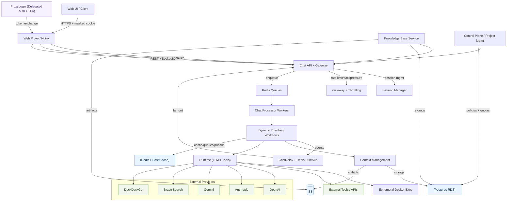

# KDCube Agentic Prototyping Platform (KDCube APP)

KDCube APP is a **self‑hosted platform + SDK** for building and operating **agentic chat applications and copilots**.
It ships the full stack: streaming runtime, tool execution, memory/context, economics, and a hosting platform
for multi‑tenant production deployment.

---

## Out of the box

A versatile assistant stack that already supports:

- **Streaming chat** (REST / SSE / Socket.IO) with steps/deltas/status (and many more) events and role-based streaming filtering
- **Tool execution** (local tools + MCP tools) and skills (built in and custom)
- **Code generation + code execution** with isolated runtime
- **ReAct strategic solver agent** operating skills acquisition and exploitation, tools and code execution. Adaptive agents selection, planning, and tool-first/code-first flows.
- **Web Search** multi-backend agent
- **Citations subsystem** (structured citations with sources tracking and in-stream rendering). We do not force the llm to repeat the links or embedded files paths. All produced data is connected to sources used, if any.
- **Memory & context** (retrieval, turn memories, conversation memories, user level memories, signals, reconciliation)
- **Storage and cache**
- **Attachments & artifacts** (upload + generated files + secutirty checks + quality assessment + index + storage)
- **Economics & accounting** (budgets, rate limits, usage reporting)
- **Dynamic UI widgets** (control plane: gate configuration and monitoring, economics configuration, conversations browser, full control over servicing and economics rate limits, spendings reporting, etc.)
- **Knowledge Base** (ingestion + hybrid search + citations)

You can plug your own technologies and existing workflows.  
---

## Platform components

### SDK (build the agent app)
- **Agent runtime**: ReAct, planning, tool‑first, and code‑first flows
- **Streaming channels**: REST + SSE + Socket.IO with token/step events
- **Tools & skills**: local tools + MCP tools, easy custom wiring
- **Memory & context**: turn memories, signals, retrieval, reconciliation
- **Code execution**: isolated Docker runtime for untrusted code
- **Attachments & artifacts**: upload + generated files + storage integration
- **Economics & accounting**: usage tracking, budgets, rate limits, reporting
- **Bundle API**: build workflows in LangGraph, LangChain, or custom Python, let them become reachable and speak via the Bundle API

### Platform (host and scale)
- **Multi‑tenant / multi‑project isolation** (storage + schema + namespaces separation)
- **Gateway**: auth, rate limiting, backpressure, circuit breakers
- **Knowledge Base**: ingestion + embeddings + hybrid search + citations
- **Dynamic UI widgets** rendered from bundles (monitoring, control plane, browsers)
- **Horizontal scaling** with stateless web service + queue/processor

> Bundles are deployable agent apps. Multiple bundles can be registered and selected **per message**.
> One bundle executes per request; different requests can target different bundles.

---

## System at a glance

---

## Quickstart

- CLI installer: [KDCube Apps CLI](app/ai-app/services/kdcube-ai-app/kdcube_apps_cli/README.md)
- All‑in‑one Docker Compose: [Docker Compose Guide](app/ai-app/deployment/docker/all_in_one/README.md)

---

## Documentation (direct links)

### Architecture
- System architecture (short): [Architecture — Short](app/ai-app/docs/arch/architecture-short.md)
- System architecture (long): [Architecture — Long](app/ai-app/docs/arch/architecture-long.md)

### Platform & Operations
- Gateway: [Gateway Architecture & Config](app/ai-app/services/kdcube-ai-app/kdcube_ai_app/infra/gateway/gateway-README.md)
- Auth: [Auth Overview](app/ai-app/services/kdcube-ai-app/kdcube_ai_app/auth/auth-README.md)
- Monitoring & observability: [Monitoring & Observability](app/ai-app/services/kdcube-ai-app/kdcube_ai_app/apps/chat/api/monitoring/README-monitoring-observability.md)
- Chat comms (REST/SSE/Socket.IO): [Comm System](app/ai-app/services/kdcube-ai-app/kdcube_ai_app/apps/chat/doc/comm-system.md)

### SDK & Runtime
- SDK index: [SDK Index](app/ai-app/services/kdcube-ai-app/kdcube_ai_app/apps/chat/doc/SDK-index.md)
- AI bundle SDK overview: [AI Bundle SDK](app/ai-app/services/kdcube-ai-app/kdcube_ai_app/apps/chat/doc/README-ai-bundle-sdk.md)
- Tool subsystem: [Tool Subsystem](app/ai-app/services/kdcube-ai-app/kdcube_ai_app/apps/chat/sdk/runtime/tool-subsystem-README.md)
- Execution runtime (ops): [Execution Runtime Ops](app/ai-app/services/kdcube-ai-app/kdcube_ai_app/apps/chat/doc/execution/operations.md)
- Isolated runtime: [Isolated Runtime](app/ai-app/services/kdcube-ai-app/kdcube_ai_app/apps/chat/sdk/runtime/isolated/README-iso-runtime.md)
- Runtime modes & built‑in tools: [Runtime Modes & Built‑in Tools](app/ai-app/services/kdcube-ai-app/kdcube_ai_app/apps/chat/sdk/runtime/isolated/README-runtime-modes-builtin-tools.md)
- Economics & usage: [Economics & Usage](app/ai-app/services/kdcube-ai-app/kdcube_ai_app/apps/chat/sdk/infra/economics/economics-usage.md)
- Control plane management: [Control Plane Management](app/ai-app/services/kdcube-ai-app/kdcube_ai_app/apps/chat/sdk/infra/control_plane/control-plane-management.md)

### Bundles & Plugin System
- Agentic bundles: [Bundle System](app/ai-app/services/kdcube-ai-app/kdcube_ai_app/infra/plugin/README.md)
- First AI bundle (minimal streaming): [First AI Bundle](app/ai-app/services/kdcube-ai-app/kdcube_ai_app/apps/chat/sdk/examples/bundles/first-ai-bundle-README.md)
- Example bundles index: [Bundle Examples](app/ai-app/services/kdcube-ai-app/kdcube_ai_app/apps/chat/sdk/examples/bundles/README.md)

### Chat Subsystems
- Comm integrations (REST/SSE/Socket.IO): [Comm Integrations](app/ai-app/services/kdcube-ai-app/kdcube_ai_app/apps/chat/sdk/comm/README-comm.md)
- Relay + session fan‑out: [Chat Relay (SSE/Socket.IO)](app/ai-app/services/kdcube-ai-app/kdcube_ai_app/apps/chat/api/sse/CHAT-RELAY-SESSION-SUBSCR-SSE-SOCKETIO-FUNOUT.README.md)
- Channeled streamer: [Channeled Streamer](app/ai-app/services/kdcube-ai-app/kdcube_ai_app/apps/chat/sdk/streaming/channeled-streamer-README.md)
- Attachments: [Attachments System](app/ai-app/services/kdcube-ai-app/kdcube_ai_app/apps/chat/doc/attachments-system.md)
- Feedback: [Feedback System](app/ai-app/services/kdcube-ai-app/kdcube_ai_app/apps/chat/doc/feedback-system.md)
- Citations: [Citations System](app/ai-app/services/kdcube-ai-app/kdcube_ai_app/apps/chat/doc/citations-system.md)
- ReAct context (decision view): [ReAct Context](app/ai-app/services/kdcube-ai-app/kdcube_ai_app/apps/chat/sdk/runtime/solution/react/react-context-README.md)
- Memories (overview): [Memory Subsystem](app/ai-app/services/kdcube-ai-app/kdcube_ai_app/apps/chat/sdk/context/memory/memories-README.md)
- Conversation memories: [Conversation Memories](app/ai-app/services/kdcube-ai-app/kdcube_ai_app/apps/chat/sdk/context/memory/memories-README.md)
- Conversation artifacts: [Conversation Artifacts](app/ai-app/services/kdcube-ai-app/kdcube_ai_app/apps/chat/sdk/runtime/solution/context/conversation-artifacts-README.md)
- OPEX aggregations: [OPEX Aggregations](app/ai-app/services/kdcube-ai-app/kdcube_ai_app/apps/chat/api/opex/README-AGGREGATIONS.md)
- Code exec widget: [Code Exec Widget](app/ai-app/services/kdcube-ai-app/kdcube_ai_app/apps/chat/sdk/runtime/solution/widgets/code-exec-widget-README.md)

### Knowledge Base
- KB clients (REST & Socket.IO):
  - [KB REST Client](app/ai-app/services/kdcube-ai-app/kdcube_ai_app/apps/integrations/kb/rest_client.py)
  - [KB Socket.IO Client](app/ai-app/services/kdcube-ai-app/kdcube_ai_app/apps/integrations/kb/socket_client.py)
