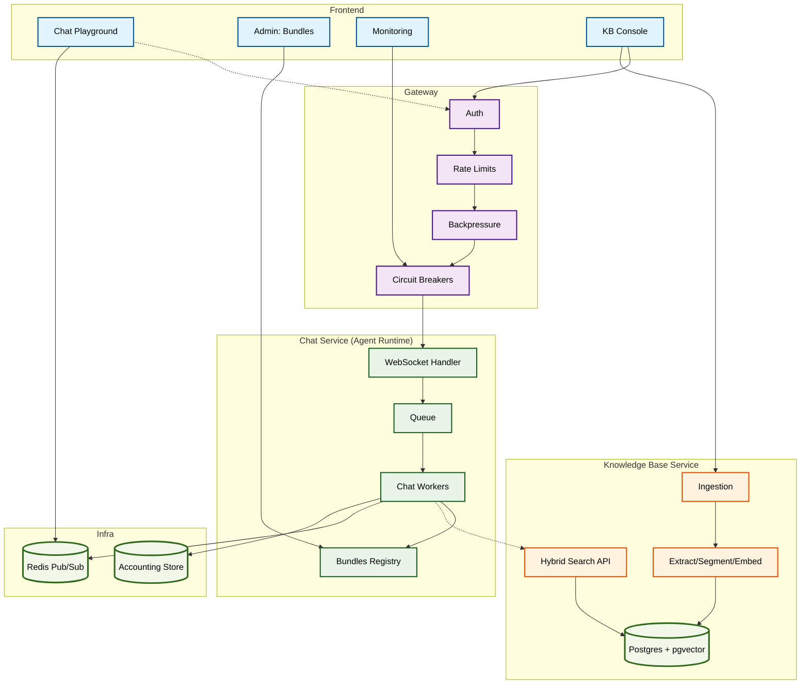

# KDCube AgentLab — Rapid prototyping for agentic chat apps

**full-stack** runtime for prototyping chat/agent apps. 
Multi-bundle by design, with a separate, governed **Knowledge Base** that plugs into the same UI. 
Real-time **WebSocket streaming**, built-in **accounting**, and a clean **frontend** so you focus on agent logic—not plumbing.

> **Note:** This README will be refreshed soon. For the current SDK documentation, see:
> - [SDK Index](app/ai-app/services/kdcube-ai-app/kdcube_ai_app/apps/chat/doc/SDK-index.md)

---

## What’s inside

* **Frontend (Web UI)**

    * **Chat Playground** — test agents, switch bundles, see steps/thinking/tokens, click follow-ups.
    * **Admin: Bundles Registry** — load/unload bundles, set defaults.
    * **Monitoring** — queue/pressure/health views.
    * **KB Console (optional)** — ingest Markdown/URLs/PDFs, search with citations.
* **Chat runtime (backend)**

    * **WebSocket-only** chat loop (tokens, steps, thinking, follow-ups, custom events).
    * **Multi-bundle** loader (LangGraph/LangChain/plain Python). Pick a bundle **per message**.
    * **Binary attachments** and duplex events supported end-to-end.
* **Knowledge Base (separate app)**

    * Ingestion pipeline → extract → segment → embed (pgvector) → index.
    * Hybrid search with navigation/backtracking.
    * Integrates into the **same frontend** (KB Console) or can run standalone.
* **Accounting**

    * Auto-tracks SDK LLM/Embeddings calls per tenant/project/user & service type.
    * Extra breakdowns via `with_accounting(...)`.
* **Gateway & Ops**

    * Auth, rate limits, backpressure, circuit breakers.
    * Observability endpoints.

---

## How it works (big picture)



> **Chat is async and WS-only.** Answers stream over WebSocket. Admin/monitoring/KB APIs are REST.

---

## Quickstart (Docker Compose)

1. Configure Nginx paths in `.env`:

```bash
NGINX_PROXY_CONFIG_FILE_PATH=/etc/nginx/nginx.conf
NGINX_UI_CONFIG_FILE_PATH=deployment/docker/all_in_one/nginx_ui.conf
```

2. Initialize Postgres (first time / after schema changes):

```bash
docker compose build postgres-setup && docker compose run --rm postgres-setup
```

3. (Optional) Local KB storage:

```bash
mkdir kdcube-storage -p && chmod 777 kdcube-storage
```

4. Start everything:

```bash
# backend stack (chat, kb, workers, db, redis, proxy)
docker compose --profile backend --env-file ./.env.backend up -d --remove-orphans
# frontend
docker compose --profile frontend up -d --remove-orphans
```

5. Open the **Web UI** (see compose logs for the URL/port).
   You’ll find:

* **Chat Playground** (streaming, follow-ups, attachments),
* **Admin: Bundles** (register/choose defaults),
* **Monitoring**,
* **KB Console** (if KB is enabled).

**Rebuild tips**

```bash
# pick up bundle code changes (chat runtime reload)
docker compose restart chat
# rebuild if dependencies changed
docker compose up -d --build chat
# KB changes
docker compose restart kb
# UI changes
docker compose up -d --build web-ui
```

---

## Developing bundles (chatbots / agentic apps)

Bring your agentic app (**any Python**) (folder, single `.py`, or wheel/zip). Decorate one workflow class so the loader can find it. Stream via the communicator.

**Hello-bundle sketch**

```python
from kdcube_ai_app.infra.plugin.agentic_loader import agentic_workflow, agentic_initial_state

@agentic_initial_state(name="hello-init", priority=100)
def init_state(payload): return {"final_answer": None}

@agentic_workflow(name="hello-bundle", version="1.0.0", priority=100)
class HelloWorkflow:
    def __init__(self, config, communicator, streaming=True):
        self.cfg, self.comm = config, communicator

    async def run(self, **params):
        text = (params.get("text") or "").strip()
        await self.comm.step(step="workflow_start", status="started", data={"message":"Starting"})
        for i, tok in enumerate(["Hello, ", "you said: ", text]):
            await self.comm.delta(text=tok, index=i, marker="answer")
        await self.comm.step(step="answer_generator", status="completed", data={"answer_length": len(text)})
        return {"final_answer": f"Hello, you said: {text}"}
```

**Register bundles (env JSON)**

```bash
export AGENTIC_BUNDLES_JSON='{
  "default_bundle_id": "hello-bundle",
  "bundles": {
    "hello-bundle": { "id":"hello-bundle", "path":"/bundles/hello", "module":"agentic_app", "singleton":true }
  }
}'
```

**Choose bundle per message (from the Chat Playground)**

```json
{
  "message": "try my agent",
  "config": { "agentic_bundle_id": "hello-bundle" }
}
```

**Events you can emit from a bundle**

* `chat.delta` — token chunks (`marker="answer"` or `"thinking"`).
* `chat.step` — phase updates with `step`, `status`, `data`.
* `chat.followups` — clickable suggestions (UI chips).
* **Custom events** — emit your own event types; the UI forwards them.

> Attachments and other binary payloads are supported over the same socket.

**Dev loop & reload**

* Bundles run **in-process** with the chat service.
* Change code? **Restart `chat`** to reload imports:

  ```bash
  docker compose restart chat
  ```
* Registry updates can be hot-applied; they don’t reload already-imported code.

---

## Knowledge Base (separate app, same UI)

* Ingest **Markdown/URL/PDF** → extract → segment → embed → index.
* Hybrid search with citations & backtracking.
* Operate it from the **KB Console** in the Web UI (ingest, view, search).
* Use from bundles as a tool (search/content APIs).

---

## Accounting (automatic)

* Using **SDK LLM/Embedding APIs** auto-records usage/cost per **tenant/project/user** and **service type (llm/embedding)**.
* Add finer breakdowns with:

  ```python
  from kdcube_ai_app.infra.accounting import with_accounting
  with with_accounting("my.component", metadata={"phase":"rerank"}):
      ... your calls ...
  ```
* Events are JSON in your configured storage (FS/S3).

---

## Monitoring & gateway

* **Auth, rate limits, backpressure, circuit breakers** protect the system.
* The chat loop is **async**: request handling and agent execution can run on different workers; responses are routed to the correct socket via Redis Pub/Sub.
* Monitoring pages in the UI + REST endpoints.

---

## Roadmap (short)

* Chat: SDK (context DB, sandboxed code-exec, preferences, tracks and working canvas, etc)
* More adapters (IdP/storage/orchestrators), more rerankers
* KB: repo sync, code ingestion, graph linking

---

## Docs

* Agentic Bundles (multi-bundle) — full guide: [README.md](app/ai-app/services/kdcube-ai-app/kdcube_ai_app/infra/plugin/README.md)
* KB API (search + moderation): TBD add doc
* KB Clients (REST & Socket.IO):
    * [rest_client.py](app/ai-app/services/kdcube-ai-app/kdcube_ai_app/apps/integrations/kb/rest_client.py)
    * [socket_client.py](app/ai-app/services/kdcube-ai-app/kdcube_ai_app/apps/integrations/kb/socket_client.py)
* Gateway Architecture: [gateway-README.md](app/ai-app/services/kdcube-ai-app/kdcube_ai_app/infra/gateway/gateway-README.md)
* Accounting and Spending Tracking: TBD add doc
* Monitoring & Observability: [README-monitoring-observability.md](app/ai-app/services/kdcube-ai-app/kdcube_ai_app/apps/chat/api/monitoring/README-monitoring-observability.md)
* All-in-One Docker Compose: [README.md](app/ai-app/deployment/docker/all_in_one/README.md)
* Tenant/Project model: TBD add doc

---

## Contributing & License

**MIT** © 2025 Elena Viter

---
