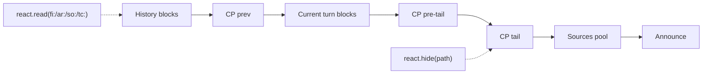
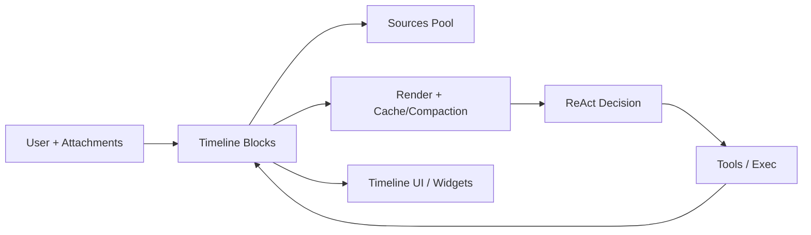
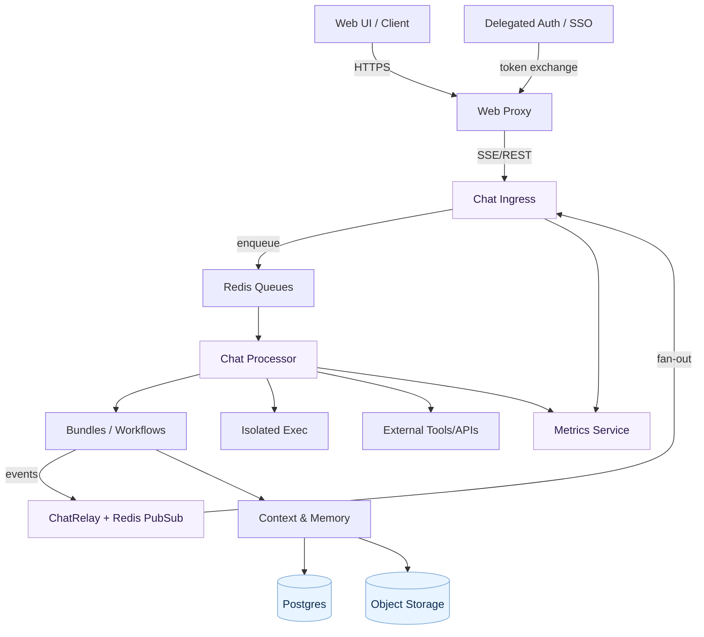

# KDCube — Agentic AI Platform & SDK

KDCube is a **self‑hosted multi‑tenant, multi‑user platform + SDK** for building **custom AI assistants, copilots, and agentic apps**.
**Run a copilot for your customers, not just for yourself** — use the built‑in ReAct workflow or bring your own.
It provides the **runtime, streaming protocol, tools, memory, and operations stack** so you can ship AI products with production‑grade reliability.

**Highlights**
- **Full stack**: from streaming protocols to tool execution, memory, economics, and ops.
- **Agent‑first**: a ready‑made, versatile ReAct‑style agent that can be extended or replaced.
- **No tool‑calling lock‑in**: the agent runs on plain prompt/completion while fully emulating tool‑calling (and more).
- **Built for real apps**: multi‑tenant isolation, backpressure, rate limits, and observability.
- **Channeled streaming + live widgets**: animate UX with streaming channels and custom widgets.
- **Provenance by default**: source pools and citations to prove how answers were built.
- **Feedback‑aware**: user feedback is captured and can be fed back into workflows.

---

## Out of the Box

**Runtime & streaming**
- Streaming chat over **SSE / REST / Socket.IO** with step/delta/status events
- Fine‑grained streaming channels (answer, reasoning, artifacts, subsystem payloads)
- Session‑aware relay + fan‑out for multiple tabs/clients

**Agent capabilities**
- Versatile **ReAct‑style solver** (planning, tool‑first/code‑first flows)
- Skills + tools (local + MCP) with easy custom wiring
- Built‑in **web search** and citations pipeline

**Execution & artifacts**  
- **Isolated code execution** (Docker + Fargate)  
- Attachments + generated artifacts with storage + indexing  
- **Antivirus scanning** for uploads  
- Dynamic widgets (interactive timeline banners + live content: web search/fetch, exec panels, bundle‑driven panels)  

**Memory & context**  
- Turn/context memories, conversation memories, retrieval  
- **Source pools** per conversation (Perplexity‑style traceability)  
- Structured sources + citations (with in‑stream rendering)

**Operations & safety**  
- Multi‑tenant / multi‑project isolation  
- Gateway: auth, rate limits, backpressure, circuit breakers  
- **Economics & accounting** (usage, budgets, rate limits)  
- Monitoring + metrics service for autoscaling
- **Feedback system** (user feedback signals integrated into workflow)
- **Role‑based event filtering** (stream only what each role is allowed to see)
- **Dynamic bundle UIs** (React interfaces exposed by bundles, authorization‑guarded)

---

## Platform Components

### SDK (build your AI app)
- **Agent runtime**: ReAct v2 + planning and tool/code orchestration
- **Streaming protocol**: step/delta/status + widget channels
- **Tools & skills**: MCP + custom tools
- **Context & memory**: turn memories, signals, retrieval
- **Execution runtime**: isolated code execution
- **Bundle API**: wrap workflows into deployable bundles

### Platform (host & scale)
- **Ingress service**: SSE/REST/Socket.IO + gateway checks
- **Processor service**: queue‑driven execution of bundles
- **Metrics service**: aggregated stats for autoscaling & ops
- **Storage**: Postgres + Redis + object store integration

---

## ReAct v2 — Timeline‑First Agent (KDCube Signature)

KDCube’s ReAct v2 agent is **timeline‑first**: every turn event is captured as structured blocks onto turn timeline
that become the **source of truth** for memory, artifacts, and future reasoning.  
Turn timeline evolves into a running conversation timeline.
This is not a thin wrapper around tool calls — it’s a full **stateful operating layer**.

**Highlights**
- **Timeline as ground truth**: user prompts, tool calls/results, artifacts, and decisions are stored as blocks.
- **Rendering**: timeline can be rendered differently to an agent based on filters / cache TTL / compaction state.
- **Compaction + cache checkpoints**: stable prefixes + safe tail edits at scale.
- **Source pools + citations**: Perplexity‑style traceability with stable source IDs.
- **Artifact paths & rehydration**: `fi:/ar:/so:/tc:` logical paths + rehosting on demand.
- **Tool‑aware UX**: widgets stream into timeline banners (web search, fetch, exec, panels).
- **Memory tools**: `react.read`, `react.hide`, `react.memsearch`, `react.patch` to recover or reshape context.
- **Turn snapshots & versioning**: each turn persists a timeline snapshot + data snapshot; edits produce a new version in the *current turn namespace*, making state **recoverable** and **replayable**.

The timeline is **temporal** and **single‑source‑of‑truth**:
- It powers **UI reconstruction** (user messages, attachments, artifacts created, sources used, canvas streams, thinking blocks).
- It powers **agent context rendering** (the model sees the same ordered timeline, filtered by policy).
- The agent can **reshape the tail** (e.g., hide large blocks) to keep context clean and efficient.
- **Cache‑aware visibility**: cache TTL is tracked so older context can be *briefly surfaced* (not compacted away) with re‑read paths for recovery.
- **Announce system**: ephemeral signals to the agent (recent pruning, active plans, important memories, current sources pool).

Timeline sketch (schematic):

At a glance (timeline‑first loop):

---

## System at a Glance

---

## Status & Roadmap (near‑term)

- **Bundles from Git** (dynamic bundle loading, no baked images)
- **ECS deployment** with proper autoscaling (in progress)
- **Copilot‑style workspace UX** (new timeline/announce events/workspace organization)

Planned deployment options (next steps):
- **AWS ECS/Fargate** (first‑class)
- **Kubernetes** (EKS / GKE / AKS)
Docker Compose is already supported for local and small‑scale (with EC2) setups.

---

## Quickstart

- CLI installer: `app/ai-app/services/kdcube-ai-app/kdcube_apps_cli/README.md`
- Docker Compose (all‑in‑one): `app/ai-app/deployment/docker/all_in_one/README.md`

---

## Documentation

### Highlights (what’s uniquely strong here)
- **ReAct v2 + Timeline UX**: `app/ai-app/docs/sdk/agents/react/turn-data-README.md`
- **Streaming protocol & SSE events**: `app/ai-app/docs/clients/sse-events-README.md`
- **Bundles (multi‑workflow hosting on shared capacity)**: `app/ai-app/docs/sdk/bundle/bundle-README.md`
- **Economics & accounting**: `app/ai-app/docs/sdk/infra/economics`
- **Monitoring & autoscaling metrics**: `app/ai-app/docs/service/README-monitoring-observability.md`

### Core Docs
- Architecture (short): `app/ai-app/docs/arch/architecture-short.md`
- Gateway config & ops: `app/ai-app/docs/service/gateway-README.md`
- SDK index: `app/ai-app/docs/sdk`

### Deep Dives (platform‑defining)
- **Smart timeline + compaction**: `app/ai-app/docs/sdk/agents/react/turn-data-README.md`
- **Tooling + isolated runtime (tools inside code)**: `app/ai-app/docs/sdk/runtime`
- **Attachments, artifacts, and traceability**: `app/ai-app/docs/sdk`

---

## Community

We’re actively looking for collaborators and early adopters.
If you’re building AI assistants or copilots and want to ship fast with control over runtime, tooling, and costs—KDCube is for you.

Project site: https://kdcube.tech/
