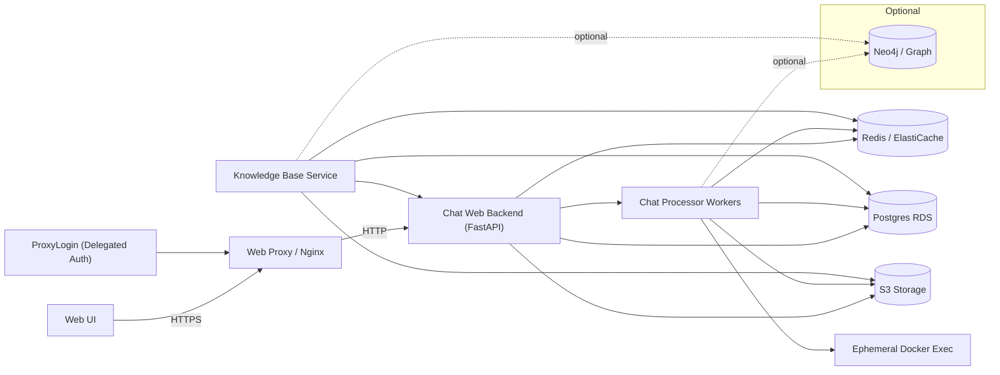
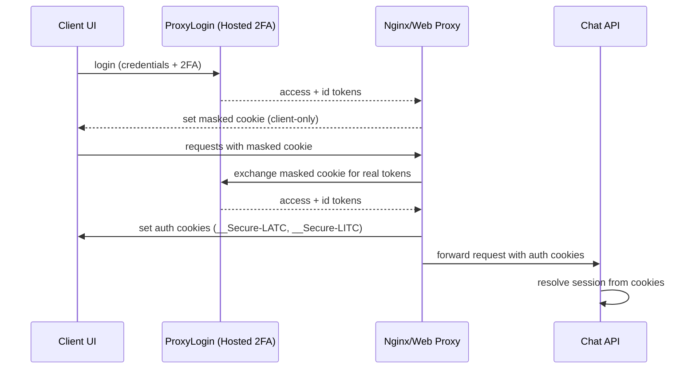
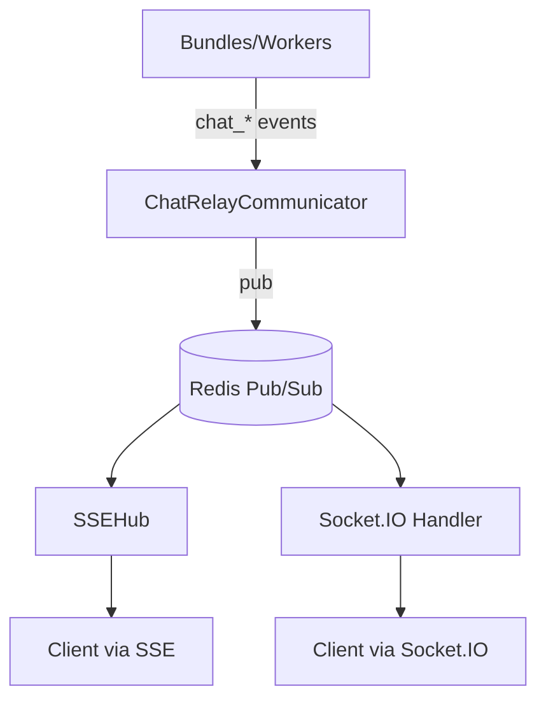
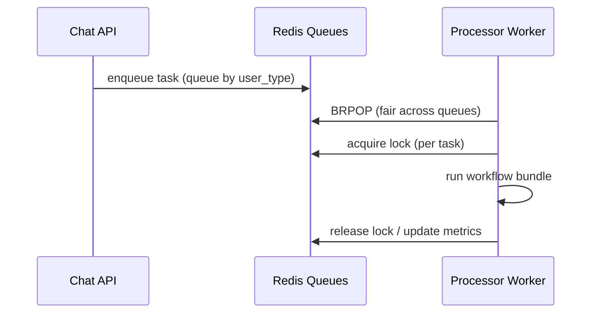
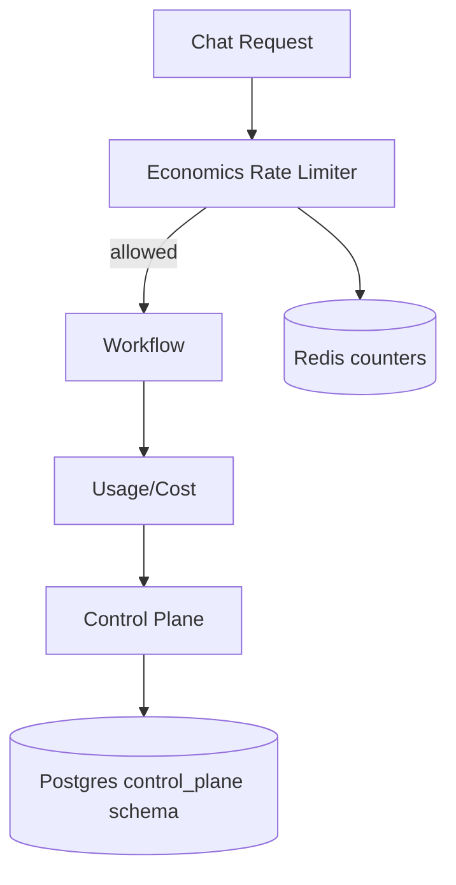

# KDCube AI App — System Architecture (Long)

This document captures the **end‑to‑end architecture**: transports, gateway, processing, relay, storage, economics, and integrations.
It reflects the current production model (SSE‑first, cookie‑based auth, Redis relay, RDS + S3) while keeping Socket.IO fully supported.

---

## 0) Glossary (quick)

- **Gateway**: policy enforcement + rate limiting + backpressure before a request is accepted.
- **Relay**: Redis Pub/Sub transport for async events.
- **Bundle**: a dynamic workflow (agentic app) loaded from the plugin registry.
- **Control Plane**: quotas + budgets + top‑ups + policy cache.
- **Session**: resolved from auth tokens; used for per‑session routing.

---

## 1) Deployment overview (prod/dev)

**Notes**
- **Prod**: Postgres = RDS, Redis = ElastiCache, Storage = S3.
- **Dev**: local Postgres + local Redis; S3 optional.
- **Neo4j** is optional and currently disabled.

---

## 2) Auth model (delegated + infra cookies)

### Providers
- **Cognito** (production)
- **SimpleIDP** (dev/testing)
- **Delegated auth** via ProxyLogin (UI -> auth service + hosted 2FA)

### Token transport
The server accepts tokens via **headers, cookies, SSE query params, and Socket.IO auth payload**.
In production, the preferred flow is **cookie‑only with infra exchange**:

**Compatibility**: existing clients may still pass tokens (headers or SSE query params); the gateway accepts both.
Hosted UI for 2FA is available in both modes; infra exchange adds cookie-only auth for the client.

References:
- [auth-README.md](../../../auth/auth-README.md)
- [token_extract.py](../../middleware/token_extract.py)

---

## 3) API surface (chat + monitoring + control plane)

**Chat transports**
- **SSE**: `/sse/stream`, `/sse/chat`, `/sse/conv_status.get`
- **Socket.IO**: `/socket.io` handshake + `chat_message`, `conv_status.get`
- **REST**: `/profile`, admin/monitoring/control‑plane routes

Key entrypoint: [web_app.py](../../api/web_app.py)

---

## 4) Gateway & policy enforcement

The gateway enforces **authentication**, **rate limits**, and **backpressure** before a request is accepted:

- **Gateway rate limiting** (requests / hour / etc.)
- **Backpressure** (queue capacity, system protection)
- **Circuit breakers** (system health and failure protection)
- **Session resolution** (anonymous → registered/privileged upgrade)

Key modules:
- [gateway.py](../../../apps/middleware/gateway.py)
- [infra/gateway](../../../infra/gateway/gateway-README.md)

---

## 5) Streaming & relay (SSE and Socket.IO)

Both SSE and Socket.IO use the same **Redis relay**, which is session‑scoped.

Design goals:
- Dynamic per‑session subscription
- Low fan‑out cost (no global firehose)
- Transport symmetry (SSE + Socket.IO)

References:
- [comm-system.md](../comm-system.md)
- [README-comm.md](../comm/README-comm.md)
- [SSE relay deep dive](../../api/sse/CHAT-RELAY-SESSION-SUBSCR-SSE-SOCKETIO-FUNOUT.README.md)

---

## 6) Processing pipeline (queue + worker)

Requests are enqueued into **user‑type queues** (privileged/registered/anonymous). Workers pop fairly and apply locks.

Key worker: [apps/chat/processor.py](../../processor.py)

---

## 7) Horizontal scaling & instance load

- Each running process has an **instance id** and maintains load counters.
- Workers respect **max concurrent** limits and fair queue scheduling.
- Gateway + backpressure protect the system from overload before enqueue.

---

## 8) Dynamic bundles (plugin system)

Bundles are **runtime‑loadable workflows** with custom logic and optional endpoints.

- Registry + loader: [infra/plugin/README.md](../../../infra/plugin/README.md)
- Example bundle entrypoint: [codegen/entrypoint.py](../../../apps/custom_apps/codegen/entrypoint.py)

Bundles can:
- Define workflows (agentic graphs)
- Register custom endpoints
- Use storage, KB, economics, control‑plane
- Emit chat events via `ChatCommunicator`

---

## 9) Context management

Context management reconciles per‑turn context, preferences, and artifacts so workflows receive a clean, ordered view.

- Uses **Postgres** for metadata, indexes, and control‑plane policy joins.
- Uses **S3** (prod) for artifacts and large blobs (attachments, generated files).
- Feeds workflows and tools with **turn‑ordered memory blocks** and signals.

---

## 10) Economics & control plane
The economics subsystem provides **tier‑aware rate limiting** and **charging**, while the control plane provides **policy management**.

Key points:
- **Per‑user quotas** + **tier overrides** + **project budgets**
- **Concurrency locks** to prevent oversubscription
- **Control plane** stores policies and replenishments
- Quotas can be enforced **per user across projects** (control‑plane scope).

References:
- [economics-usage.md](../../sdk/infra/economics/economics-usage.md)
- [control-plane-management.md](../../sdk/infra/control_plane/control-plane-management.md)

---

## 11) Multi‑tenancy & data layout

### Postgres
- **Per‑tenant + per‑project schema** (prod and dev separated by schema)
- **Control plane** uses a shared schema (`kdcube_control_plane`)

### Storage (S3 / FS)
- **Tenant/project bucket** or **shared bucket with prefix**
- Prefix segment forms the tenant/project boundary

### Redis
- Cache + rate‑limit counters + Pub/Sub relay

### Neo4j
- Optional graph context; currently off

---

## 12) Inputs & payload limits

- **Message/attachment limits** enforced at transport layer.
- Socket.IO limits are configured via max buffer size; SSE uses server‑side validation.

References:
- [Socket.IO transport](../../api/socketio/chat.py)
- [SSE transport](../../api/sse/chat.py)

---

## 13) Observability & reporting

- **Monitoring/observability**: [README-monitoring-observability.md](../../api/monitoring/README-monitoring-observability.md)
- **Accounting & spending**: usage envelopes + spend reporting (per tenant/project/user)

---

## 14) Integrations

### Knowledge Base (KB)
- REST + Socket.IO
- Postgres + pgvector, optional S3 storage
- [KB README](../../../apps/knowledge_base/README.md)

### Runtime tools & LLM providers
- Centralized service hub for models, embeddings, and tool adapters.
- Typical providers (configured per deployment):
  - **LLMs**: Anthropic, OpenAI, Gemini
  - **Embeddings**: OpenAI
  - **Web search**: Brave, DuckDuckGo
  - **Code execution**: ephemeral Docker runtime

---

## 15) Appendix — key files

- Chat API entrypoint: [web_app.py](../../api/web_app.py)
- SSE transport: [sse/chat.py](../../api/sse/chat.py)
- Socket.IO transport: [socketio/chat.py](../../api/socketio/chat.py)
- Processor: [apps/chat/processor.py](../../processor.py)
- Comm subsystem: [comm-system.md](../comm-system.md)
- Comm integrations: [README-comm.md](../comm/README-comm.md)
