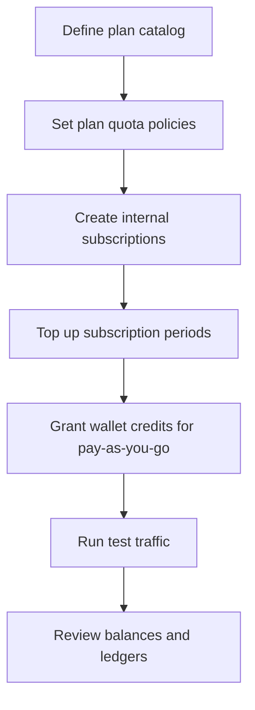

# Economics Kickoff Plan (Beta Testers)

This document is an anonymized operational playbook for running the first beta with manual subscriptions (no Stripe yet).
It is written for a director‑led setup session using the admin UI.

## Goal

- Define plans and limits
- Create subscriptions for beta users
- Enable pay‑as‑you‑go wallet users
- Keep registered users on free limits
- Validate the end‑to‑end economics flow

## Quick Model Summary

- Role decides funding access (`registered`, `paid`, `privileged`).
- Plan decides quota limits (`free`, `payasyougo`, `admin`, or custom plan IDs).
- Paid role is derived automatically if a user has an active subscription or wallet credits.
- Plan is resolved at runtime from subscription or wallet.
- If a user has both subscription and wallet, subscription covers up to available and wallet covers overflow for the turn.
- Quotas are enforced **per tenant/project** (global across bundles): hourly is rolling 60‑minute, monthly is rolling 30‑day (anchored to first usage per tenant/project), daily is calendar day (UTC).

## Visual Overview

## Plan Catalog (Recommended for Beta)

Use these plan IDs as a baseline:

- `free` — registered users (project‑funded)
- `payasyougo` — wallet‑funded users
- `beta-30` — internal subscription plan $30/month
- `beta-50` — internal subscription plan $50/month
- `admin` — privileged/admin (almost unlimited)

You can add additional plan IDs later. Plan IDs are arbitrary strings.

## Pre‑requisites

- Control plane schema deployed
- Admin UI accessible
- Master bundle has run once to seed plan quota policies
- Project budget funded (for free users)

## Step‑by‑Step Setup

### 1) Create subscription plans

Admin UI: **Subscriptions → Subscription Plans**

Create internal plans:

- `beta-30` (provider: internal, monthly_price_cents: 3000)
- `beta-50` (provider: internal, monthly_price_cents: 5000)
- `payasyougo` (provider: internal, monthly_price_cents: 0)

Notes:

- Plan IDs must exist before creating subscriptions.
- You can keep `free`, `admin`, `anonymous` as implicit plan IDs (no plan rows required).

### 2) Configure plan quota policies

Admin UI: **Quota Policies**

Set limits per `plan_id`.
Suggested examples:

- `free`: conservative daily/monthly limits
- `payasyougo`: higher limits than free
- `beta-30`: moderate limits
- `beta-50`: higher limits
- `admin`: high concurrency, minimal token limits

This is the only place that enforces quota limits in production after seeding.

Optional (recommended):
- Set the per‑bundle reservation floor via bundle props:
  `economics.reservation_amount_dollars` (e.g., `2.0`).

### 3) Top up project budget

Admin UI: **App Budget → Top up**

This funds `registered` users on the `free` plan.

### 4) Create internal subscriptions for beta users

Admin UI: **Create Subscription**

- Provider: internal
- Plan ID: `beta-30` or `beta-50`
- User ID: tester user id

### 5) Fund the first subscription period

Admin UI: **Lookup Subscription (by user)**

Click **Renew now** for internal subscriptions.

This will:

- Create the billing period budget
- Add the monthly amount to the period balance
- Set the next charge date

### 6) Create pay‑as‑you‑go users (wallet)

Admin UI: **Lifetime Credits**

- Add credits to the user’s wallet (USD amount)
- This automatically makes the user `paid`
- Plan stays `free`, but service limits come from `payasyougo`
  (token limits still come from `free`)

### 7) Keep registered (free) users

Do not create a subscription and do not add wallet credits.

These users stay `registered` and use:

- Plan: `free`
- Funding: project budget

### 8) Validate setup for each user

Admin UI: **User Budget Breakdown**

Check:

- `role` (registered or paid)
- `plan_id` (free, beta‑30, payasyougo)
- `plan_source` (subscription or role)
- Subscription balance or wallet balance
- If you want to verify rolling reset timestamps, provide the **Bundle ID** in the breakdown form.

### 9) Run test traffic

Ask each tester to run a few requests and confirm:

- Limits are enforced correctly
- Subscription balance or wallet balance decreases
- Project budget decreases for free users

### 10) Review ledgers and history

Admin UI: **Subscription Period History**

- Review per‑period spend
- Inspect ledger entries

Admin UI: **App Budget**

- Check project budget spend by bundle

## Operational Tasks During the Beta

- Reap expired reservations: **Subscriptions → Reap Expired Subscription Reservations**
- Sweep rollovers at period end: **Subscriptions → Sweep Unused Subscription Balances**
- Watch pending Stripe requests and economics events (even if Stripe is disabled)

## Reporting (Manual for Now)

Suggested report checklist:

- List of beta users with plan IDs
- Current subscription period balances
- Wallet balances for pay‑as‑you‑go
- Project budget total spend
- Any rate‑limit denials or warnings

This will later move into a dedicated reporting view.

## Notes and Troubleshooting

- If a user is marked as `paid` but has no subscription or wallet, ensure their session role is correct.
- If limits are wrong, update the plan policy in admin UI.
- Use **Min reservation (USD)** in plan policies to enforce a per‑request reservation floor.
- If subscription balance is stuck, run Reap Expired Reservation and re‑check.
- If a subscription period is closed, remaining balance is moved to project budget by the sweep job.
