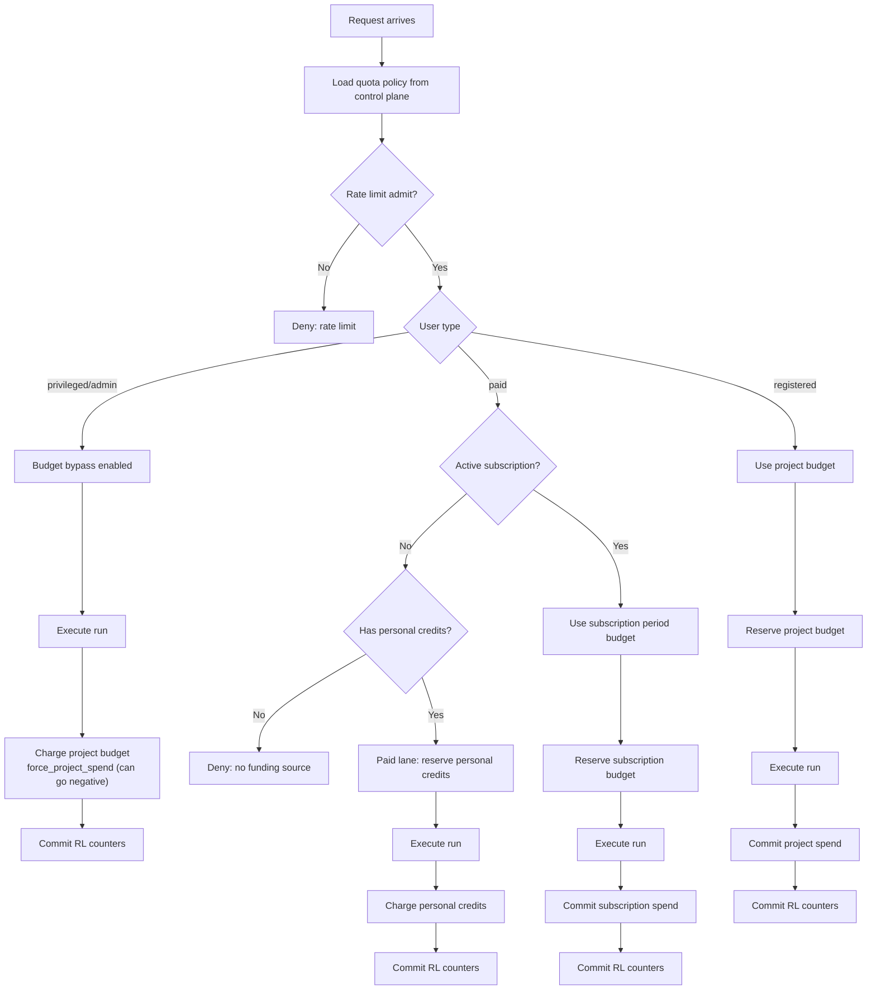

# Economics Model (Control Plane)

This document is the authoritative description of the current economics model and how it is enforced in runtime.
It replaces the older usage notes and reflects the production bundle flow and control‑plane schema.

## Scope

The economics subsystem covers:

- Rate limits and quotas (requests, tokens, concurrency)
- Funding lanes (subscription budget, project budget, personal credits)
- Reservation semantics for correctness under concurrency
- Accounting and cost attribution
- Subscription period management and rollovers

Runtime entrypoint: [entrypoint_with_economic.py](services/kdcube-ai-app/kdcube_ai_app/apps/chat/sdk/solutions/chatbot/entrypoint_with_economic.py).

## Roles and Funding Rules

We currently use three user types (roles):

- `registered` (free/trial users)
- `paid` (users with an active subscription)
- `privileged` (admin/operators)

Important: **user_type is for quota policy**, while **subscription status is for funding source**. The two are related but not identical.

Funding rules are enforced in the runtime entrypoint:

1. **Paid users**
   - Must have an active subscription (`user_subscriptions.status=active`, tier in `paid|premium`, not past due).
   - Funding source: **subscription period budget** only.
   - If subscription is inactive/past‑due, they have **no funding source** unless they also have personal lifetime credits.

2. **Registered users**
   - No subscription expected.
   - Funding source: **project budget** (tenant/project balance).

3. **Privileged users**
   - Budget checks are bypassed, but **project budget is still charged**.
   - This is an explicit operational decision: admins can run even if budget is negative.
   - Quota policy still applies (max_concurrent etc), but limits are effectively “almost unlimited” in the default policy.

Implementation detail:

- Allowed project budget user types are declared in `project_budget_user_types()` (default: `{"registered"}`).
- Budget bypass user types are declared in `budget_bypass_user_types()` (default: `{"privileged", "admin"}`).
- Privileged bypass still charges the project budget after the run using `force_project_spend` (no overdraft checks).

## Core Concepts

### 1) Quotas (Rate Limiting)

- Enforced by `UserEconomicsRateLimiter` using Redis + Lua.
- Counters: requests (day/month/total), tokens (hour/day/month), concurrency lock.
- Policies are stored in the control plane and loaded per user_type.
- A **tier override** can temporarily replace base limits (not additive).

The admit decision is made before running the model. If allowed, a concurrency lock is held and released on commit or failure.

### 2) Tier Overrides

- Stored in `user_tier_overrides`.
- Optional `expires_at` controls automatic expiry.
- Overrides replace base limits (e.g., raise tokens_per_month for 7 days).

### 3) Personal Lifetime Credits (Token Wallet)

- Stored in `user_lifetime_credits`.
- Depleting token bucket; never expires.
- Used when a request exceeds tier funding or the user is in the paid lane.

Concurrency safety:

- `user_token_reservations` prevents two concurrent turns from spending the same credits.
- Reservations are short‑lived and either committed or released.

### 4) Project Budget (Money)

- Stored in `tenant_project_budget` with ledger + reservations.
- Used by `registered` users and for admin bypass charging.
- Project budget is **money**, not tokens. We convert token usage to USD via the reference model at runtime.

Overdraft rules:

- `overdraft_limit_cents` controls how negative the budget may go.
- `force_project_spend` bypasses overdraft checks (used for admin bypass and post‑fact settlement).

### 5) Subscription Period Budget (Per‑month balance)

- Stored in `user_subscription_period_budget` (one row per user per billing period).
- Topped up once per period (idempotent).
- Not additive across months.
- Expired periods are **closed** and any remaining balance is rolled into the project budget.

## Funding Lanes (Runtime Flow)

Runtime logic (simplified):

1. **Load policy** from control plane.
2. **Admit** via `UserEconomicsRateLimiter`.
3. **Select funding source**:
   - Active subscription: subscription budget.
   - Registered: project budget (only if no active subscription).
   - Privileged/admin: bypass checks; charge project budget after run.
4. **Reserve** funds before execution:
   - Tier lane: reserve subscription/project budget for estimated tier coverage.
   - Overflow: reserve personal lifetime credits.
5. **Execute model**.
6. **Apply accounting** and compute actual cost.
7. **Commit** reservations and apply final spend.

If a funding source has insufficient funds, a user can still run if they have personal lifetime credits; otherwise the request is denied.

## Decision Tree by User Role (Visual)

The following diagram shows the per‑request decision path from arrival to funding and execution.

## Subscription Periods and Rollovers

Subscription budgets are **per billing period**. The period key is deterministic and derived from:

- `provider` (internal or stripe)
- `stripe_subscription_id` (if stripe)
- `period_start` and `period_end`

At period end:

- The period is closed.
- Available balance (balance - reserved) is rolled into the project budget.
- This is **idempotent** and recorded via `external_economics_events` with `kind=subscription_rollover`.

Maintenance entry points:

- `SubscriptionManager.sweep_due_subscription_rollovers(...)`
- Control plane endpoint: `/subscriptions/rollover/sweep`

## Data Model (Tables)

Authoritative schema is defined in:

- [deploy-kdcube-control-plane.sql](services/kdcube-ai-app/kdcube_ai_app/ops/deployment/sql/control_plane/deploy-kdcube-control-plane.sql)

Key tables:

- `user_quota_policies` — base policy per user_type
- `user_tier_overrides` — temporary overrides
- `user_lifetime_credits` — lifetime token wallet
- `user_token_reservations` — wallet reservations
- `tenant_project_budget` — project money balance
- `tenant_project_budget_reservations` — project budget holds
- `tenant_project_budget_ledger` — project budget ledger
- `user_subscription_budget_settings` — per user subscription config (overdraft)
- `user_subscription_period_budget` — per period subscription balance
- `user_subscription_period_reservations` — subscription holds
- `user_subscription_period_ledger` — subscription ledger
- `user_subscriptions` — subscription metadata
- `external_economics_events` — idempotency + audit for external/internal economic operations

## Accounting and Costing

Accounting events are emitted by service wrappers (e.g., LLM calls, web search).
They are aggregated per turn, then converted to cost using the reference model.

Model usage is billed by the runtime entrypoint when the turn completes.

## Admin Operations

The admin control plane supports:

- Policy seeding from bundle config
- Project budget topups
- Tier overrides and trials
- Wallet (lifetime credits) topups and refunds
- Subscription creation, manual renewal, and rollover sweep
- Stripe reconciliation

Control plane entrypoint:

- [control_plane.py](services/kdcube-ai-app/kdcube_ai_app/apps/chat/api/control_plane/control_plane.py)

## Operational Guarantees

- **Idempotency** for Stripe and internal “once per period” actions via `external_economics_events`.
- **Atomicity** for budget adjustments via SQL transactions and row locks.
- **Concurrency safety** for credits and quotas via Redis/Lua + DB reservations.

For Stripe-specific flows and operations, see `stripe-README.md` in this folder.
For operational procedures and configuration, see `operational-README.md` in this folder.
