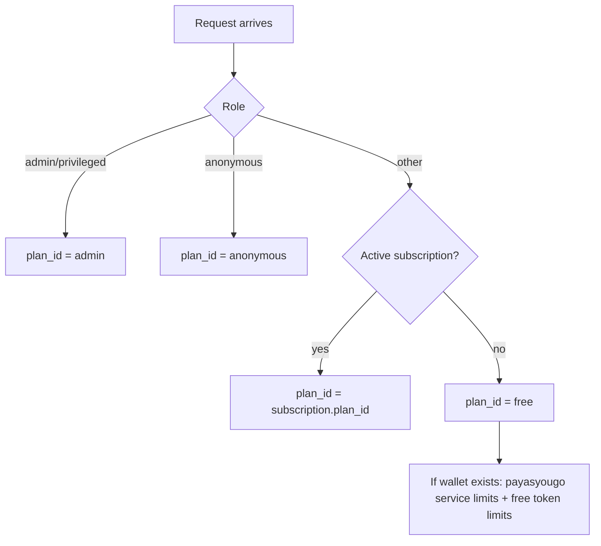
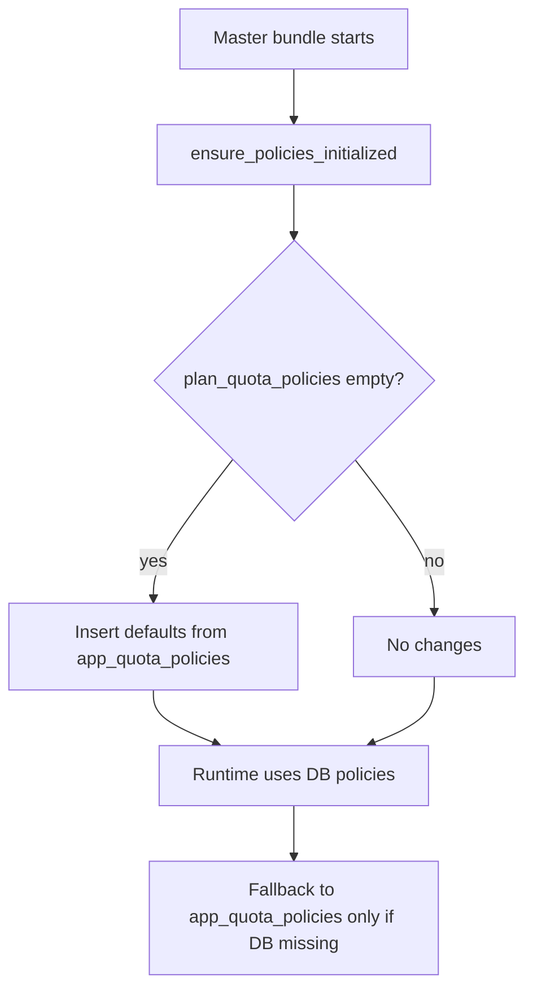
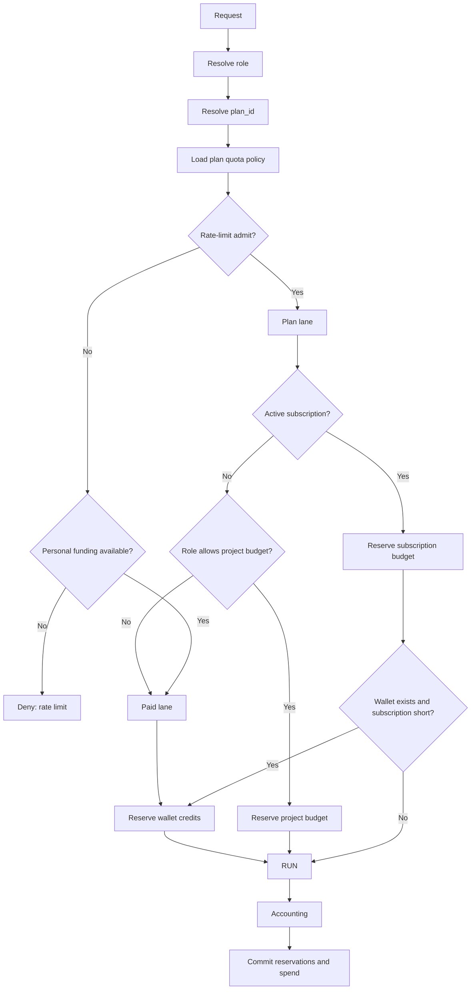

# Economics Model (Control Plane)

This document is the authoritative description of the current economics model and how it is enforced at runtime.
It replaces the older usage notes and reflects the production bundle flow and control‑plane schema.

Runtime entrypoint:
- [entrypoint_with_economic.py](services/kdcube-ai-app/kdcube_ai_app/apps/chat/sdk/solutions/chatbot/entrypoint_with_economic.py)

## Scope

The economics subsystem covers:

- Rate limits and quotas (requests, tokens, concurrency)
- Funding lanes (subscription budget, project budget, wallet credits)
- Reservation semantics for correctness under concurrency
- Accounting and cost attribution
- Subscription period management and rollovers

## Core Concepts

### Terminology

- **Plan** = quota policy identity (limits for requests/tokens/concurrency).
- **Plan override** = temporary per‑user override of plan limits.
- **Lane** = `plan` lane or `paid` lane.

Lane vs funding (important):
- **Lane** is only `plan` (plan lane) or `paid` (wallet‑only lane).
- **Funding source** is `subscription` or `project` (for plan lane), or `wallet` (for paid lane).
- A **subscription plan** runs in the **plan lane**; it just uses **subscription funding**.

Tracing a single request:
- `request_id` is the **turn_id**.
- Use `GET /economics/request-lineage?request_id=turn_id` to fetch ledger + reservation rows.

### Role (economics role)

Role is the funding access decision, not the quota policy. The gateway can override the authenticated role based on economics state.

Role resolution is applied in the gateway and stored in the session:

- If `privileged` or `admin`, role stays privileged.
- Else if active subscription or wallet credits exist, role becomes `paid`.
- Else role remains `registered`.

This overrides the session `user_type` (the role used by the runtime entrypoint). The session key uses the resolved role:

- `...:paid:<user_id>`
- `...:registered:<user_id>`

### Plan (quota policy identity)

Plan (`plan_id`) is the quota policy identity used by the rate limiter. It is distinct from role.

Plan is resolved in the entrypoint at request time. The active plan determines base quotas via `plan_quota_policies`.

### Funding Sources

Funding sources are money or tokens used to pay for requests:

- Subscription period budget (per‑month balance, USD)
- Wallet or lifetime credits (token bucket, USD‑quoted)
- Project budget (tenant/project balance, USD)

Role determines which funding sources are allowed, while plan determines rate limits.

## Plan Resolution (Runtime)

Plan resolution is performed in the entrypoint using the following priority:

1. `privileged/admin` → `admin`
2. `anonymous` → `anonymous`
3. active subscription → `subscription.plan_id`
4. default → `free`

Special handling for wallet users with no subscription:

- The **plan stays `free`**, but **service limits** (requests/concurrency) are taken from the `payasyougo` plan.
- **Token limits** still come from the `free` plan.
- When the free token quota is insufficient and a wallet exists, the request switches to **paid lane**.

Visual summary:

## Where Limits Come From (Plan Quotas)

Plan quotas are stored in the control plane table `plan_quota_policies`.

**Scope and window semantics (important):**
- Quotas are enforced **per tenant/project** (global across bundles).
- Hourly token limits use a **rolling 60‑minute** window (minute buckets).
- Monthly limits use a **rolling 30‑day** window anchored to the user’s first usage **per tenant/project**.
- Daily limits use **calendar day (UTC)**.
- Total requests do not reset.
Reservation amount configuration:
- Per‑bundle fixed reservation can be set via bundle props: `economics.reservation_amount_dollars`.
- If set, the reservation estimate uses that fixed USD amount (lane‑independent).
  Configure via Integrations bundle props API (see `eco-admin-README.md`).

Accounting and spend are still recorded **per bundle** for reporting, but quota enforcement is global per tenant/project.
Global quota counters use bundle id `__project__` in Redis keys (subject_id already encodes tenant/project).

Seeding flow:

- A master bundle calls `ensure_policies_initialized()`.
- The entrypoint seeds `plan_quota_policies` from `app_quota_policies` only if records are missing.
- After initial seeding, updates should be made in the admin UI or directly in the table.
- Runtime always prefers the DB policy, with a fallback to `app_quota_policies` if a plan is missing.

## Funding Lanes and Reservation Semantics

### Plan lane

Plan lane is the normal path when rate‑limit admit succeeds.

Funding for plan lane:

- Active subscription → reserve from subscription period budget.
  - If a wallet exists and the subscription cannot cover the full reservation, reserve **subscription up to available** and reserve **wallet overflow** for the remainder.
  - If subscription funds **zero** for the turn, the request switches to **paid lane** and **payasyougo** quotas apply.
  - If no wallet exists and actual spend exceeds reservation, **project budget absorbs the overage** (`shortfall:subscription_overage`).
- Registered role (no subscription) → reserve from project budget.
- Privileged bypass → no pre‑check; project budget is charged after run.
- If project‑funded (free plan) actual spend exceeds reservation, **project budget absorbs the overage** (`shortfall:free_plan`).
- Wallet‑backed free users keep `plan_id=free` but use **payasyougo service limits** (requests/concurrency) while **token limits** remain from `free`.

If the **actual** spend exceeds both plan funding and wallet (e.g., underestimated cost), the **project budget absorbs the remainder** and a ledger entry is written with a shortfall note. **Subscriptions and wallets never go negative.**
Shortfall notes are tagged as `shortfall:wallet_subscription`, `shortfall:wallet_paid`, `shortfall:wallet_plan`, `shortfall:subscription_overage`, or `shortfall:free_plan` for reporting.

### Paid lane

Paid lane is used when plan admit is denied **and** a wallet is available, when plan funding cannot be reserved, **or** when subscription funding for the turn is zero and the wallet must cover the full request.

Funding for paid lane:

- Reserve wallet credits (lifetime tokens).

### Reservation types

- Rate limiter token reservation (Redis) for plan lane
- Subscription reservations in `user_subscription_period_reservations`
- Project budget reservations in `tenant_project_budget_reservations`
- Wallet reservations in `user_token_reservations`

Reservations are committed or released after execution and accounting. Expired reservations are reaped automatically.

## Decision Tree (Role → Plan → Funding)

## Subscription Periods and Rollovers

Subscription budgets are per billing period.

- Each period is keyed by `(tenant, project, user_id, period_key)`.
- Top‑up is once per period by default (idempotent).
- Periods are closed at the end date.
- Unused balance is rolled into project budget.

Maintenance entry points:

- `SubscriptionManager.sweep_due_subscription_rollovers(...)`
- Control plane endpoint: `POST /subscriptions/rollover/sweep`
- Reservation reaper: `POST /subscriptions/reservations/reap-all`

## Data Model (Tables)

Authoritative schema:

- [deploy-kdcube-control-plane.sql](services/kdcube-ai-app/kdcube_ai_app/ops/deployment/sql/control_plane/deploy-kdcube-control-plane.sql)

Key tables:

- `plan_quota_policies` — base policy per plan_id
- `user_plan_overrides` — temporary plan overrides
- `user_lifetime_credits` — wallet credits
- `user_token_reservations` — wallet reservations
- `tenant_project_budget` — project money balance
- `tenant_project_budget_reservations` — project budget holds
- `tenant_project_budget_ledger` — project budget ledger
- `tenant_project_budget_absorption` — view for shortfall absorption reporting
- `tenant_project_budget_absorption_detail` — view for shortfall reporting by user/bundle
- `subscription_plans` — plan catalog and Stripe price mapping
- `user_subscriptions` — subscription metadata
- `user_subscription_period_budget` — per period subscription balance
- `user_subscription_period_reservations` — subscription holds
- `user_subscription_period_ledger` — subscription ledger
- `external_economics_events` — idempotency and audit for external/internal economic operations

## Accounting and Costing

Accounting events are emitted by service wrappers (LLM calls, web search, etc.).
Events are aggregated per turn and converted to USD using the reference model.

Reference model conversion is used for:

- Wallet credit conversion (USD → tokens)
- Token balance display (tokens → USD)
- Estimation of request cost for reservations
