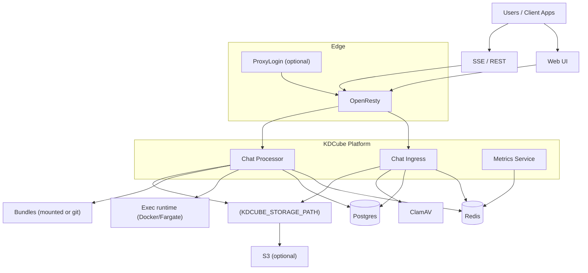

# Ops Overview

This section is the **operations entry point** for KDCube: deployment options, service topology, and near‑term plans (ECS/EKS).

## Deployment options

See `deployment/index-README.md` for a quick map. Key options:

- **DevEnv (run services locally)**: `deployment/devenv/`
- **Local infra only**: `deployment/docker/local-infra-stack/`
- **All‑in‑one compose** (everything local): `deployment/docker/all_in_one_kdcube/`
- **Custom UI + managed infra**: `deployment/docker/custom-ui-managed-infra/`

## EC2 vs ECS (what to use, where)

**EC2 / Docker‑compose**  
Use the compose options above. Each component has its own env file:

- `all_in_one_kdcube`: `sample_env/.env.ingress`, `.env.proc`, `.env.metrics`
- `custom-ui-managed-infra`: same layout, but points to managed DB/Redis

**ECS**  
See `docs/ops/ecs/ecs-deployment-README.md`. Templates live under `deployment/ecs/`:

- `ingress/env.template`
- `proc/env.template`
- `metrics/env.template`
- `frontend/env.template`

Frontend runtime config on ECS:
- `FRONTEND_CONFIG_JSON` (inline JSON) **or**
- `FRONTEND_CONFIG_S3_URL` (S3/HTTPS)

## Per‑component notes

- **Ingress**: SSE + REST entrypoint, uses Redis + Postgres, AV (optional).
- **Proc**: queue worker + bundles + integrations, uses Redis + Postgres + bundles + exec runtime.
- **Metrics**: aggregates Redis metrics and exports to CloudWatch/Prometheus.
- **Frontend**: static UI with runtime `config.json` injection.

## Service topology (current)

**Storage**
- `KDCUBE_STORAGE_PATH` can point to **local FS** or **S3**.
- For S3 usage and bucket layout, see `docs/ops/s3.md`.

## Config entry points

- Service configuration: `docs/service/service-config-README.md`
- Gateway configuration and capacity logic: `docs/service/gateway-README.md`
- Metrics & autoscaling: `docs/service/scale/metric-server-README.md` and `docs/service/scale/metrics-README.md`

## Roadmap (ops‑facing)

- **ECS**: target runtime for prod (managed infra, autoscaling, task roles).
- **EKS**: optional Kubernetes path (for teams already on k8s).
- **Bundle‑from‑git**: remove “fat image” requirement for processors.
- **Fargate exec**: complete adapter for isolated tool/code execution.
