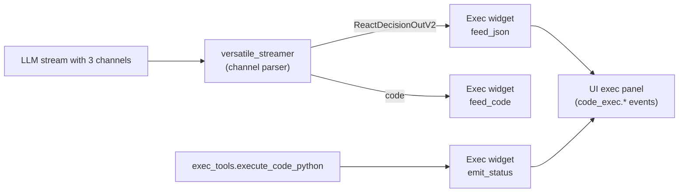

# Streaming Exec Widget (Live Code + Execution Status)

This document describes the **live exec streaming widget** used by the ReAct v2 decision loop. It supersedes the older code‑exec widget notes and reflects the current runtime wiring.

## What It Is

The exec streaming widget is a **backend streaming adapter** that listens to the LLM’s multi‑channel output and emits structured UI events as code is generated and executed.

It drives the frontend “exec” panel that shows:

- Program name
- Objective/status text
- Live code stream (as the model outputs it)
- Execution contract (expected artifacts)
- Status transitions (`gen → exec → done/error`)

Core implementation:

- [exec.py](../../../services/kdcube-ai-app/kdcube_ai_app/apps/chat/sdk/solutions/widgets/exec.py)

## Where It Is Wired

Decision streaming (3‑channel LLM stream):

- [decision.py](../../../services/kdcube-ai-app/kdcube_ai_app/apps/chat/sdk/solutions/react/v2/agents/decision.py)

Runtime wiring and subscriptions:

- [runtime.py](../../../services/kdcube-ai-app/kdcube_ai_app/apps/chat/sdk/solutions/react/v2/runtime.py)

Execution status updates (same widget instance):

- [execution.py](../../../services/kdcube-ai-app/kdcube_ai_app/apps/chat/sdk/runtime/execution.py)

Channeled streaming protocol:

- [channeled-streamer-README.md](channeled-streamer-README.md)

## The Channels It Listens To

The ReAct decision LLM uses **three channels**:

- `thinking` (user‑visible short status text)
- `ReactDecisionOutV2` (JSON tool call)
- `code` (raw code snippet)

The exec widget subscribes to **two** of them:

- `ReactDecisionOutV2` → used to detect `exec_tools.execute_code_python`, parse params, and emit contract/program/status.
- `code` → streamed live into the exec panel.

The `thinking` channel is not used by the widget directly.

## Execution ID (Grouping)

Each exec streaming session is tagged with an `execution_id` created in the ReAct runtime:

- `exec_id = "exec_" + <tool_call_id>`

This id is attached to every `code_exec.*` event so the UI can group related deltas.

## Event Schema Emitted to the UI

All events are emitted via `comm.delta(...)` with `marker="subsystem"` and `sub_type="code_exec.*"`.
The widget automatically chooses `artifact_name` based on `sub_type`.

Event types:

- `code_exec.objective`
- `code_exec.program.name`
- `code_exec.code`
- `code_exec.contract`
- `code_exec.status`

### 1) Objective (optional)

Emitted when the decision notes are associated with an exec tool call.

- `sub_type`: `code_exec.objective`
- `format`: `text`
- `title`: `Objective`

### 2) Program name (optional)

Emitted when `prog_name` exists in exec tool params.

- `sub_type`: `code_exec.program.name`
- `format`: `text`
- `title`: `Program Name`

### 3) Code stream (live)

Live code chunks are streamed as the model writes `<channel:code>`.

- `sub_type`: `code_exec.code`
- `format`: `text`
- `language`: typically `python`
- `completed=true` is emitted when streaming ends

### 4) Contract

Emitted once the exec tool params are parsed.

- `sub_type`: `code_exec.contract`
- `format`: `json`
- `title`: `Execution Contract`

Payload shape:

```json
{
  "execution_id": "exec_tc_xxx",
  "contract": [
    {
      "artifact_name": "report",
      "description": "...",
      "mime": "application/pdf",
      "filename": "turn_id/files/report.pdf"
    }
  ]
}
```

### 5) Status

Emitted at index `0` (no completion event). Transitions:

- `gen` when code streaming begins
- `exec` after contract emission
- `done` or `error` after execution finishes

Payload shape:

```json
{
  "status": "gen | exec | done | error",
  "timings": {
    "codegen": null,
    "exec": 4123
  },
  "error": {
    "code": "...",
    "message": "...",
    "where": "exec_execution",
    "managed": true
  }
}
```

## How Data Flows (High‑Level)



## How the Widget Populates the UI

Sequence for a typical exec round:

1. `ReactDecisionOutV2` begins streaming.
2. Widget parses JSON, detects `tool_id=exec_tools.execute_code_python`.
3. Status `gen` emitted.
4. Optional `program.name` and `objective` emitted.
5. Code chunks stream from `<channel:code>` into `code_exec.code`.
6. Contract emitted when tool params are parsed.
7. Status switches to `exec`.
8. Exec tool runs; runtime calls `emit_status(done|error)` and sets `exec` timing.

The UI should group events by `execution_id` and render them in order:

- Objective
- Program name
- Code
- Contract
- Status

## Xpath‑Based Streaming (Generic Mode)

The widget can also stream a **string JSON field** by `stream_xpath` from a JSON channel.
This is used by `CodegenJsonCodeStreamer` and similar variants.

Example configuration:

- `stream_xpath="files.content"`

In this mode, the widget parses JSON incrementally and emits only the string at that path, chunked as it arrives.

The current ReAct decision integration uses the **code channel** instead of xpath streaming.

## UI Expectations

The frontend widget should:

- Filter events by `marker=subsystem` and `sub_type` prefix `code_exec.`.
- Group by `execution_id`.
- For `code_exec.code`, append streamed chunks in order.
- For `code_exec.status`, update the status indicator and timings.
- For `code_exec.contract`, render a table of expected output artifacts.

## Common Failure Modes

- Missing `<channel:code>` → exec tool fails with `missing_code` and status `error`.
- Missing/invalid contract → runtime emits `error` status and a protocol notice.
- Incorrect tool_id → widget never activates; no exec panel appears.

## Related Docs

- [channeled-streamer-README.md](channeled-streamer-README.md)
- [decision.py](../../../services/kdcube-ai-app/kdcube_ai_app/apps/chat/sdk/solutions/react/v2/agents/decision.py)
- [runtime.py](../../../services/kdcube-ai-app/kdcube_ai_app/apps/chat/sdk/solutions/react/v2/runtime.py)
- [exec.py](../../../services/kdcube-ai-app/kdcube_ai_app/apps/chat/sdk/solutions/widgets/exec.py)
- [execution.py](../../../services/kdcube-ai-app/kdcube_ai_app/apps/chat/sdk/runtime/execution.py)
