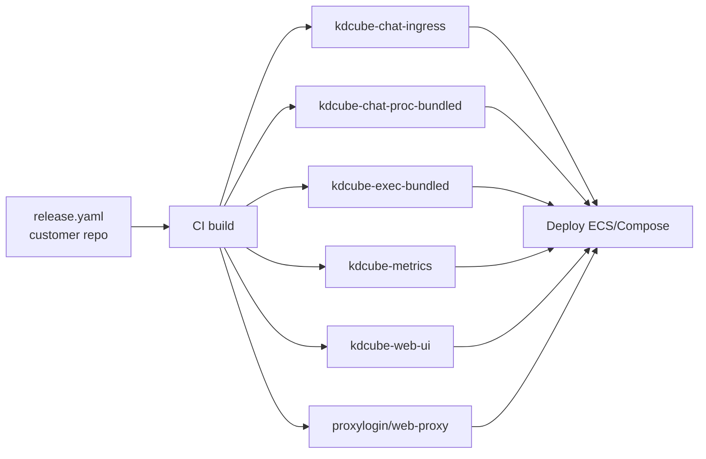
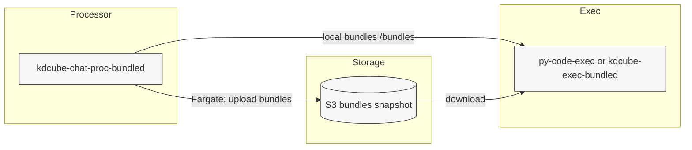

# Custom CI/CD (Open Source + Customer Repo)

This document is a practical plan for a **two‑repo** CI/CD setup:

- **Platform repo (open source):** `kdcube-ai-app`  
- **Customer repo (closed):** bundles + frontend + proxy config

Goal: keep **docker‑compose (EC2)** working during transition, while preparing **ECS** deployment.

---

## TL;DR (1‑page CI/CD Flow)

**Inputs (single release file in customer repo):**
- `release.yaml` (pins platform tag + frontend tag + bundles list)

**CI (build phase):**
1. Checkout **platform repo** at `platform.ref`.
2. Checkout **customer repo** at `bundles.items[].ref` + `frontend.ref`.
3. For each bundle entry → copy `<subdir>/<id>` into `/bundles/<id>`.
4. Generate **runtime descriptor** (`AGENTIC_BUNDLES_JSON`) with `path=/bundles` and `module=...entrypoint`.
5. Build + push images:
   - `kdcube-chat-ingress`
   - `kdcube-chat-proc` (or `kdcube-chat-proc-bundled`)
   - `py-code-exec` (or `kdcube-exec-bundled`)
   - `kdcube-metrics`
   - `kdcube-web-ui`
   - `proxylogin` / `web-proxy` (if used)

**CD (deploy phase):**
- **ECS:** update task definitions with new image tags + envs.
- **EC2 compose:** update `.env.*` files and `docker compose up -d`.



**Runtime config (where env lives):**
- ECS: task definitions (ingress/proc/metrics)
- Compose: `.env.ingress`, `.env.proc`, `.env.metrics`
- UI config: `config.json` baked or mounted at runtime

**Bundle runtime toggles (proc):**
- `BUNDLES_FORCE_ENV_ON_STARTUP=1` for one rollout to overwrite Redis registry.
- `BUNDLES_INCLUDE_EXAMPLES=0` to disable example bundles.
- `BUNDLE_GIT_RESOLUTION_ENABLED=0` when using mounted paths only.
- `BUNDLE_GIT_REDIS_LOCK=1` to serialize git pulls per instance.

---

## 1) Build Outputs (Images)

**Platform images (built from open‑source repo):**

- `kdcube-chat-ingress` (thin ingress service)
- `kdcube-chat-proc` (processor service)
- `kdcube-metrics` (metrics service)
- `kdcube-postgres-setup` (db schema provisioning)
- `kdcube-web-proxy` (nginx/openresty proxy)
- `proxylogin` (auth proxy for delegated flows)

**Customer images (built from customer repo):**

- `kdcube-web-ui` (frontend bundle)
- `kdcube-chat-proc-bundled` (processor image with bundles baked in)
- `kdcube-exec-bundled` (code‑exec image with bundles baked in)

---

## 1.1) Image → Dockerfile Mapping

**Platform repo (open source):**  
Use Dockerfiles from `deployment/docker/custom-ui-managed-infra`.  
(They are identical to the local‑infra variants; keep one source of truth for CI.)

| Image | Dockerfile |
| --- | --- |
| `kdcube-chat-ingress` | `app/ai-app/deployment/docker/custom-ui-managed-infra/Dockerfile_Ingress` |
| `kdcube-chat-proc` | `app/ai-app/deployment/docker/custom-ui-managed-infra/Dockerfile_Chatproc` |
| `kdcube-metrics` | `app/ai-app/deployment/docker/custom-ui-managed-infra/Dockerfile_Metricservice` |
| `kdcube-postgres-setup` | `app/ai-app/deployment/docker/custom-ui-managed-infra/Dockerfile_PostgresSetup` |
| `kdcube-web-proxy` | `app/ai-app/deployment/docker/custom-ui-managed-infra/Dockerfile_ProxyOpenResty` |
| `proxylogin` | `app/ai-app/deployment/docker/custom-ui-managed-infra/Dockerfile_ProxyLogin` |
| `py-code-exec` | `app/ai-app/deployment/docker/custom-ui-managed-infra/Dockerfile_Exec` |

**Customer repo (closed):**

| Image | Dockerfile |
| --- | --- |
| `kdcube-web-ui` | `<customer-repo>/ops/.../Dockerfile_UI` |
| `kdcube-chat-proc-bundled` | `<customer-repo>/ops/.../Dockerfile_ChatProcBundled` (base = `kdcube-chat-proc`) |
| `kdcube-exec-bundled` | `<customer-repo>/ops/.../Dockerfile_ExecBundled` (base = `py-code-exec`) |

---

## 2) Recommended Tagging Strategy

**Platform repo:**

- `:git-sha` (immutable)
- `:branch` (moving tag for dev/staging)
- `:vX.Y.Z` (optional releases)

**Customer repo:**

- `:customer-sha`
- `:customer-branch`

---

## 3) Release Descriptor (Single Source of Truth)

See: `docs/service/cicd/release-descriptor-README.md`

This file (`release.yaml` in the customer repo) pins platform + frontend + bundles
and is the only release input CI should need.

---

## 4) Bundle Descriptor (Derived by CI)

CI derives `AGENTIC_BUNDLES_JSON` from the release descriptor.
See: `docs/service/cicd/release-descriptor-README.md`

**Optional shortcut (EC2/dev):** mount the `release.yaml` directly and set:

```
AGENTIC_BUNDLES_JSON=/config/release.yaml
```

The loader will read the `bundles` section from the YAML.

---

## 5) Environment Files (Compose‑compatible)

We now split env per component:

- `.env` (compose paths + build contexts)
- `.env.ingress`
- `.env.proc`
- `.env.metrics`
- `.env.postgres.setup`
- `.env.proxylogin` (optional)
- `.env.frontend` (optional)

**Important:** Use the **same `GATEWAY_CONFIG_JSON`** for ingress/proc/metrics (tenant/project is shared).

---

## 6) EC2 Docker‑Compose (Transition Phase)

**Current flow (recommended while migrating):**

1. CI builds images and pushes to registry.
2. Ops updates `.env.*` files on EC2.
3. Compose pulls new images.

Example command sequence:

```bash
docker compose -f docker-compose-decentralized-infra-data.yaml pull
docker compose -f docker-compose-decentralized-infra-data.yaml up -d
```

**Notes:**
- `chat-ingress` + `chat-proc` are now separate services.
- `metrics` can be enabled without user impact.
- Use `.env.postgres.setup` for `postgres-setup`, not `.env.ingress/.env.proc`.

---

## 7) ECS (Target State)

**Split into services:**

1. **Ingress service**
2. **Processor service**
3. **Metrics service**
4. **Proxy/UI (optional split)**

**Routing (example):**

- `/chatbot/api/*` → ingress
- `/chatbot/api/integrations/*` → processor
- `/metrics/*` (if exposed) → metrics (usually internal)

---

## 8) CI Pipeline (Suggested Structure)

### Platform repo pipeline

- Build + push:
  - `kdcube-chat-ingress`
  - `kdcube-chat-proc`
  - `kdcube-metrics`
  - `kdcube-postgres-setup`
  - `kdcube-web-proxy` (if used)
  - `proxylogin`
- Publish release artifacts (optional)

### Customer repo pipeline

- Build + push:
  - `kdcube-web-ui`
- Build + push (bundles baked into processor):
  - `kdcube-chat-proc-bundled`
- Build + push (bundles baked into exec image):
  - `kdcube-exec-bundled`
- Publish updated nginx config + config.json

---

## 8.1) Bundle Descriptor Generation

CI derives `AGENTIC_BUNDLES_JSON` from the release descriptor.
See: `docs/service/cicd/release-descriptor-README.md`

---

## 8.2) CD: Where Env Vars Live (Ingress / Proc / Metrics)

**ECS (recommended):**
- Each service has its own **task definition** with env vars + secrets.
- Use the **same `GATEWAY_CONFIG_JSON`** across ingress/proc/metrics.
- Inject `AGENTIC_BUNDLES_JSON` **only** for the processor service.

**Compose (transition):**
- `.env.ingress`, `.env.proc`, `.env.metrics`, `.env.postgres.setup`
- Compose file references each env file explicitly.

---

## 8.3) Frontend Config (Runtime)

The frontend requires a **runtime config file** (e.g. `config.json`).
This file must be present **inside the UI container at runtime**.

Options:
1. **Bake into the UI image** during build (Dockerfile copies it).
2. **Mount at runtime** (volume/config/sidecar) in ECS.

See the customer Dockerfile and config example:
- `.../ops/.../Dockerfile_UI`
- `.../ops/.../prod/config.json`

For ECS, the recommended approach is to bake `config.json` into the UI image
or provide it via a mounted volume at the path expected by the UI build.

---

## 9) Bundles in Customer Repo (No Git Bundles Yet)

Because Git‑based bundle fetching is not finished yet, **bundles must be baked into a processor image** for ECS.

Recommended approach:

1. Use the platform `kdcube-chat-proc` image as the base.
2. Copy bundles from the customer repo into `/bundles`.
3. Set `AGENTIC_BUNDLES_ROOT=/bundles`.

Example Dockerfile (customer repo):

```dockerfile
FROM <registry>/kdcube-chat-proc:<version>

WORKDIR /app

# Copy bundles into container
COPY ./bundles /bundles

ENV AGENTIC_BUNDLES_ROOT=/bundles
```

This produces `kdcube-chat-proc-bundled`, which ECS can run without host mounts.

### Bundle Descriptor Ownership + Versioning (Now)

**Owner:** the customer repo owns the **bundle descriptor** (`AGENTIC_BUNDLES_JSON`) and controls bundle versions.  
**Platform repo** only provides the loader + runtime.

**Recommended (today):**

- Put the bundle descriptor in the **processor env** (`AGENTIC_BUNDLES_JSON`).
- Keep `path` pointing to `/bundles/...` (because bundles are baked).
- Also include **git metadata** for traceability (`repo`, `ref`, `subdir`).

Example entry (works today, tracks version):

```json
{
  "default_bundle_id": "my-bundle@2.0.0",
  "bundles": {
    "my-bundle@2.0.0": {
      "id": "my-bundle@2.0.0",
      "name": "My Bundle",
      "path": "/bundles",
      "module": "my-bundle@2.0.0.entrypoint",
      "repo": "https://git.example.com/org/my-bundle.git",
      "ref": "v2.0.0",
      "subdir": "bundles"
    }
  }
}
```

**How version is defined today:**

- The bundle ID (e.g. `my-bundle@2.0.0`) is the visible version.
- `ref` is the **true source version** (tag or commit SHA).
- The baked processor image must contain the matching `/bundles/...` folder.

**Important (until Git bundles are ready):**

- Keep `repo/ref` for traceability **only**.
- Set `BUNDLE_GIT_RESOLUTION_ENABLED=0` to prevent git cloning on startup.

**When Git bundles are enabled:**

- Use pinned `ref` (tag/commit) for deterministic updates.
- If you must track a branch head, set `BUNDLE_GIT_ALWAYS_PULL=1`.
- Set `BUNDLE_GIT_REDIS_LOCK=1` so each replica pulls **once** on startup.

**Apply env bundles on deploy (no admin auth):**

- Set `BUNDLES_FORCE_ENV_ON_STARTUP=1` in proc env for the deploy.
- Restart the processor → Redis registry is overwritten from env.

### Code‑Exec Image (Docker/Fargate)

The processor spawns the **code‑exec** image on demand. The exec image needs access to bundle tools/code.

**Current (no Git bundles):**

- Build a **bundled exec image**:
  - Base: `py-code-exec` (platform)
  - Copy bundles into `/bundles`
  - Set `PY_CODE_EXEC_IMAGE` to this bundled tag

Example Dockerfile (customer repo):

```dockerfile
FROM <registry>/py-code-exec:<version>
COPY ./bundles /bundles
ENV AGENTIC_BUNDLES_ROOT=/bundles
```

**Fargate path:**  
The processor uploads bundles to S3 before starting Fargate exec. This still requires bundles to be present locally in the processor (hence bundled proc image remains needed until Git bundles).

**Note (upcoming):**  
We are adding **bundle‑from‑git** support. Once enabled, you will no longer need a fat processor image.  
Bundles will be configured via env/admin (bundle descriptor) and fetched at runtime.

**Bundle‑from‑git checklist (future):**
- Stop building `kdcube-chat-proc-bundled`
- Stop building `kdcube-exec-bundled`
- Set bundle git descriptors in env/admin
- Ensure processor can fetch bundles at runtime

---

## 10) Exec Flow (Diagram)



---

## 11) Minimal Inputs Required From Ops

- Container registry (ECR) names
- IAM policies for CI push
- ECS cluster + VPC + subnets
- ALB routing rules
- Secrets storage (SSM or Secrets Manager)

---

## 12) Common Failure Points (Checklist)

- `GATEWAY_CONFIG_JSON` missing tenant/project
- Redis URL mismatch between ingress/proc/metrics
- Postgres `max_connections` too low for processor concurrency
- ALB idle timeout too low for SSE
- Missing host mount for `/exec-workspace` when running locally

---

## 13) Next Steps

1. Align image names + ECR repos.
2. Decide ECS task layout (1 service per component).
3. Migrate compose → ECS one service at a time.
4. Enable metrics export + autoscaling rules.
