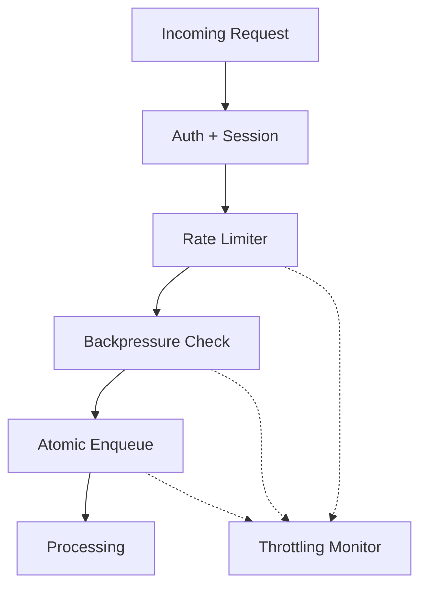
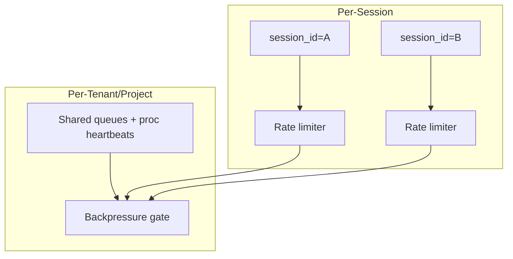
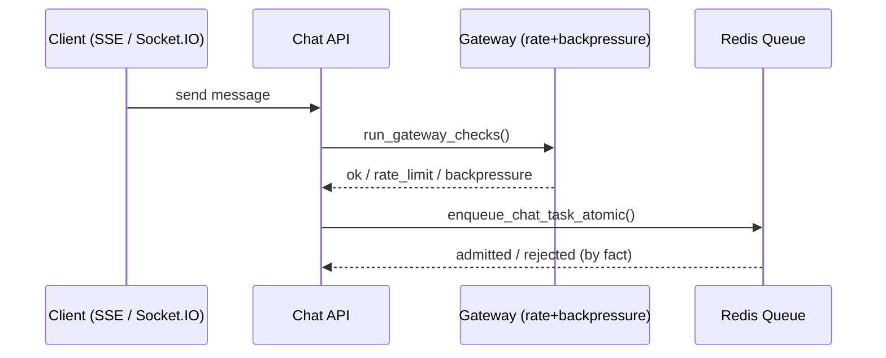
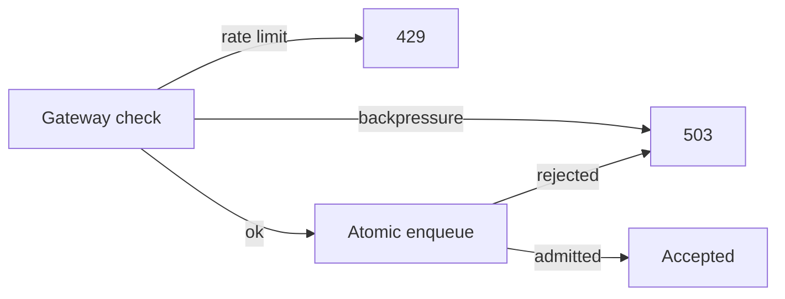

# Gateway & Admission Control (Current)

This document describes **how the gateway actually runs today** in this codebase and how to configure it.

---

## 1) What the gateway does

The gateway provides:
- **Session resolution** (auth → user/session/user_type)
- **Rate limiting** (per session, per user type, burst + hourly)
- **Backpressure** (tenant/project queue + processor health admission control)
- **Circuit breakers** (fail‑fast on system failures)
- **Atomic enqueue gating** (admit/deny at enqueue time)



### Rate limit vs backpressure scope (important)
- **Rate limits are per session** (keyed by `session_id`, tenant/project‑scoped in Redis).
- **Backpressure is per tenant/project** (global queue + healthy processor capacity).



---

## 2) Where it is enforced today

### HTTP middleware (session by default)
The HTTP middleware in `apps/chat/api/web_app.py` resolves the session and applies
**policy‑based throttling/backpressure**.

- **Default**: REST is **session‑only** (bypass throttling/backpressure).
- **Guarded REST**: exact heavy endpoints are classified as `CHAT_INGRESS` and **are gated**.
- **Session ownership check**: if a request includes `User-Session-ID` (header) or
  `user_session_id` (query param), the gateway **verifies that this session belongs
  to the authenticated user**. Mismatches are rejected (401/403).

Key files:
- [web_app.py](../../apps/chat/api/web_app.py)
- [gateway_policy.py](../../apps/middleware/gateway_policy.py)
- [gateway.py](../../apps/middleware/gateway.py)

### Auth requirements (non‑anonymous access)
Endpoints using `require_auth(RequireUser())` **must be authenticated**:
- `RequireUser` now enforces **non‑anonymous** sessions **and at least one role**.
- This applies uniformly across REST, SSE, and Socket.IO.
- `/profile` remains session‑only (anonymous allowed).

### Chat ingress (full gateway checks)
Chat ingestion **does** run full gateway protection:
- **SSE** `/sse/chat` via `run_gateway_checks(...)`
- **Socket.IO** `chat_message` via `run_gateway_checks(...)`
- **Integrations operations** `/api/integrations/.../operations/...` via middleware policy

After admission, the task is enqueued via **atomic enqueue** with backpressure:
- `AtomicChatQueueManager.enqueue_chat_task_atomic(...)`

Key files:
- [chat_core.py](../../apps/chat/api/ingress/chat_core.py)
- [sse/chat.py](../../apps/chat/api/sse/chat.py)
- [socketio/chat.py](../../apps/chat/api/socketio/chat.py)
- [backpressure.py](./backpressure.py)

---

## 3) Admission flow (today)





**Note:** Non‑ingress REST endpoints still pass through **rate limiting**, but **bypass backpressure**.

---

## 4) How to enable gateway protection for REST APIs

Currently, REST APIs are **session‑only** by default. To apply gateway limits:

Option A (recommended): **update the policy**
- Edit [gateway_policy.py](../../apps/middleware/gateway_policy.py)
- Classify the REST endpoints you want as `CHAT_INGRESS` or add a new class
- Set `bypass_throttling=False` and `bypass_gate=False`

Option B: **apply checks per‑endpoint**
- Use `gateway_adapter.require(...)` or `run_gateway_checks(...)` explicitly

When adding REST throttling, use **higher/burstier limits** so client APIs can call
internal endpoints without being dropped.

### Activation note (current code)
- The policy includes an **explicit guarded REST pattern list** in
  [gateway_policy.py](../../apps/middleware/gateway_policy.py).
- To activate or tune it, set `guarded_rest_patterns` in `GATEWAY_CONFIG_JSON` (or update via `/admin/gateway/update-config`).

Current guarded endpoints (exact patterns):
- `/resources/link-preview`
- `/resources/by-rn`
- `/conversations/{tenant}/{project}/{conversation_id}/fetch`
- `/conversations/{tenant}/{project}/turns-with-feedbacks`
- `/conversations/{tenant}/{project}/feedback/conversations-in-period`
- `/integrations/bundles/{tenant}/{project}/operations/{operation}`

---

## 5) Configuration

Gateway configuration is centralized in:
- [config.py](./config.py)
- [resolvers.py](../../apps/chat/api/resolvers.py)

Key environment variables:
- `GATEWAY_COMPONENT` (`ingress` | `proc`). Each service sets this at startup; it selects the component slice.
- `GATEWAY_PROFILE` (development|testing|production|load_test)
- `GATEWAY_PRESET` (optional preset name)
- `GATEWAY_CONFIG_JSON` (full config override; recommended)
- `REDIS_URL`
- `INSTANCE_ID` (must be **unique per replica**; do **not** include in `GATEWAY_CONFIG_JSON`)
- `AVG_PROCESSING_TIME_SECONDS` (fallback if omitted from `GATEWAY_CONFIG_JSON.service_capacity`)

Capacity is configured via `GATEWAY_CONFIG_JSON.service_capacity`:
- `concurrent_requests_per_process` (per process)
- `processes_per_instance` (per service instance)

Ingress worker count:
- `service_capacity.ingress.processes_per_instance` drives the **Uvicorn worker count** for the ingress service.
- `service_capacity.proc.processes_per_instance` drives the **processor worker count** (one processor per worker).

Backpressure capacity source:
- `backpressure.capacity_source_component` selects which **process heartbeats** drive capacity.
- Default is `"proc"` → uses `chat:proc` heartbeats.
- You can set `"ingress"`/`"rest"` or `"chat:rest"` to use ingress capacity instead.

Component-aware config:
- `service_capacity`, `backpressure`, `rate_limits`, `pools`, `limits`
  can be **flat** (single dict) or **component-aware**:
  - `{"ingress": {...}, "proc": {...}}`
- When component keys exist, the running service selects its slice based on
  `GATEWAY_COMPONENT`.

Tenant/project keys:
- Preferred: `"tenant"` and `"project"`.
- Accepted for compatibility: `"tenant_id"` and `"project_id"`.
- **Required** in `GATEWAY_CONFIG_JSON` (parser now errors if missing).

Note:

Admin endpoints for config validation/update:
- `POST /admin/gateway/validate-config`
- `POST /admin/gateway/update-config`
- `POST /admin/gateway/reset-config`

See: [README-monitoring-observability.md](../../apps/chat/api/monitoring/README-monitoring-observability.md)

**Config persistence + propagation**
- Gateway config is stored in Redis (per tenant/project) using the KV cache abstraction.
- Update events are published to a **tenant/project‑scoped channel**, and replicas
  subscribe and apply changes at runtime.
- The config is **tenant/project‑scoped** via Redis key prefixing and channel names.

---

## 6) Monitoring & Autoscaling Signals (Summary)

The gateway emits signals consumed by `/monitoring/system` and the Metrics server:

- **Ingress**:
  - SSE connections (current + rolling windows)
  - REST latency percentiles (p50/p95/p99)
  - Pool utilization + max in‑use windows
- **Processor**:
  - Queue depth + pressure windows
  - Queue wait + exec latency percentiles
  - Pool utilization + max in‑use windows

These signals are **tenant/project‑global** and safe for autoscaling.
See: `docs/service/scale/metrics-README.md`.
- Each service instance **applies only its own tenant/project config** (from env),
  but it can **publish updates for any tenant/project** via the admin API.
- On startup, the service **loads Redis config first** (if present) and falls back to env defaults.

Redis keys/channels (per tenant/project):
- `"<tenant>:<project>:kdcube:config:gateway:current"`
- `"<tenant>:<project>:kdcube:config:gateway:update"`

Subscriber wiring:
- Chat API subscribes on startup in [web_app.py](../../apps/chat/api/web_app.py).

### Update-config payload (component-aware)
`POST /admin/gateway/update-config`

```json
{
  "tenant": "tenant-a",
  "project": "project-a",
  "service_capacity": {
    "ingress": {
      "processes_per_instance": 2
    },
    "proc": {
      "concurrent_requests_per_process": 8,
      "processes_per_instance": 4,
      "avg_processing_time_seconds": 25
    }
  },
  "backpressure": {
    "capacity_buffer": 0.1,
    "queue_depth_multiplier": 3.0,
    "anonymous_pressure_threshold": 0.6,
    "registered_pressure_threshold": 0.9,
    "paid_pressure_threshold": 0.9,
    "hard_limit_threshold": 0.98,
    "capacity_source_component": "proc"
  },
  "rate_limits": {
    "ingress": {
      "anonymous": { "hourly": 120, "burst": 10, "burst_window": 60 },
      "registered": { "hourly": 2000, "burst": 100, "burst_window": 60 },
      "paid": { "hourly": 4000, "burst": 150, "burst_window": 60 },
      "privileged": { "hourly": -1, "burst": 300, "burst_window": 60 }
    },
    "proc": {
      "anonymous": { "hourly": 120, "burst": 10, "burst_window": 60 },
      "registered": { "hourly": 2000, "burst": 100, "burst_window": 60 },
      "paid": { "hourly": 4000, "burst": 150, "burst_window": 60 },
      "privileged": { "hourly": -1, "burst": 300, "burst_window": 60 }
    }
  },
  "pools": {
    "ingress": { "pg_pool_min_size": 0, "pg_pool_max_size": 4, "redis_max_connections": 20 },
    "proc": { "pg_pool_min_size": 0, "pg_pool_max_size": 8, "redis_max_connections": 40 },
    "pg_max_connections": 100
  },
  "redis": {
    "sse_stats_ttl_seconds": 60,
    "sse_stats_max_age_seconds": 120
  },
  "limits": {
    "ingress": { "max_sse_connections_per_instance": 200 },
    "proc": { "max_integrations_ops_concurrency": 20, "max_queue_size": 100 }
  }
}
```

### Quick key check (Redis)
- **Rate limits (per session):**  
  `kdcube:system:ratelimit:{tenant}:{project}:{session_id}*`
- **Queues + backpressure (per tenant/project):**  
  `kdcube:chat:prompt:queue:{tenant}:{project}:{role}`  
  `kdcube:heartbeat:process:{tenant}:{project}:*` (capacity source)  
  `kdcube:system:capacity:{tenant}:{project}:counter`

Notes:
- `tenant`/`project` are optional; if omitted, the update applies to the local service tenant/project.
- Role limits are **per role** and can include any role key the system recognizes.
- `limits.ingress.max_sse_connections_per_instance` is enforced **per worker process** (SSE hub is per process).
  Total per instance = `max_sse_connections_per_instance × processes_per_instance`.
- `limits.proc.max_queue_size` is a **hard cap** on total queued chat tasks (0 = unlimited).
- All `pools` values are **per process**, except `pg_max_connections` which is
  a global DB capacity reference used only for monitoring warnings.

### GATEWAY_CONFIG_JSON (example, component-aware)
```json
{
  "tenant_id": "tenant-a",
  "project_id": "project-a",
  "guarded_rest_patterns": [
    "^/resources/link-preview$",
    "^/resources/by-rn$",
    "^/conversations/[^/]+/[^/]+/[^/]+/fetch$",
    "^/conversations/[^/]+/[^/]+/turns-with-feedbacks$",
    "^/conversations/[^/]+/[^/]+/feedback/conversations-in-period$",
    "^/integrations/bundles/[^/]+/[^/]+/operations/[^/]+$",
    "^/api/cb/conversations/[^/]+/[^/]+$",
    "^/api/opex/total$"
  ],
  "service_capacity": {
    "ingress": {
      "concurrent_requests_per_process": 5,
      "processes_per_instance": 2,
      "avg_processing_time_seconds": 25
    },
    "proc": {
      "concurrent_requests_per_process": 8,
      "processes_per_instance": 4,
      "avg_processing_time_seconds": 25
    }
  },
  "backpressure": {
    "ingress": {
      "capacity_buffer": 0.2,
      "queue_depth_multiplier": 2.0,
      "anonymous_pressure_threshold": 0.6,
      "registered_pressure_threshold": 0.8,
      "paid_pressure_threshold": 0.8,
      "hard_limit_threshold": 0.95
    },
    "proc": {
      "capacity_buffer": 0.1,
      "queue_depth_multiplier": 3.0,
      "anonymous_pressure_threshold": 0.6,
      "registered_pressure_threshold": 0.9,
      "paid_pressure_threshold": 0.9,
      "hard_limit_threshold": 0.98
    }
  },
  "rate_limits": {
    "ingress": {
      "anonymous": { "hourly": 120, "burst": 10, "burst_window": 60 },
      "registered": { "hourly": 2000, "burst": 100, "burst_window": 60 },
      "paid": { "hourly": 4000, "burst": 150, "burst_window": 60 },
      "privileged": { "hourly": -1, "burst": 300, "burst_window": 60 }
    },
    "proc": {
      "anonymous": { "hourly": 120, "burst": 10, "burst_window": 60 },
      "registered": { "hourly": 2000, "burst": 100, "burst_window": 60 },
      "paid": { "hourly": 4000, "burst": 150, "burst_window": 60 },
      "privileged": { "hourly": -1, "burst": 300, "burst_window": 60 }
    }
  },
  "pools": {
    "ingress": { "pg_pool_min_size": 0, "pg_pool_max_size": 4, "redis_max_connections": 20 },
    "proc": { "pg_pool_min_size": 0, "pg_pool_max_size": 8, "redis_max_connections": 40 },
    "pg_max_connections": 100
  },
  "redis": {
    "sse_stats_ttl_seconds": 60,
    "sse_stats_max_age_seconds": 120
  },
  "limits": {
    "ingress": { "max_sse_connections_per_instance": 200 },
    "proc": { "max_integrations_ops_concurrency": 20 }
  }
}
```

### .env example
```dotenv
GATEWAY_CONFIG_JSON='{
  "tenant_id": "tenant-a",
  "project_id": "project-a",
  "guarded_rest_patterns": [
    "^/resources/link-preview$",
    "^/resources/by-rn$",
    "^/conversations/[^/]+/[^/]+/[^/]+/fetch$",
    "^/conversations/[^/]+/[^/]+/turns-with-feedbacks$",
    "^/conversations/[^/]+/[^/]+/feedback/conversations-in-period$",
    "^/integrations/bundles/[^/]+/[^/]+/operations/[^/]+$",
    "^/api/cb/conversations/[^/]+/[^/]+$",
    "^/api/opex/total$"
  ],
  "service_capacity": {
    "ingress": {
      "concurrent_requests_per_process": 5,
      "processes_per_instance": 2,
      "avg_processing_time_seconds": 25
    },
    "proc": {
      "concurrent_requests_per_process": 8,
      "processes_per_instance": 4,
      "avg_processing_time_seconds": 25
    }
  },
  "backpressure": {
    "ingress": {
      "capacity_buffer": 0.2,
      "queue_depth_multiplier": 2.0,
      "anonymous_pressure_threshold": 0.6,
      "registered_pressure_threshold": 0.8,
      "paid_pressure_threshold": 0.8,
      "hard_limit_threshold": 0.95
    },
    "proc": {
      "capacity_buffer": 0.1,
      "queue_depth_multiplier": 3.0,
      "anonymous_pressure_threshold": 0.6,
      "registered_pressure_threshold": 0.9,
      "paid_pressure_threshold": 0.9,
      "hard_limit_threshold": 0.98
    }
  },
  "rate_limits": {
    "ingress": {
      "anonymous": { "hourly": 120, "burst": 10, "burst_window": 60 },
      "registered": { "hourly": 2000, "burst": 100, "burst_window": 60 },
      "paid": { "hourly": 4000, "burst": 150, "burst_window": 60 },
      "privileged": { "hourly": -1, "burst": 300, "burst_window": 60 }
    },
    "proc": {
      "anonymous": { "hourly": 120, "burst": 10, "burst_window": 60 },
      "registered": { "hourly": 2000, "burst": 100, "burst_window": 60 },
      "paid": { "hourly": 4000, "burst": 150, "burst_window": 60 },
      "privileged": { "hourly": -1, "burst": 300, "burst_window": 60 }
    }
  },
  "pools": {
    "ingress": { "pg_pool_min_size": 0, "pg_pool_max_size": 4, "redis_max_connections": 20 },
    "proc": { "pg_pool_min_size": 0, "pg_pool_max_size": 8, "redis_max_connections": 40 },
    "pg_max_connections": 100
  },
  "redis": {
    "sse_stats_ttl_seconds": 60,
    "sse_stats_max_age_seconds": 120
  },
  "limits": {
    "ingress": { "max_sse_connections_per_instance": 200 },
    "proc": { "max_integrations_ops_concurrency": 20 }
  }
}'
```

### Common client boot requests (example patterns)
Use these if you want client-side boot calls to count toward the gateway limits.

```json
{
  "guarded_rest_patterns": [
    "^/integrations/bundles/[^/]+/[^/]+/operations/[^/]+$",
    "^/api/cb/conversations/[^/]+/[^/]+$",
    "^/api/opex/total$"
  ]
}
```

### Reset-config payload (current)
`POST /admin/gateway/reset-config`

```json
{
  "tenant": "tenant-a",
  "project": "project-a",
  "dry_run": true
}
```

Notes:
- If `tenant`/`project` are omitted, the local service resets itself.
- If `dry_run=true`, no Redis write or publish occurs.
- Otherwise, this writes env defaults into Redis and publishes an update event.

---

## 6) Notes on backpressure

Two checks are used:
- **Gateway check**: `BackpressureManager.check_capacity(...)`
- **Atomic enqueue**: `AtomicChatQueueManager.enqueue_chat_task_atomic(...)`

This prevents race conditions where system pressure changes between check and enqueue.
