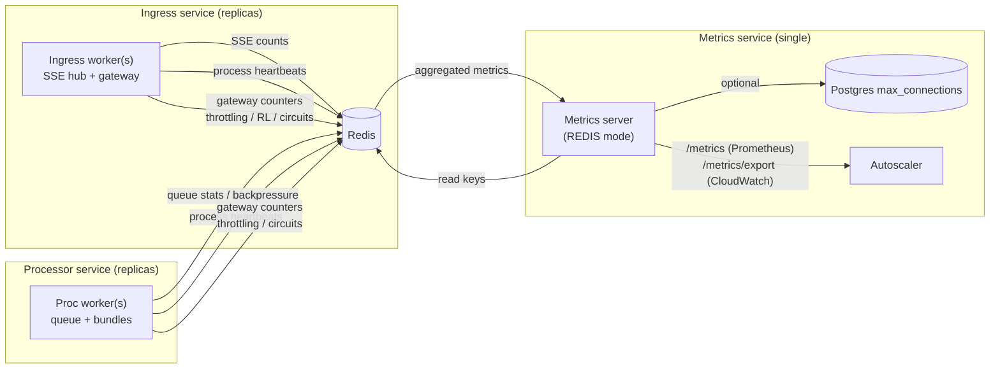

# Metrics & Autoscaling Guide (Ingress + Processor)

This document defines **what to measure** and **how to scale** the chat system in ECS/Kubernetes.
It focuses on two services:

- **Ingress**: SSE/REST entrypoint, session/auth, gateway admission.
- **Processor**: queue workers + bundle execution + integrations REST.

The goal is to scale these **independently** using a small, consistent set of metrics.

---

## 1) Primary metrics endpoint

**Endpoint**

`GET /monitoring/system`

**Auth**

Requires a valid admin session (`auth_without_pressure`).

**What it returns (high‑value fields)**
- `components.ingress.sse` (SSE current + rolling windows)
- `components.proc.queue` (queue depth + pressure windows)
- `components.proc.latency` (queue wait + exec p50/p95/p99 for 1m/15m/1h)
- `components.ingress.latency.rest_ms` (REST p50/p95/p99 for 1m/15m/1h)
- `components.*.pools_aggregate` (Redis/PG pool utilization + max in‑use windows)
- `capacity_transparency` (capacity source + configured vs actual)
- `throttling_windows` (1m/15m/1h 429/503 counts)
- `db_connections` (max_connections + estimated usage)

**Important scopes**

`/monitoring/system` mixes **process‑local** and **tenant/project‑global** data.
Do **not** treat every field as “per instance”.

Scope legend:
- **Tenant/project‑global**: stored in Redis under `tenant:project` keys (all instances combined).
- **Instance‑aggregated**: derived from heartbeats across workers on the same instance.

If you run multiple Uvicorn workers in one task, prefer the **aggregated component stats**
(`components.*`) rather than per‑process signals.

---

## 1.5) Signal flow diagram (instances → Redis → Metrics → Autoscaler)



**What the Metrics server reads from Redis**
- SSE counts per worker (keys under `kdcube:chat:sse:connections:*`)
- Process heartbeats (worker liveness)
- Queue stats and capacity context
- Throttling stats, circuit breaker stats

**What the Autoscaler consumes**
- Ingress: SSE saturation (`global_total_connections / global_max_connections`)
- Processor: queue utilization + wait time + pressure ratio

---

## 2) Metrics table (Ingress)

Ingress is bound by **open SSE streams** and **request bursts**, not by queue processing.

| Metric (JSON path) | Scope | Meaning | Scale‑out signal | Scale‑in signal |
|---|---|---|---|---|
| `components.ingress.sse.total_connections` | Tenant/project‑global | SSE connections (aggregated) | >70% of `max_connections` for 2–5 min | <30% for 10–15 min |
| `components.ingress.sse.windows` | Tenant/project‑global | Rolling SSE windows (1m/15m/1h/max) | Use 1m/15m for scaling | — |
| `components.ingress.latency.rest_ms` | Tenant/project‑global | REST latency percentiles (p50/p95/p99) | p95 > 1–2s sustained | p95 < 500ms |
| `components.ingress.pools_aggregate.utilization_windows` | Tenant/project‑global | Pool utilization windows | >80% sustained = alert | <40% sustained |
| `components.ingress.pools_aggregate.in_use_windows` | Tenant/project‑global | Rolling max in‑use (1h) | Diagnose pool pressure | — |
| `throttling_windows.*` | Tenant/project‑global | 1m/15m/1h 429/503 counts | Alert/diagnostic only | — |

Notes:
- Use the rolling windows for autoscaling signals (1m/15m/1h).
- Pool windows are **aggregated** across workers.

---

## 3) Metrics table (Processor)

Processor is bound by **queue depth** and **queue wait time**.

| Metric (JSON path) | Scope | Meaning | Scale‑out signal | Scale‑in signal |
|---|---|---|---|---|
| `components.proc.queue.windows.pressure_ratio` | Tenant/project‑global | Pressure ratio windows | >0.8 sustained (15m) | <0.4 sustained |
| `components.proc.queue.windows.depth` | Tenant/project‑global | Queue depth windows | Growing for >2–3 min | Stable low |
| `components.proc.latency.queue_wait_ms` | Tenant/project‑global | Queue wait p50/p95/p99 | p95 > 3–5s sustained | p95 < 1s |
| `components.proc.latency.exec_ms` | Tenant/project‑global | Execution time p50/p95/p99 | p95 > threshold for 5m | p95 low |
| `components.proc.pools_aggregate.utilization_windows` | Tenant/project‑global | Redis/PG pool utilization | >80% sustained = alert | <40% sustained |
| `components.proc.pools_aggregate.in_use_windows` | Tenant/project‑global | Rolling max in‑use | Diagnose pool pressure | — |

Notes:
- Processor metrics are **global for the tenant/project**, good autoscaling signals.
- Scaling processor increases **DB/Redis connections**; watch pool in‑use windows.

---

## 4) Autoscaler behavior (recommended)

### Ingress scaling (SSE‑driven)
Use **SSE saturation** (windows) as primary target:

```
sse_saturation = total_connections / max_connections
```

Example policy:
- Scale out when `sse_saturation > 0.7` for 2–5 min (1m/15m window).
- Scale in when `sse_saturation < 0.3` for 10–15 min.

### Processor scaling (queue‑driven)
Use **queue wait + queue pressure**:

Example policy:
- Scale out when `pressure_ratio > 0.7` or `p95 queue_wait > 3s` for 2–5 min.
- Scale in when `queue_utilization < 0.3` and `avg_wait < 1s` for 10–15 min.

---

## 5) ECS vs Kubernetes

### Kubernetes (HPA)
Recommended approach:
1. Scrape `/monitoring/system` with Prometheus.
2. Expose selected fields as custom metrics (Prometheus Adapter).
3. Configure HPA per deployment (ingress and processor).

### ECS (Service Auto Scaling)
Recommended approach:
1. Run a small **metrics poller** (sidecar or scheduled task) that calls `/monitoring/system`.
2. Publish metrics to **CloudWatch** (`PutMetricData`).
3. Use **Target Tracking** or **Step Scaling** for:
   - Ingress: SSE saturation metric.
   - Processor: queue utilization or avg wait time metric.

If you run multiple workers per task, prefer the **component aggregates**
(`components.*`) rather than per‑process signals.

---

## 6) Metric naming (suggested)

When exporting to CloudWatch/Prometheus, use consistent names:

**Ingress**
- `chat.ingress.sse.connections`
- `chat.ingress.sse.saturation`
- `chat.ingress.rest.latency.p95`
- `chat.ingress.throttle.rate_limit_429`
- `chat.ingress.throttle.backpressure_503`

**Processor**
- `chat.proc.queue.total`
- `chat.proc.queue.utilization`
- `chat.proc.queue.wait.p95`
- `chat.proc.exec.p95`
- `chat.proc.throttle.backpressure_503`

---

## 7) Operational caveats

- **Mixed scopes**: `/monitoring/system` includes both process‑local and tenant/project‑global data.
  Use the scope table above to pick autoscaling signals.
- **Per‑process metrics**: for reliable autoscaling, prefer **1 worker per ECS task** and scale tasks.
- **Redis / Postgres headroom**: scaling up tasks increases total connections.
  Track `db_connections` and `components.*.pools_aggregate` to avoid exhausting limits.
- **Component config**: each service uses `GATEWAY_COMPONENT` to select its config slice.

---

## 8) Related docs

- Gateway config: `docs/service/gateway-README.md`
- Monitoring UI: `docs/service/README-monitoring-observability.md`
- Connection pooling: `docs/service/maintenance/connection-pooling-README.md`
- Instance config: `docs/service/maintenance/instance-config-README.md`

---

## 9) Metrics service (aggregator)

We provide a **Metrics service** that aggregates ingress + processor metrics and can
push them to CloudWatch / Prometheus.

**Service**
- Module: `kdcube_ai_app.apps.metrics.web_app`
- Port: `METRICS_PORT` (default `8090`)

**Endpoints**
- `GET /metrics/ingress/system`
- `GET /metrics/proc/system`
- `GET /metrics/combined`
- `GET /metrics/export` (manual export trigger)
- `GET /metrics` (Prometheus scrape endpoint)

**Scheduler**
Set `METRICS_SCHEDULER_ENABLED=1` to run periodic export.

**Env (summary)**
- `METRICS_INGRESS_BASE_URL`, `METRICS_PROC_BASE_URL`
- `METRICS_AUTH_HEADER_NAME`, `METRICS_AUTH_HEADER_VALUE`
- `METRICS_EXPORT_INTERVAL_SEC`, `METRICS_EXPORT_ON_START`
- `METRICS_RUN_ONCE` (run exporter once and exit)
- `METRICS_EXPORT_CLOUDWATCH`, `METRICS_CLOUDWATCH_NAMESPACE`
- `METRICS_EXPORT_PROMETHEUS_PUSH`, `METRICS_PROM_PUSHGATEWAY_URL`
- `METRICS_PROM_SCRAPE_TTL_SEC` (cache TTL for `/metrics`)
- `METRICS_MAPPING_JSON` (optional name/unit mapping)

Sample env files:
- `deployment/docker/devenv/sample_env/.env.metrics`
- `deployment/docker/all_in_one/sample_env/.env.metrics`

Sample ECS task definitions:
- `deployment/ecs/metrics/metrics-task-definition.json`
- `deployment/ecs/metrics/metrics-scheduled-task.json`
- `deployment/ecs/metrics/metrics-eventbridge-rule.json`
- `deployment/ecs/metrics/metrics-eventbridge-targets.json`

See also:
- `docs/service/scale/metric-server-README.md` (full metrics server guide)

**Metric name mapping (optional)**

You can map internal metric keys to CloudWatch/Prometheus names (and units):

```json
{
  "ingress.sse.total_connections": { "name": "Ingress/SSEConnections", "unit": "Count" },
  "proc.queue.utilization_percent": { "name": "Processor/QueueUtilization", "unit": "Percent" }
}
```

Set via:

```
METRICS_MAPPING_JSON='{"ingress.sse.total_connections":{"name":"Ingress/SSEConnections","unit":"Count"}}'
```

If a mapping is not provided, defaults are used (`name` is derived from the key).
