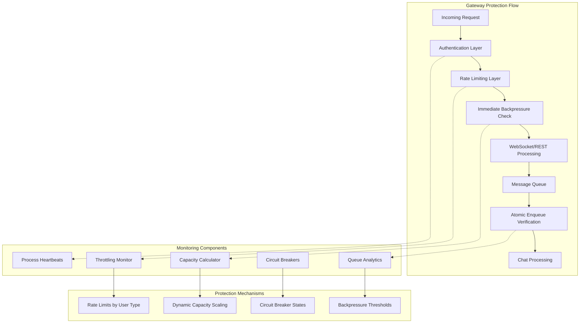

# Gateway Monitoring & Observability Guide

This guide covers the comprehensive monitoring and observability system for the **multi-layered security and capacity management gateway** that protects your chat service infrastructure.

## 🏗️ Architecture Overview

The monitoring system provides real-time visibility into a **dual-level backpressure protection** architecture with both immediate gateway checks and atomic enqueue-time verification.



## 🔄 Dual-Level Backpressure Protection

### Level 1: Immediate Gateway Check
- **When**: Right after authentication/authorization in the gateway
- **Purpose**: Fast rejection to prevent unnecessary processing
- **Scope**: REST endpoints (`/landing/chat`) and WebSocket handlers (`/socket.io/chat`)
- **Implementation**: `AtomicBackpressureManager.check_capacity()`

### Level 2: Atomic Enqueue Verification
- **When**: During actual task enqueueing (the "by fact" check)
- **Purpose**: Ensure queue capacity hasn't changed between gateway check and enqueue
- **Scope**: Both REST and WebSocket - any actual chat task creation
- **Implementation**: `AtomicChatQueueManager.enqueue_chat_task_atomic()`

## 📊 Monitoring Endpoints

### System Status Monitoring

#### GET `/monitoring/system`
**Auth Required**: Super-admin only

Returns comprehensive system status including:

```json
{
  "instances": {
    "instance-id": {
      "chat_rest": {
        "processes": 1,
        "actual_processes": 1, 
        "healthy_processes": 1,
        "load": 2,
        "capacity": 5,
        "health": "healthy",
        "is_chat_rest": true
      },
      "kb_rest": {
        "processes": 1,
        "health": "healthy",
        "is_chat_rest": false
      }
    }
  },
  "global_stats": {
    "chat_rest": {
      "expected": 1,
      "actual": 1, 
      "healthy": 1,
      "load": 2,
      "capacity": 5,
      "utilization_percent": 40.0
    }
  },
  "enhanced_queue_stats": {
    "total_queue": 15,
    "weighted_max_capacity": 100,
    "pressure_ratio": 0.15,
    "accepting_anonymous": true,
    "accepting_registered": true,
    "accepting_privileged": true
  },
  "throttling_by_period": {
    "1h": {
      "total_throttled": 25,
      "throttle_rate": 5.2,
      "rate_limit_429": 15,
      "backpressure_503": 10
    },
    "24h": {
      "total_throttled": 450,
      "throttle_rate": 3.8
    }
  },
  "capacity_transparency": {
    "capacity_metrics": {
      "configuration": {
        "configured_concurrent_per_process": 5,
        "configured_processes_per_instance": 1,
        "capacity_buffer_percent": 20.0
      },
      "actual_runtime": {
        "actual_healthy_processes_per_instance": 1,
        "actual_total_capacity_per_instance": 14
      },
      "health_metrics": {
        "process_health_ratio": 1.0,
        "processes_vs_configured": {
          "process_deficit": 0
        }
      }
    }
  },
  "circuit_breakers": {
    "summary": {
      "total_circuits": 3,
      "open_circuits": 0,
      "closed_circuits": 3
    },
    "circuits": {
      "backpressure": {
        "state": "closed",
        "failure_count": 2,
        "current_window_failures": 0
      }
    }
  }
}
```

### Circuit Breaker Management

#### GET `/admin/circuit-breakers`
**Auth Required**: Super-admin only

Returns circuit breaker status:

```json
{
  "summary": {
    "total_circuits": 3,
    "open_circuits": 0,
    "half_open_circuits": 0,
    "closed_circuits": 3
  },
  "circuits": {
    "authentication": {
      "state": "closed",
      "failure_count": 0,
      "total_requests": 1250,
      "current_window_failures": 0
    },
    "rate_limiter": {
      "state": "closed", 
      "failure_count": 3,
      "consecutive_failures": 0
    },
    "backpressure": {
      "state": "closed",
      "failure_count": 12,
      "opened_at": null
    }
  }
}
```

#### POST `/admin/circuit-breakers/{circuit_name}/reset`
**Auth Required**: Super-admin only

Manually reset a circuit breaker to CLOSED state.

### Configuration Management

#### POST `/admin/gateway/validate-config`
**Auth Required**: Super-admin only

Validate proposed configuration changes:

```json
{
  "concurrent_per_process": 8,
  "capacity_buffer": 0.15,
  "anonymous_threshold": 0.5
}
```

#### POST `/admin/gateway/update-config`
**Auth Required**: Super-admin only

Apply validated configuration changes with automatic capacity recalculation.

### Debug Endpoints

#### GET `/debug/capacity-calculation`
**Auth Required**: Super-admin only

Detailed capacity calculation breakdown:

```json
{
  "configuration": {
    "concurrent_per_process": 5,
    "processes_per_instance": 1,
    "capacity_buffer": 0.2
  },
  "actual_processes": {
    "instances_found": ["home-instance-1"],
    "processes_per_instance": {
      "home-instance-1": [{
        "service_type": "chat",
        "service_name": "rest", 
        "healthy_processes": 1,
        "is_chat_rest": true
      }]
    }
  },
  "calculations_breakdown": {
    "step_1_config": "5 concurrent per process",
    "step_2_processes": "1 healthy chat REST processes",
    "step_3_total_concurrent": "5 total concurrent capacity",
    "step_4_effective": "4 effective (after 20% buffer)",
    "step_5_queue": "10 queue capacity (2x multiplier)",
    "step_6_total_per_instance": "14 total capacity per instance",
    "step_7_instances": "1 instances detected",
    "step_8_system_total": "14 total system capacity"
  }
}
```

## 🎯 Key Monitoring Concepts

### Process-Aware Capacity Calculation

The system automatically detects and uses **actual running chat REST processes** for capacity calculations:

```python
# Capacity based on actual healthy CHAT REST processes only
healthy_chat_processes = count_healthy_processes(service_type="chat", service_name="rest")
actual_capacity = healthy_processes * concurrent_per_process * capacity_calculation

# Handles process failures gracefully:
# 3 processes configured, 2 healthy = capacity based on 2
# 1 process down = automatic capacity reduction
```

### Dynamic Thresholds

Thresholds automatically scale with actual capacity:

```python
# Dynamic thresholds based on actual capacity
anonymous_threshold = total_capacity * 0.6    # 60%
registered_threshold = total_capacity * 0.8   # 80%  
hard_limit = total_capacity * 0.95           # 95%

# More processes = higher thresholds
# Fewer processes = lower thresholds
```

### User Type Prioritization

The system provides different service levels:

- **Anonymous**: Strict limits, lowest priority (blocked at 60% capacity)
- **Registered**: Higher limits, medium priority (blocked at 80% capacity)
- **Privileged**: Highest limits, top priority, can bypass throttling on admin endpoints

### WebSocket vs REST Equivalence

| Feature | REST Endpoint | WebSocket Handler |
|---------|---------------|-------------------|
| Authentication | ✅ Gateway check | ✅ Gateway check at connect |
| Rate Limiting | ✅ Per request | ✅ Per message |
| Immediate Backpressure | ✅ Gateway level | ✅ Gateway level |
| Atomic Enqueue | ✅ "By fact" check | ✅ "By fact" check |
| Circuit Breakers | ✅ All types | ✅ All types |

## 🚨 Circuit Breaker Philosophy

Circuit breakers protect against **system failures**, not policy enforcement:

```python
# ✅ Should trigger circuit breaker:
- Database connection failures
- Service timeouts  
- 500 internal server errors
- Authentication service down
- Backpressure rejections (system overload)
- Atomic enqueue failures

# ❌ Should NOT trigger circuit breaker:
- 429 Rate limiting (POLICY enforcement)
- 401/403 Auth errors (POLICY enforcement)
```

### Enhanced Backpressure Circuit Breaker
- **Queue-Aware Recovery**: Considers actual queue pressure for faster recovery
- **Dual-Level Integration**: Responds to both gateway-level and enqueue-level rejections
- **Graceful Degradation**: Fast circuit opening under sustained pressure
- **Intelligent Recovery**: Faster recovery when queue pressure decreases

## 📈 Real-Time Metrics

### Process Health Tracking
- **Live Process Detection**: Automatic discovery of chat REST processes via heartbeats
- **Health Status**: HEALTHY, DEGRADED, UNHEALTHY, STALE
- **Load Monitoring**: Current load vs max capacity per process
- **Capacity Scaling**: Total system capacity based on healthy processes

### Queue Pressure Monitoring
- **Real-Time Capacity**: Dynamic calculation based on actual running processes
- **Pressure Ratios**: Current queue size vs total capacity
- **User Type Blocking**: Which user types are currently being throttled
- **Throughput Metrics**: Requests processed per hour by user type

### Throttling Analytics
- **Multi-Period Stats**: 1h, 3h, 6h, 12h, 24h time windows
- **Throttle Rates**: Percentage of requests being throttled
- **Reason Breakdown**: Rate limiting vs backpressure rejections
- **Top Sessions**: Most throttled sessions for abuse detection

### Capacity Transparency
- **Configured vs Actual**: Shows expected vs detected process counts
- **Dynamic Thresholds**: Live calculation of pressure thresholds
- **Health Ratios**: Process health and capacity utilization metrics
- **Performance Warnings**: Automatic detection of capacity issues

## 🔧 Configuration Profiles

### Development Profile
- Permissive settings, higher limits
- More detailed logging
- Lower circuit breaker thresholds

### Production Profile
- Conservative settings, enhanced protection
- Stricter thresholds
- Faster circuit breaker activation

### Load Test Profile
- High capacity settings
- Detailed monitoring
- Enhanced analytics collection

## ⚠️ Alert Conditions

### Critical Alerts
- Circuit breakers opening
- No healthy chat REST processes detected
- System capacity utilization > 90%
- Throttle rate > 20% for extended periods

### Warning Alerts
- Process health ratio < 80%
- Queue pressure ratio > 80%
- Throttle rate > 10%
- Process deficit (missing expected processes)

### Info Alerts
- Configuration changes applied
- Circuit breaker state transitions
- Significant load changes

## 🔍 Troubleshooting

### High Throttling Rates
1. Check process health in `/monitoring/system`
2. Verify expected vs actual process counts
3. Review capacity configuration in `/debug/capacity-calculation`
4. Check circuit breaker states

### Capacity Issues
1. Review `capacity_transparency` data
2. Check for process deficits
3. Validate environment variables in `/debug/environment`
4. Monitor queue pressure trends

### Circuit Breaker Opening
1. Check recent throttling events
2. Review system load patterns
3. Validate underlying service health
4. Consider capacity adjustments

This monitoring system provides **observability** while ensuring **consistent protection** across all entry points 
(REST and WebSocket) with **real-time adaptation** to actual system capacity.