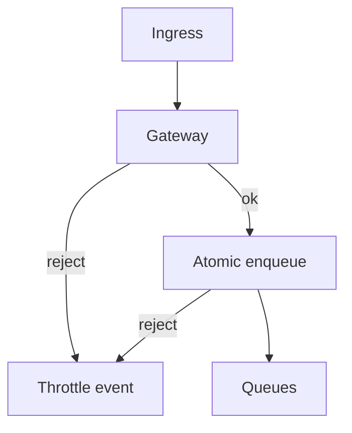
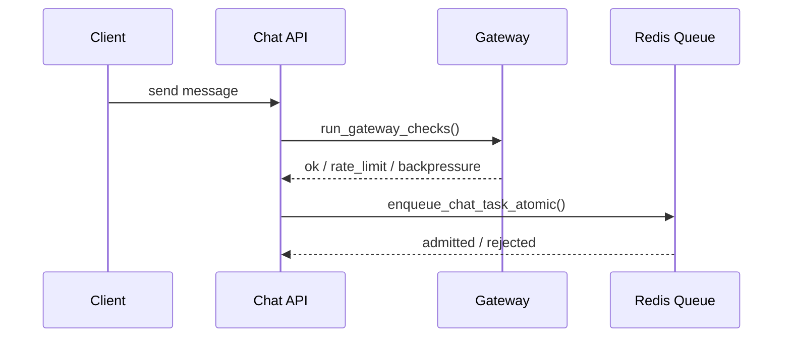

# Monitoring & Observability (Gateway / Chat)

This document describes the **current monitoring endpoints** for the gateway and chat ingress.
It reflects the actual behavior in code (SSE/Socket.IO are gated; REST is session‑only by default).

---

## 1) What is monitored

- **Gateway admission**: rate limiting + backpressure
- **Queue pressure**: per user type queue sizes + thresholds
- **Process health**: heartbeat‑based detection of active chat processes
- **Circuit breakers**: auth/rate/backpressure failure states
- **Throttling analytics**: recent throttle events and per‑period summaries

Reference: [gateway-README.md](../../../infra/gateway/gateway-README.md)

---

## 2) Current enforcement scope

- **SSE / Socket.IO chat ingress** → full gateway checks + atomic enqueue
- **REST APIs** → session resolution by default, with **guarded heavy endpoints gated** via policy

If you want REST to be gated, update the policy in:
- [gateway_policy.py](../../middleware/gateway_policy.py)

---

## 3) Endpoints

### System status
`GET /monitoring/system`

Returns gateway status + queue pressure + capacity transparency. Used by admin UI.

### Circuit breakers
- `GET /admin/circuit-breakers`
- `POST /admin/circuit-breakers/{circuit_name}/reset`

### Gateway config
- `POST /admin/gateway/validate-config`
- `POST /admin/gateway/update-config`

### Debug
- `GET /debug/capacity-calculation`
- `GET /debug/environment`

See implementation: [monitoring.py](./monitoring.py)

---

## 4) Admission flow (SSE/Socket.IO)

---

## 5) Key files

- Gateway middleware: [web_app.py](../web_app.py)
- Gateway policy: [gateway_policy.py](../../middleware/gateway_policy.py)
- Gateway core: [infra/gateway](../../../infra/gateway/gateway.py)
- Backpressure + queue: [backpressure.py](../../../infra/gateway/backpressure.py)
- SSE transport: [sse/chat.py](../sse/chat.py)
- Socket.IO transport: [socketio/chat.py](../socketio/chat.py)

---

## 6) Notes

- Queue names are tenant/project‑scoped and stored in Redis.
- Throttling stats are calculated per user type (anonymous/registered/privileged).
- Circuit breakers are for **system failures**, not policy errors (429/401/403).
- `/admin/gateway/update-config` persists config in Redis and publishes update events.
- `/admin/gateway/reset-config` resets the tenant/project config to env defaults and publishes update events.
  Use `{"dry_run": true}` to preview the env defaults without writing.
- Each service instance applies **only its own tenant/project config** (from env),
  but can publish updates for other tenants/projects via the admin API.
- Update payload uses **role‑based rate limits** (see gateway README for schema).
