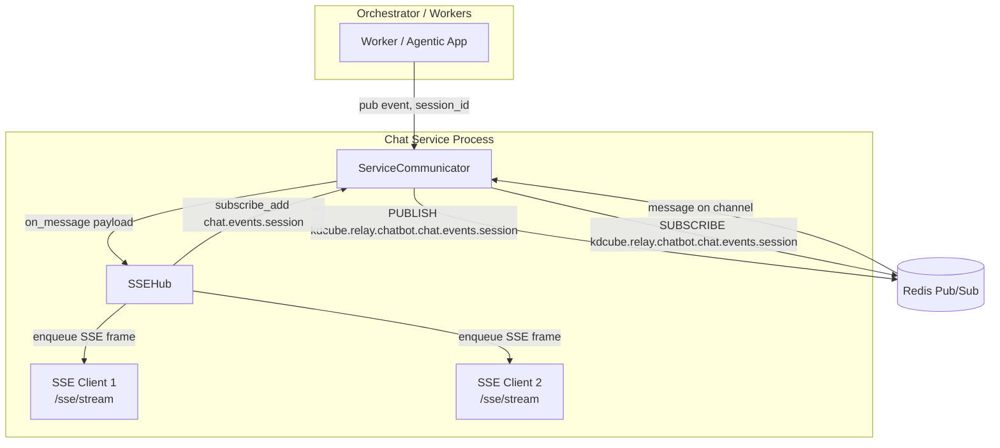
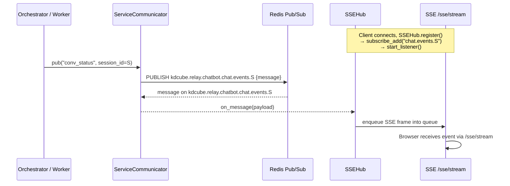

# Redis-based Chat Relay & SSE Fan-Out

This document describes the architecture of the **chat relay** in the KDCube AI App, specifically:

* How **Redis Pub/Sub** is used as a relay between orchestrators/workers and the web app.
* How the **SSE hub** dynamically subscribes to per-session channels.
* The problems we were fighting (high traffic, wrong subscription semantics, sync I/O).
* What did **not** work and what the final working design looks like.

---

## Goals & Problems We Were Fighting

### 1. Too much traffic on shared channels

Originally, chat events were published to a **small set of shared channels** (e.g. `kdcube_orchestrator_dramatiq` or a handful of fixed channels). This caused:

* Every web process that subscribed had to receive **events for all sessions**.
* Each process then had to **filter in-process** by `session_id` and ignore ~99% of messages.
* With many sessions, this becomes noisy: unnecessary Redis traffic and extra CPU.

We wanted:

* Per-session routing on Redis, so each process only receives the events it actually needs to deliver.
* The ability to **shard** channels by session without changing orchestrator logic too much.

### 2. Need for fully async I/O

The platform requirement: **no sync I/O** in the hot path.

* We had a **sync Redis client** for publishing, while subscription was async via `redis.asyncio`.
* This was inconsistent and could block the event loop or at least be conceptually wrong for our platform.

We changed to **async publish** via `redis.asyncio.Redis` as well.

### 3. Dynamic subscriptions that actually work

We wanted dynamic subscriptions:

* When the first client of a session connects:

    * Subscribe to `chat.events.<session_id>` on Redis.
* When the last client of that session disconnects:

    * Unsubscribe from that channel.

This should avoid subscribing to channels for sessions that have no active SSE clients.

The subtle bug we hit:

* We started the listener **before any real `SUBSCRIBE`** happened, using `subscribe_add([])` as a “warm-up”.
* `redis.asyncio` requires that `subscribe()` / `psubscribe()` be called **before** you start consuming messages.
* This led to:
  `pubsub connection not set: did you forget to call subscribe() or psubscribe()?`

The fix was to **start the listener only after the first real subscription**.

---

## Key Components

### `ServiceCommunicator`

File: `kdcube_ai_app/infra/orchestration/app/communicator.py`

Responsibilities:

* Unified **Redis Pub/Sub helper**.
* Async **publisher** API: `pub()`.
* Async **subscriber** API: `subscribe()`, `subscribe_add()`, `unsubscribe_some()`.
* Single **listener task** per process: `start_listener(on_message)`.

Channel naming:

* Orchestrator identity prefix, e.g. `kdcube.relay.chatbot`.
* Logical channel names like `chat.events` or `chat.events.<session_id>`.
* Final Redis channel:

  ```text
  <orchestrator_identity>.<logical_channel>
  # e.g. kdcube.relay.chatbot.chat.events.6d88a4fb-...
  ```

Publish (simplified):

```python
async def pub(self, event, target_sid, data, channel="chat.events", session_id=None):
    message = {
        "target_sid": target_sid,
        "session_id": session_id,
        "event": event,
        "data": data,
        "timestamp": time.time(),
    }

    logical_channel = channel
    if session_id and channel == "chat.events":
        logical_channel = f"{channel}.{session_id}"

    full_channel = self._fmt_channel(logical_channel)
    await self._ensure_async()
    payload = json.dumps(message, ensure_ascii=False)
    await self._aioredis.publish(full_channel, payload)
```

Subscribe / dynamic add:

```python
async def subscribe_add(self, channels, *, pattern=False):
    await self._ensure_async()
    if self._pubsub is None:
        self._pubsub = self._aioredis.pubsub()

    if isinstance(channels, str):
        channels = [channels]

    formatted = [self._fmt_channel(ch) for ch in channels]
    new_channels = [ch for ch in formatted if ch not in self._subscribed_channels]
    if not new_channels:
        return

    self._subscribed_channels.extend(new_channels)

    if pattern:
        await self._pubsub.psubscribe(*new_channels)
    else:
        await self._pubsub.subscribe(*new_channels)
```

Listener:

```python
async def start_listener(self, on_message: Callable[[dict], Any]):
    if not self._pubsub:
        raise RuntimeError("Call subscribe() before start_listener().")

    async def _loop():
        try:
            async for payload in self.listen():
                res = on_message(payload)
                if asyncio.iscoroutine(res):
                    await res
        except asyncio.CancelledError:
            raise
        except Exception as e:
            logger.error("[ServiceCommunicator] listener error: %s", e)

    if self._listen_task and not self._listen_task.done():
        return

    self._listen_task = asyncio.create_task(_loop(), name="service-communicator-listener")
```

> **Important invariant**
> `start_listener()` must be called **after** at least one `subscribe()` / `subscribe_add()` that actually calls Redis `SUBSCRIBE` or `PSUBSCRIBE`.

---

### `SSEHub` – Redis → SSE fan-out

File: `kdcube_ai_app/apps/chat/api/sse/chat.py` (inside `SSEHub` class)

Responsibilities:

* Maintain an in-process map of active SSE clients per `session_id`.
* Dynamically subscribe to Redis channels when the first client for a session arrives.
* Unsubscribe when the last client for that session disconnects.
* Receive messages from `ServiceCommunicator` and fan them out as SSE frames.

Per-client structure:

```python
@dataclass(frozen=True)
class Client:
    session_id: str
    stream_id: Optional[str]      # for DM/targeted messages
    queue: asyncio.Queue[str]     # SSE frames queue
```

Register logic (key part):

```python
async def register(self, client: Client):
    async with self._lock:
        lst = self._by_session.setdefault(client.session_id, [])
        was_empty = not lst
        lst.append(client)

    if was_empty:
        # First client for this session → subscribe + start listener
        session_ch = f"chat.events.{client.session_id}"
        await self.chat_comm._comm.subscribe_add(session_ch)
        logger.info("[SSEHub] subscribe for session=%s channel=%s", client.session_id, session_ch)

        # Ensure listener is running (safe to call multiple times)
        await self.chat_comm._comm.start_listener(self._on_relay)

    logger.info(
        "[SSEHub] register session=%s total=%d",
        client.session_id,
        len(self._by_session[client.session_id]),
    )
```

Unregister logic:

* When the last client for a session is removed, we compute `remove_channel = "chat.events.<session>"`.
* Call `unsubscribe_some(remove_channel)` on the communicator.
* That removes the channel from `_subscribed_channels` and calls `UNSUBSCRIBE` / `PUNSUBSCRIBE`.

Relay callback:

```python
async def _on_relay(self, message: dict):
    # message = { event, data, target_sid?, session_id? }
    event = message.get("event")
    data = message.get("data") or {}
    target_sid = message.get("target_sid")
    room = message.get("session_id")

    if not event or not room:
        return

    async with self._lock:
        recipients = list(self._by_session.get(room, []))

    if not recipients:
        return

    frame = _sse_frame(event, data, event_id=str(uuid.uuid4()))

    if target_sid:
        for c in recipients:
            if c.stream_id and c.stream_id == target_sid:
                self._enqueue(c, frame)
    else:
        for c in recipients:
            self._enqueue(c, frame)
```

---

### SSE `/sse/stream` endpoint

For each HTTP SSE connection:

* Resolve/validate `UserSession`.
* Create a bounded `asyncio.Queue[str]`.
* Wrap it in a `Client(session_id, stream_id, queue)`.
* Call `app.state.sse_hub.register(client)`.
* Return a `StreamingResponse` whose generator:

    * Sends initial `ready` event.
    * Then loops:

        * `frame = await asyncio.wait_for(q.get(), timeout=KEEPALIVE_SECONDS)`
        * On timeout, send `: keepalive`.

When the request is cancelled / disconnected, we call:

```python
await app.state.sse_hub.unregister(client)
```

---

## End-to-End Flow

### Mermaid architecture diagram



### Sequence diagram for one event



---

## What Did Not Work & Why

### 1. Starting the listener before subscribing

**Broken pattern:**

```python
# Old SSEHub.start()
await self.chat_comm._comm.subscribe_add([])   # "ensure _pubsub exists"
await self.chat_comm._comm.start_listener(self._on_relay)
```

* `subscribe_add([])` does **not** call `SUBSCRIBE` / `PSUBSCRIBE`.
* `self._pubsub` existed but had **no underlying connection** bound.
* When `listen()` was called, `redis.asyncio` raised:

  > `pubsub connection not set: did you forget to call subscribe() or psubscribe()?`

So the listener never received messages, not even `subscribe` control frames.

**Fix:**

* Remove the `subscribe_add([])` warm-up call.
* Call `subscribe_add(session_ch)` in `SSEHub.register()` when the first client for a session arrives.
* Only then call `start_listener()` (idempotent; safe if already running).

### 2. Single shared channel for all events

Earlier design relied on a small number of shared channels, something like:

```text
kdcube.relay.chatbot.chat.events
```

And every event for every session went there.

Problems:

* Every chat process receives all events.
* SSEHub has to inspect `session_id` for every message and drop most of them.
* This is inefficient at large scale.

**Improved design:**

* Shard by session:

  ```text
  chat.events.<session_id>
  → kdcube.relay.chatbot.chat.events.<session_id>
  ```

* Each process only subscribes to the channels for sessions it actually serves.

* When no client is listening for a session, we unsubscribe and stop receiving events.

---

## Why Dynamic Subscriptions Make Sense Here

* **High number of sessions:** we can’t afford a static subscription to thousands of per-session channels on every process.
* **SSE is already session-scoped:** one SSE connection is tightly bound to a `session_id`. It’s natural to tie Redis subscriptions to that.
* **Dynamic lifecycle:** sessions come and go; we subscribe on demand and clean up automatically when the last tab closes.

We still keep a **single listener task per process**:

* Simplifies error handling.
* Avoids spawning one listener task per channel.
* Pub/Sub is designed to handle multiple channels on a single connection.

Dynamic subscription + single listener + in-process fan-out gives:

* Low Redis chatter.
* Good isolation per session.
* Simple delivery to many browser tabs in the same session.

---

## Summary

* We use **Redis Pub/Sub** as a relay between orchestrator/workers and the web app.
* `ServiceCommunicator` provides async publish + dynamic subscribe APIs and a single background listener task.
* `SSEHub` maintains per-session client lists, performs **dynamic per-session subscriptions**, and fans out messages to SSE clients.
* The main bug we hit was starting the listener before any real `SUBSCRIBE`, which led to `pubsub connection not set` and no messages delivered.
* The working pattern is:

    * Subscribe to at least one channel.
    * Then start the listener.
    * Dynamically add/remove channels as sessions appear/disappear.
