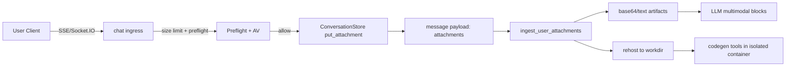
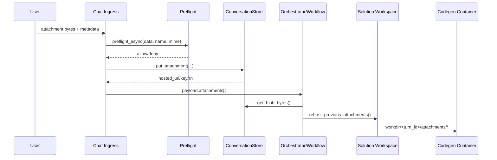

# Attachments System

## 1) Architecture overview

Attachments enter the system via the chat API (SSE or Socket.IO), are stored
in the ConversationStore, and then used in two downstream paths: multimodal
LLM inference (base64 blocks) and code-generated execution (rehosted files).

Key components:
- Ingress: `kdcube_ai_app/apps/chat/api/sse/chat.py`, `kdcube_ai_app/apps/chat/api/socketio/chat.py`
- Storage: `kdcube_ai_app/apps/chat/sdk/storage/conversation_store.py`
- Preflight/AV: `kdcube_ai_app/infra/gateway/safe_preflight.py`
- Attachment ingestion and conversion: `kdcube_ai_app/apps/chat/sdk/runtime/user_inputs.py`
- Multimodal message composition: `kdcube_ai_app/apps/chat/sdk/context/retrieval/documenting.py`
- Rehosting to execution workspace: `kdcube_ai_app/apps/chat/sdk/runtime/solution/solution_workspace.py`
- Codegen runtime usage: `kdcube_ai_app/apps/chat/sdk/runtime/solution/react/react.py`



## 2) Attachment handling in our system

### 2.1 Ingress and hosting

When a user submits attachments:
- SSE: `kdcube_ai_app/apps/chat/api/sse/chat.py`
- Socket.IO: `kdcube_ai_app/apps/chat/api/socketio/chat.py`

Both flows:
1) Collect raw bytes + metadata (filename, mime).
2) Enforce size limit (`CHAT_MAX_UPLOAD_MB`, default 20 MB).
3) Run `safe_preflight.preflight_async(...)` when `APP_AV_SCAN=1`.
4) If allowed, store via `ConversationStore.put_attachment(...)`.
5) Emit attachment metadata into the message payload.

### 2.2 Multimodal LLM usage (base64 artifacts)

In the workflow (`kdcube_ai_app/apps/custom_apps/codegen/orchestrator/workflow.py`):
- Attachments are retrieved from storage and converted by
  `ingest_user_attachments(...)` in `kdcube_ai_app/apps/chat/sdk/runtime/user_inputs.py`.
- The function resolves mime, optionally extracts text, and adds base64 only for
  supported mimes:
  - Images: `image/jpeg`, `image/png`, `image/gif`, `image/webp`
  - Docs: `application/pdf`
- Base64 payloads are size-limited (`MODALITY_MAX_IMAGE_BYTES`, `_SUMMARY_MAX_DOC_BYTES`).

When composing messages, `_messages_with_context(...)` in
`kdcube_ai_app/apps/chat/sdk/context/retrieval/documenting.py` uses
`attachment_blocks(...)` to create multimodal content blocks for LLMs.
These appear in tools such as `llm_tools.py` and the React toolchain.

### 2.3 Rehosting for code-generated execution

For code-generated programs, attachments are rehosted into the execution
workspace so generated code can read them as files:
- `kdcube_ai_app/apps/chat/sdk/runtime/solution/react/react.py`
- `kdcube_ai_app/apps/chat/sdk/runtime/solution/solution_workspace.py`

Rehosted structure:
```
workdir/
  <turn_id>/attachments/<filename>
```

Execution runs in a containerized environment (no network, workdir-only access),
so attachments are accessible as local files for program logic.



## 3) Security implications and defense level

### 3.1 Current defenses (ingress)

When `APP_AV_SCAN=1` (default, and always enabled in prod):
- **AV scan (ClamAV)** is run before storage.
- **Preflight validation** enforces:
  - **Type allowlist** via mime sniffing and filename fallback. Unknown types are denied.
  - **PDF heuristics** (max updates, object counts, pages, stream length hints).
  - **ZIP/OOXML checks** (max files, max expansion, compression ratio, no nested archives).
  - **Macro blocking** for OOXML (`.docm`, `.pptm`, VBA projects disallowed).
  - **Macro-free policy:** any macro-enabled OOXML is rejected at ingress.
  - **Generic ZIP archives** are disallowed by policy (`allow_zip=False`).
  - **Text size** limits for `text/*`.
  - **Allowed attachment types (stored if they pass checks):**
    - `application/pdf`
    - `application/vnd.openxmlformats-officedocument.wordprocessingml.document` (docx)
    - `application/vnd.openxmlformats-officedocument.presentationml.presentation` (pptx)
    - `application/vnd.openxmlformats-officedocument.spreadsheetml.sheet` (xlsx)
    - `image/jpeg`, `image/png`, `image/gif`, `image/webp`
    - `text/*` (subject to size limit)

Additional safeguards:
- Size limit at ingress (`CHAT_MAX_UPLOAD_MB`).
- Base64 only for whitelisted mime types and size caps.

### 3.2 Gaps and implications (even with preflight ON)

With `APP_AV_SCAN=1`, the following risks remain:
- **Zero-day or obfuscated malware** can bypass AV and heuristic checks.
- **Parser/renderer vulnerabilities** in supported formats (e.g., PDFs/images)
  remain possible if any downstream consumer is vulnerable.
- **MIME spoofing** is mitigated but not eliminated; we rely on magic sniffing
  and filename as a fallback.
- **Rehosting does not re-scan**; attachments are trusted once stored in the bucket.

### 3.3 Net effect (defense level)

- With `APP_AV_SCAN=1`: moderate defense (AV + structural checks + type allowlist).
- With `APP_AV_SCAN=0`: minimal defense (size limit only).
