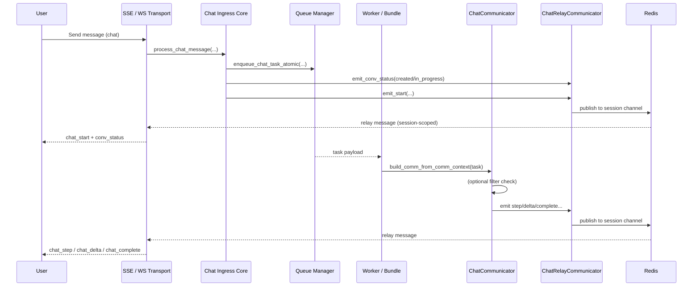
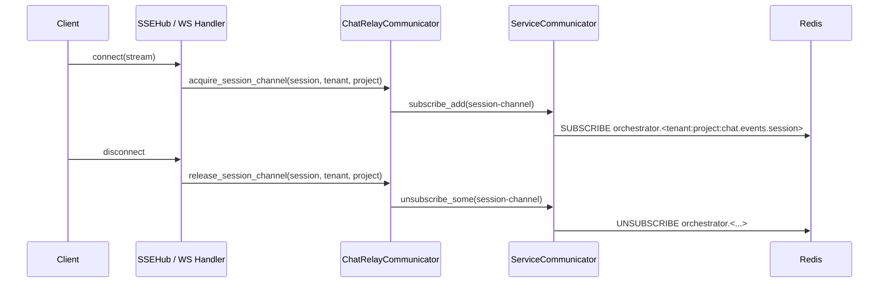

# Communication Subsystem Architecture

This README describes the **communication subsystem** that delivers **async server events** from chat scenarios/bundles to connected clients via **Redis Pub/Sub**, **SSE**, and **WebSocket**.

The design goal is:

* **low fan-out cost**
* **per-session isolation**
* **transport-agnostic producers**
* **policy-driven delivery**
* **minimal useless Pub/Sub traffic**

---

## High-level picture

Comm stack is a three-layer pipeline:

1. **Service relay** — raw Redis Pub/Sub abstraction
2. **Chat relay** — session-aware channeling and subscription orchestration
3. **Chat communicator** — producer-friendly envelope + filtering + delta sniffing

Transports (SSE / Socket.IO) hook into the chat relay to dynamically subscribe/unsubscribe **per connected user session**.

---

## Components and responsibilities

### 1) Service Relay — `ServiceCommunicator`

**What it abstracts**

* A unified Redis Pub/Sub interface with:

    * publishing (`pub`)
    * incremental subscribe/unsubscribe (`subscribe_add`, `unsubscribe_some`)
    * listener lifecycle (`start_listener`, `stop_listener`)
* Automatic **identity prefixing** to keep producers and consumers aligned:

    * `orchestrator_identity.<logical_channel>`

**What it captures**

* A consistent wire message schema:

  ```json
  {
    "target_sid": "optional exact connection id",
    "session_id": "room / user session",
    "event": "socket-level event name",
    "data": { "envelope payload" },
    "timestamp": 1730000000.0
  }
  ```

**Why it exists**

* Separate infrastructure concerns from chat semantics.
* Allow other subsystems to reuse the same relay pattern.

---

### 2) Chat Relay — `ChatRelayCommunicator`

**What it wires**

* A chat-specific adapter on top of `ServiceCommunicator`.

**Core responsibilities**

* **Dynamic session subscriptions** (with refcounting).
* **Tenant/project-aware channel naming**.
* **Fan-out into transport callbacks** (SSE hub, WS handler).
* **Single publishing entry** for standard chat envelope types.

**What it captures**

* The session-scoped channel:

    * Base channel optionally namespaced:

        * `"{tenant}:{project}:{channel}"`
    * Final channel shards by session:

        * `"{tenant}:{project}:chat.events.{session_id}"`

**Why this matters**

* It prevents every transport worker from subscribing to a global firehose.
* The Pub/Sub traffic becomes proportional to *active sessions*, not *total system volume*.

---

### 3) Chat Communicator — `ChatCommunicator`

**What it abstracts**

* The **producer API** used by bundles/scenarios.
* A consistent envelope builder tied to:

    * `service` context
    * `conversation` context
* A single choke point for:

    * route selection
    * filters
    * delta sniffing/recording

**Core responsibilities**

* Build and emit standard envelopes:

    * `start`, `step`, `delta`, `complete`, `error`
* Provide a generic typed event API:

    * `event(...)`
* **Record deltas** into an internal cache:

    * `get_delta_aggregates`, `export_delta_cache`, etc.
* Apply **policy filters** (optional):

    * `IEventFilter.allow_event(...)`

---

## Where filters live and what they see

Filters are evaluated **inside `ChatCommunicator.emit()`**, before the event is published to Redis.

They receive:

* `user_type`, `user_id`
* derived `EventFilterInput` (from payload + socket event):

    * `type`
    * `route`
    * `socket_event`
    * `agent`
    * `step`
    * `status`
    * `broadcast`

Key detail:

* `route_key = route OR socket_event`

This means:

* Typed events carried via `chat_step` transport can still be distinguished if `route` is explicitly provided in the envelope.

---

## Dynamic per-session subscription lifecycle

The system subscribes to Redis **only when at least one live connection for that session exists**.

### SSE path

* `SSEHub.register(client)`

    * calls `chat_comm.acquire_session_channel(session_id, tenant, project, callback)`
* `SSEHub.unregister(client)`

    * calls `chat_comm.release_session_channel(session_id, tenant, project)`

### WS path

* `SocketIOChatHandler.connect`

    * joins the socket room: `session.session_id`
    * calls `acquire_session_channel(...)`
* `disconnect`

    * calls `release_session_channel(...)`

### Why refcounting exists

Multiple tabs / multiple connections can share:

* same session
* same tenant/project

So:

* first client triggers subscription
* last client triggers unsubscribe

---

## The “channeling” optimization

Without channeling:

* every server instance would need to subscribe to `chat.events`
* and filter in-process for relevance

With channeling:

* events are published into **session-specific channels**
* only workers with connected clients for that session subscribe

This reduces:

* Redis message delivery overhead
* CPU in transport servers
* memory pressure in fan-out hubs

---

## Supported opcode families

### Standard chat streaming events

Typically emitted via `ChatCommunicator` and mapped to socket events:

| Envelope type   | Socket event    |
| --------------- | --------------- |
| `chat.start`    | `chat_start`    |
| `chat.step`     | `chat_step`     |
| `chat.delta`    | `chat_delta`    |
| `chat.complete` | `chat_complete` |
| `chat.error`    | `chat_error`    |

### Conversation state events (`conv_status`)

These are **also served through the same comm path**.

They are emitted when:

* a turn is accepted and state transitions to `created` / `in_progress`
* a turn is rejected and state rolls back
* `conv_status.get` is called with `publish=True`

They are published via:

* `ChatRelayCommunicator.emit_conv_status(...)`
* under event name:

    * `conv_status`

Transports treat them like any other message:

* SSE wraps into frames
* WS emits to `target_sid` or `session_id` room

---

## Authentication, user types, and policy delivery

Transport entrypoints support:

* anonymous sessions
* token-based upgrade at connection time

### Upgrade flow

* SSE `/stream`
* WS `connect`

Both can:

* accept bearer / id_token
* upgrade anonymous to:

    * `registered`
    * `privileged`
      depending on roles

### Policy gate flags

You can enforce hard blocking at transport boundary:

* `CHAT_SSE_REJECT_ANONYMOUS`
* `CHAT_WS_REJECT_ANONYMOUS`

### Filter role

Even when transport allows a user, filters can still restrict:

* which events are delivered
* especially inside `chat_step` route traffic

This gives you two layers:

1. **who may connect**
2. **what they may receive**

---

## End-to-end diagrams

### A) Subsystem architecture (who wires what)

```mermaid
flowchart TB
  subgraph Producers
    P1[Bundles / Scenarios]
  end

  subgraph CommSubsystem
    CC[ChatCommunicator\n(envelopes + filters + delta sniffer)]
    CR[ChatRelayCommunicator\n(session channels + refcount subs + callbacks)]
    SC[ServiceCommunicator\n(redis pub/sub + identity prefix)]
  end

  subgraph Transports
    SSE[SSEHub\n(per-process fan-out)]
    WS[Socket.IO Chat Handler\n(room emit)]
  end

  subgraph Clients
    C1[Browser via SSE]
    C2[Browser via WebSocket]
  end

  P1 --> CC
  CC --> CR
  CR --> SC

  SC --> SSE
  SC --> WS

  SSE --> C1
  WS --> C2
```

---

### B) User request + async event journey

This shows the **full exchange** from a user message to streamed results.



---

### C) Dynamic subscribe / unregister



---

## Summary

This subsystem provides:

* **Infrastructure abstraction**

    * `ServiceCommunicator`
* **Session-aware transport wiring**

    * `ChatRelayCommunicator`
* **Bundle-friendly producer API**

    * `ChatCommunicator`
* **Policy control**

    * `IEventFilter`
* **Traffic reduction**

    * per-session redis channeling
* **Transport symmetry**

    * SSE and WS share the same event bus

---

---

# README 2 — Bundle Developer Guide (ChatCommunicator)

This README explains how to emit events from Python bundles so they reliably arrive in the client over SSE/WS.

---

## The mental model

As a bundle author, you only need to care about:

1. building a `ChatCommunicator` from the task
2. calling high-level emit helpers
3. optionally supplying a filter

The communicator will:

* attach service + conversation context
* enforce policy (if provided)
* route to the correct session channel
* ensure the transport receives the right socket-level event name

---

## Create a communicator

```python
from kdcube_ai_app.apps.chat.emitters import build_comm_from_comm_context
from kdcube_ai_app.apps.chat.sdk.comm.event_filter import DefaultEventFilter

async def run_task(task):
    comm = build_comm_from_comm_context(
        task,
        event_filter=DefaultEventFilter(),  # optional
    )

    # Now stream events...
```

---

## Built-in event helpers

### 1) Turn start

```python
await comm.start(
    message="Starting your request...",
    queue_stats={"high_priority": 0, "batch": 2}
)
```

Emits:

* socket event: `chat_start`
* payload type: `chat.start`

---

### 2) Step updates

```python
await comm.step(
    step="retrieval",
    status="running",
    title="Retrieving documents",
    agent="my.bundle",
    data={"k": 5}
)

await comm.step(
    step="retrieval",
    status="completed",
    title="Documents ready",
    agent="my.bundle",
    data={"count": 5}
)
```

Emits:

* socket event: `chat_step`
* payload type: `chat.step`

---

### 3) Streaming deltas

```python
for i, chunk in enumerate(["Hello ", "world", "!"]):
    await comm.delta(
        text=chunk,
        index=i,
        marker="answer",
        agent="assistant",
        completed=(i == 2)
    )
```

Emits:

* socket event: `chat_delta`
* payload type: `chat.delta`

Also:

* records chunks into the internal delta cache

---

### 4) Turn complete

```python
await comm.complete(
    data={"result": "ok"}
)
```

Emits:

* socket event: `chat_complete`
* payload type: `chat.complete`

---

### 5) Error

```python
await comm.error(
    message="Model unavailable",
    agent="my.bundle",
    step="generation",
    title="Generation Error"
)
```

Emits:

* socket event: `chat_error`
* payload type: `chat.error`

---

## Generic typed events

When you need a domain-specific UI block:

```python
await comm.event(
    agent="my.bundle",
    type="chat.followups",
    step="followups",
    status="completed",
    title="Suggested follow-ups",
    data={"items": ["Option A", "Option B"]},
    route="chat.followups",   # important for filter visibility
)
```

This produces:

* an envelope with `type="chat.followups"`
* **transported** through `chat_step` unless you later extend mapping

---

## Writing filters

### Base interface

```python
from kdcube_ai_app.apps.chat.sdk.comm.event_filter import IEventFilter, EventFilterInput

class MyFilter(IEventFilter):
    def allow_event(self, *, user_type, user_id, event: EventFilterInput, data=None) -> bool:
        return True
```

---

### Example 1 — block some types for non-privileged users

```python
class FollowupsForPrivilegedOnly(IEventFilter):
    def allow_event(self, *, user_type, user_id, event: EventFilterInput, data=None) -> bool:
        ut = (user_type or "anonymous").lower()
        if ut == "privileged":
            return True
        return event.type != "chat.followups"
```

---

### Example 2 — route-aware policy

Default idea: filter only inside `chat_step` transport.

```python
class StepRouteWhitelist(IEventFilter):
    ALLOWED = {
        "chat.conversation.title",
        "chat.followups",
        "chat.files",
        "chat.citations",
        "chat.turn.summary",
    }

    def allow_event(self, *, user_type, user_id, event: EventFilterInput, data=None) -> bool:
        ut = (user_type or "anonymous").lower()
        if ut == "privileged":
            return True

        if event.route_key == "chat_step":
            t = event.type or ""
            return t in self.ALLOWED

        return True
```

---

## Where filters are applied

Filters are executed here:

* `ChatCommunicator.emit(...)`

So they affect **all high-level helpers**:

* `start/step/delta/complete/error/event`

If the filter throws:

* the communicator **fails open** (event still sent)

---

## Best-practice bundle pattern

```python
async def run_bundle(task):
    comm = build_comm_from_comm_context(task)

    await comm.start(message=task.request.message)

    await comm.step(
        step="analysis",
        status="running",
        title="Analyzing request",
        agent="my.bundle",
    )

    text = "Short answer streamed."
    for i, ch in enumerate(text.split()):
        await comm.delta(text=ch + " ", index=i)

    await comm.event(
        agent="my.bundle",
        type="chat.followups",
        step="followups",
        status="completed",
        title="Follow-ups",
        data={"items": ["Ask for examples", "Request a summary"]},
        route="chat.followups",
    )

    await comm.complete(data={"final": text})
```

---

## How this reaches the client

You don’t need to know SSE vs WS specifics.
The relay + transport layer ensures:

* events are published to:

    * `"{tenant}:{project}:chat.events.{session_id}"`
* only servers with an active connection for that session are subscribed
* the correct client receives:

    * direct message if `target_sid` is set
    * broadcast to session room otherwise

---

## Quick troubleshooting checklist

If your UI event doesn’t appear:

1. Confirm you used the right helper:

    * `comm.step` vs `comm.event`
2. If it’s a typed event transported inside `chat_step`,
   **set `route`** so filters can distinguish it:

   ```python
   route="chat.followups"
   ```
3. Check user role:

    * anonymous vs registered vs privileged
4. Verify that the client is connected to the correct session:

    * session-based channeling means wrong session = silence
