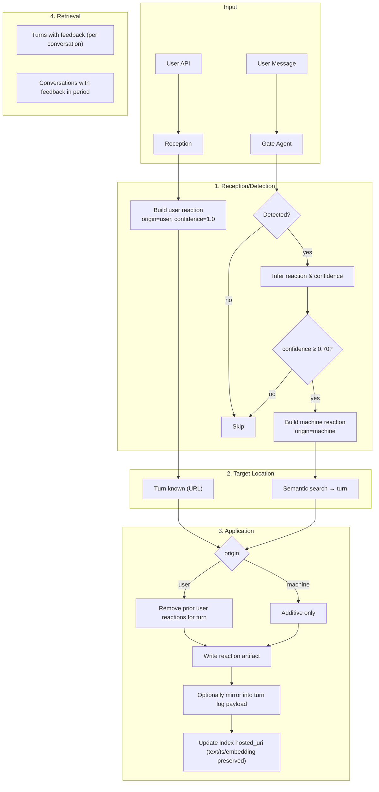

# Feedback System – Complete Architecture & Design (v2.2)

**Last Updated:** 2025-11-06

---

#### Submit Feedback

```python
# Base URL
BASE_URL = "https://api.example.com"

# Endpoint
POST /conversations/{tenant}/{project}/{conversation_id}/turns/{turn_id}/feedback
```

---

## Overview

The feedback system lets **users** (explicit) and the **machine** (inferred) attach reactions and comments to specific turns. Two artifact forms exist:

* **Reaction artifact** — `artifact:turn.log.reaction` (authoritative, small, indexed)
* **Turn log** — `artifact:turn.log` (rich S3 blob; optionally mirrors feedbacks)

### Lifecycle (high level)

1. **Receive/Detect feedback** (user API or machine inference)
2. **Locate target turn** (known from API; or semantic search for machine)
3. **Persist reaction artifact** (and optionally mirror into turn log payload)
4. **Index update** (preserve original `ts`, `text`, `embedding`; update `hosted_uri` only when turn log is rewritten)

---

## System Architecture



---

## Feedback Types & Data

### Properties

| Field        | User Feedback                                    | Machine Feedback                         |
| ------------ | ------------------------------------------------ | ---------------------------------------- |
| `origin`     | `"user"`                                         | `"machine"`                              |
| `confidence` | `1.0`                                            | `0.0–1.0` (must be ≥ `0.70`)             |
| `reaction`   | `"ok"`, `"not_ok"`, `"neutral"` | `null` (clear) | `"ok"`, `"not_ok"`, `"neutral"` | `null` |
| Target       | From URL                                         | Semantic search                          |
| Cardinality  | **One active per turn** (replaces)               | **Many** (additive)                      |

### Reaction artifact (authoritative)

```json
{
  "reaction": {
    "turn_id": "turn_1762441078644_qp8d27",
    "text": "Ah the previous diagram also worked fine. It was my issue.",
    "confidence": 1.0,
    "ts": "2025-11-06T17:47:02.162904Z",
    "reaction": "ok",
    "origin": "user"
  },
  "meta": {
    "rn": "ef:...:turn_1762441078644_qp8d27:artifact:artifact-2025-11-06T17-47-03-....",
    "turn_id": "turn_1762441078644_qp8d27",
    "track_id": "A",
    "user_type": "privileged",
    "kind": "turn.log.reaction"
  },
  "conversation_id": "b2c2405c-0a94-4cce-bfdc-d811403256b3",
  "bundle_id": "with.codegen"
}
```

**Tags on index row (conv_messages.tags):**

```
['artifact:turn.log.reaction', 'turn:<turn_id>', 'origin:<user|machine>', 'track:<id>']
```

---

## Component Details

### 1A. User Feedback Reception (API)

**Location:** `api/conversations/conversations.py`

**Endpoint:**

```
POST /conversations/{tenant}/{project}/{conversation_id}/turns/{turn_id}/feedback
```

**Request:**

```json
{
  "reaction": "ok",               // "ok" | "not_ok" | "neutral" | null (clear)
  "text": "Great explanation!",   // optional
  "ts": "2025-11-06T15:30:00Z"    // optional, defaults to now
}
```

**Process:**

1. AuthN/Z
2. Validate `reaction` in {"ok","not_ok","neutral",null}
3. Build reaction with `origin="user"`, `confidence=1.0`
4. Turn is known from URL
5. Write **reaction artifact**; if `reaction==null`, remove prior user reactions
6. Optionally mirror into turn log payload (`feedbacks[]` + timeline entry)

---

### 1B. Machine Feedback Detection (Gate Agent)

**Location:** `models/gate_agent.py`

* Detect from incoming user messages.
* If `confidence ≥ 0.70`, infer `reaction` and proceed.
* Locate target via semantic search; write additive **reaction artifact**.

---

### 2. Target Location (Semantic Search)

**Location:** `orchestrator/workflow.py → handle_feedback()`
Score: `0.85*similarity + 0.15*recency`, `top_k=5`, `days=365`.

---

### 3. Feedback Application

**Location:** `apps/chat/sdk/context/retrieval/ctx_rag.py`

* `append_reaction_to_turn_log(...)` writes the **reaction artifact** (`artifact:turn.log.reaction`).
* `remove_user_reaction(...)` clears prior user-origin reactions for a turn.
* `apply_feedback_to_turn_log(...)` optionally mirrors into `artifact:turn.log` S3 blob (keeps index `ts/text/embedding`).

---

## Retrieval & Reporting APIs

### Quick Endpoint Cards

#### Submit Feedback

```python
# Base URL
BASE_URL = "https://api.example.com"

# Endpoint
POST /conversations/{tenant}/{project}/{conversation_id}/turns/{turn_id}/feedback
```

#### Get Turns With Feedback (per conversation)

```python
# Base URL
BASE_URL = "https://api.example.com"

# Endpoint
POST /conversations/{tenant}/{project}/{conversation_id}/turns-with-feedbacks
```

#### Get Conversations With Feedback in Period (cross-conversation)

```python
# Base URL
BASE_URL = "https://api.example.com"

# Endpoint
POST /conversations/{tenant}/{project}/feedback/conversations-in-period
```

---

### 4A. Turns With Feedbacks (Per Conversation)

**Endpoint:**

```
POST /conversations/{tenant}/{project}/{conversation_id}/turns-with-feedbacks
```

**Request:**

```json
{
  "turn_ids": null,
  "days": 365
}
```

**Response (shape):**

```json
{
  "user_id": "user_123",
  "conversation_id": "conv_456",
  "turns": [
    {
      "turn_id": "turn_1761153697221_4ek9ma",
      "turn_log": { /* optional materialized turn.log */ },
      "assistant": { /* optional */ },
      "user": { /* optional */ },
      "feedbacks": [ /* from turn_log.feedbacks[] if mirrored */ ],
      "reactions": [ /* raw artifact:turn.log.reaction rows with payload */ ]
    }
  ]
}
```

*Notes:* This API can materialize from turn logs **or** return raw reaction artifacts depending on the consumer’s needs.

---

### 4B. Conversations With Feedbacks In Period (Dashboard Summary)

**Endpoint:**

```
POST /conversations/{tenant}/{project}/feedback/conversations-in-period
```

**Request:**

```json
{
  "start": "2025-11-01T00:00:00Z",
  "end":   "2025-11-06T23:59:59Z",
  "include_turns": true,
  "limit": 100,
  "cursor": null
}
```

**Authoritative Source:** **Only** `artifact:turn.log.reaction` artifacts (no turn-log fetches).

**Response (shape):**

```json
{
  "tenant": "ACME",
  "project": "Support",
  "window": { "start": "2025-11-01T00:00:00Z", "end": "2025-11-06T23:59:59Z" },
  "items": [
    {
      "conversation_id": "with.codegen",
      "last_activity_at": "2025-11-06T17:47:02.162904Z",
      "started_at": null,
      "feedback_counts": { "total": 3, "user": 1, "machine": 0, "ok": 1, "not_ok": 0, "neutral": 2 },
      "turns": [
        {
          "turn_id": "turn_1762441078644_qp8d27",
          "ts": "2025-11-06T17:47:02.162904Z",
          "feedbacks": [
            {
              "turn_id": "turn_1762441078644_qp8d27",
              "ts": "2025-11-06T17:47:02.162904Z",
              "text": "Ah the previous diagram also worked fine. It was my issue.",
              "reaction": "ok",
              "confidence": 1.0,
              "origin": "user",
              "rn": "ef:...:turn_1762441078644_qp8d27:artifact:artifact-2025-11-06T17-47-03-..."
            }
          ]
        }
      ]
    }
  ],
  "next_cursor": null
}
```

**Aggregation Rules:**

* Count by **origin** and **reaction** using reaction artifacts only.
* `include_turns=true` → attach per-turn lists of **feedbacks** built directly from reaction artifacts.
* Each feedback item **must include** `rn` from artifact `meta.rn`.

---

## Storage & Indexing

### Postgres: `conv_messages` for reaction artifacts

* **role:** `'artifact'`
* **tags (required):**
  `['artifact:turn.log.reaction', 'turn:<turn_id>', 'origin:<user|machine>', 'track:<id>?']`
* **turn_id:** populated
* **text:** small printable header + reaction dict
* **hosted_uri → payload:** as shown above (contains `reaction`, `meta`, `conversation_id`, `bundle_id`, etc.)

### Turn Log mirroring (optional)

When mirroring into `artifact:turn.log`:

* Update S3 blob payload (`feedbacks[]` + `entries[]` + append to `text`)
* **Preserve** index row `ts`, `text`, `embedding`; update only `hosted_uri` (and tags if needed)

---

## Query Patterns (Index-only)

### All reactions for a turn

```python
await ctx_client.search(
  kinds=("artifact:turn.log.reaction",),
  roles=("artifact",),
  scope="conversation",
  user_id=user_id,
  conversation_id=conversation_id,
  all_tags=[f"turn:{turn_id}"],
  with_payload=True,
  days=365
)
```

### Count splits (origin / reaction) in a period

```python
await ctx_client.search(
  kinds=("artifact:turn.log.reaction",),
  roles=("artifact",),
  scope="user",
  user_id=user_id,
  days=3650,
  sort="recency",
  timestamp_filters=[{"op": ">=", "value": start_iso}, {"op": "<=", "value": end_iso}],
  with_payload=True
)
# → group in Python by payload.reaction.origin & payload.reaction.reaction
```

---

## Error Handling

* **User API**: 400 invalid reaction; 404 turn not found; 401 unauthorized; 500 on storage/index error
* **Machine**: ignore low confidence; skip if no target found; log S3/index issues

---

## Analytics Hints

* **Satisfaction rate:** `ok / (ok + not_ok + neutral)`
* **Freshness weighting:** use reaction `ts` for time-bucketed dashboards
* **De-dupe:** user-origin is single active per turn (replaced on update)

---

## Implementation Notes

* The period summary endpoint **does not** fetch turn logs. It relies solely on `artifact:turn.log.reaction`.
* Ensure tag **`artifact:turn.log.reaction`** is used (not `kind:turn.log.reaction`).
  A one-off migration fixed historical rows with the wrong tag.
* Include **`meta.rn`** in every feedback item returned by reporting endpoints.

---

## API Reference (Condensed)

### Submit User Feedback (Add/Replace/Clear)

```
POST /conversations/{tenant}/{project}/{conversation_id}/turns/{turn_id}/feedback
```

Body:

```json
{ "reaction":"ok", "text":"Great explanation!", "ts":"2025-11-06T15:30:00Z" }
```

### Fetch Turns With Feedbacks (Per Conversation)

```
POST /conversations/{tenant}/{project}/{conversation_id}/turns-with-feedbacks
```

### Conversations With Feedbacks In Period

```
POST /conversations/{tenant}/{project}/feedback/conversations-in-period
```

---
