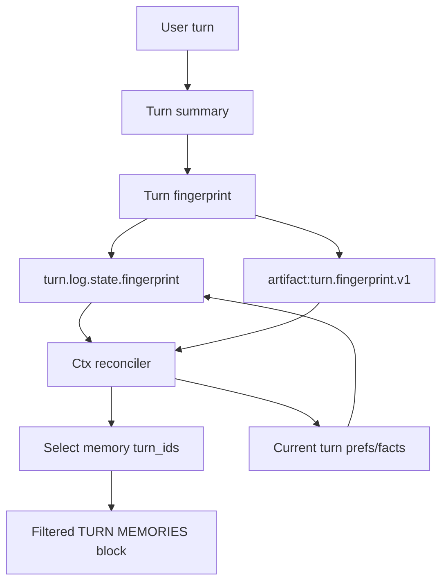
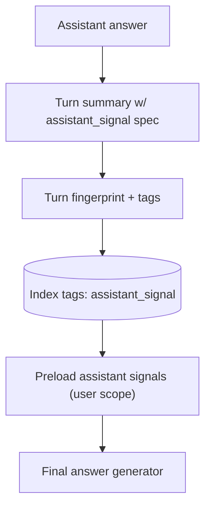
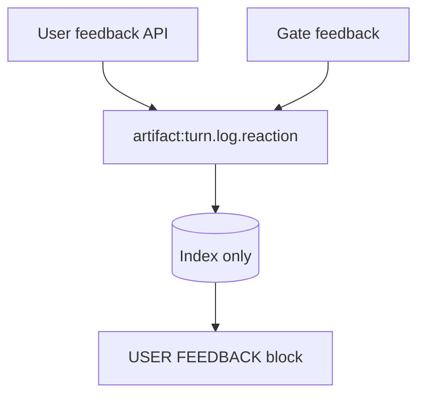

# Memory Subsystem (Chat SDK)

**Last Updated:** 2026-01-25

---

## Overview

The memory subsystem captures per-turn preferences and facts, assistant-originated signals, and user feedback.
It then presents the most relevant memory slices to downstream agents without reloading full turn logs.

Core goals:
- Preserve per-turn preferences and facts as compact fingerprints.
- Prevent repeated assistant promotions via assistant signals.
- Keep feedback visible as a memory-like signal.
- Keep retrieval fast (index-only where possible).

---

## Terminology (stable names)

1) Turn Memories (per-turn, user-originated)
   - Source: ctx-reconciler (assertions/exceptions/facts extracted from user input).
   - Stored in turn fingerprint and embedded in turn log payload.
   - Represents: contextual preferences and facts expressed in the turn.

2) Assistant Signals (per-turn, assistant-originated)
   - Source: turn summarizer via a dynamic assistant-signal spec.
   - Stored in turn fingerprint and tagged `assistant_signal`.
   - Represents: what the assistant already promoted/claimed (promo guard).

3) User Feedback (per-turn)
   - Source: gate feedback + manual feedback injection.
   - Stored as its own artifact (`artifact:turn.log.reaction`).
   - Represents: user corrections / satisfaction / issues with prior output.

---

## Artifacts and Storage

Below are the memory-related artifacts and where their content lives.

- `artifact:turn.log`
  - Storage: S3 (hosted_uri points to blob).
  - Also indexed in `conv_messages.text` with a compact JSON snapshot.
  - Memory-related paths inside the payload:
    - `turn_log.state.fingerprint` (Turn Memory / fingerprint)
    - `turn_summary.prefs` (assertions/exceptions for current turn)
    - `turn_summary.facts` (facts for current turn)
    - `turn_summary.assistant_signals` (assistant-originated signals)
    - `turn_log.feedbacks[]` (optional mirror of feedbacks when `apply_feedback_to_turn_log` is used)
    - `turn_log.entries[]` with `area="feedback"` (chronological feedback line)

- `artifact:turn.fingerprint.v1`
  - Storage: index-only (no S3 blob).
  - Stored in `conv_messages.text` as JSON for fast retrieval.
  - Tags:
    - `artifact:turn.fingerprint.v1`
    - `assistant_signal` (when assistant_signals exist)
    - `assistant_signal:<key>` (normalized key)

Fingerprint access points (all supported):
- From `artifact:turn.log` payload:
  - `turn_log.state.fingerprint`
- From `artifact:turn.fingerprint.v1` (index-only JSON payload)
- From in-memory turn log during the current turn:
  - `scratchpad.tlog.state["fingerprint"]` (set when fingerprint is persisted)

- `artifact:turn.log.reaction`
  - Storage: index-only (no S3 blob).
  - Stored in `conv_messages.text` as a serialized JSON block prefixed with `[turn.log.reaction]`.
  - Tag `origin:user` vs `origin:machine` distinguishes source.

- `conversation.active_set.v1`
  - Storage: index-only (no S3 blob).
  - Stored in `conv_messages.text` as JSON.
  - Contains selection metadata only:
    - `picked_bucket_ids`
    - `selected_local_memories_turn_ids`
    - `last_reconciled_ts`, `since_last_reconcile`

- `conversation.memory.bucket.v1`
  - Storage: S3 (hosted_uri points to blob).
  - Indexed by unique tag `mem:bucket:<bucket_id>`.
  - Disabled when `LONG_MEMORIES_LOG=1` or `MEMORY_RECONCILE_ENABLED=0`.

---

## Workflow (high-level)

1) Before gate
   - Load recent turn logs (compressed views).
   - Load TURN MEMORIES (last N + delta window).
   - Load USER FEEDBACK (conversation-scoped).
   - Load ASSISTANT SIGNALS (user-scoped, cross-conversation) but only pass to final answer generator.

2) Ctx-reconciler
   - Reads TURN MEMORIES section and chooses relevant turn_ids
     (`local_memories_turn_ids`) based on current objective and freshness.
   - Output: objective + assertions/exceptions/facts for current turn,
     plus selected memory turn ids for downstream.

3) Post-ctx-reconciler
   - Turn memories are filtered to selected memory turn_ids.
   - Feedback remains unfiltered (conversation-scoped).
   - Downstream agents see only the filtered TURN MEMORIES.

---

## Schematic View (what each agent sees)

Gate (before ctx-reconciler)

[CURRENT TURN]
[PRIOR TURNS (newest->oldest) - COMPRESSED VIEWS]
[TURNS CANDIDATES TABLE]
[USER FEEDBACK — CHRONOLOGICAL (newest->oldest; scope=conversation)]
[TURN MEMORIES — CHRONOLOGICAL (newest->oldest; scope=conversation)]

Ctx-reconciler (same as gate; must pick relevant memory turn_ids)

[CURRENT TURN]
[PRIOR TURNS (newest->oldest) - COMPRESSED VIEWS]
[TURNS CANDIDATES TABLE]
[USER FEEDBACK — CHRONOLOGICAL (newest->oldest; scope=conversation)]
[TURN MEMORIES — CHRONOLOGICAL (newest->oldest; scope=conversation)]
  -> choose local_memories_turn_ids here

Post-ctx-reconciler (downstream agents)

[CURRENT TURN]
[PRIOR TURNS (newest->oldest) - COMPRESSED VIEWS]
[TURNS CANDIDATES TABLE]
[USER FEEDBACK — CHRONOLOGICAL (newest->oldest; scope=conversation)]
[TURN MEMORIES — CHRONOLOGICAL (newest->oldest; scope=conversation)]
  -> only selected memory turn_ids remain

Final answer generator only (adds assistant signals)

[TURN MEMORIES — CHRONOLOGICAL (selected; scope=conversation)]
[USER FEEDBACK — CHRONOLOGICAL (scope=conversation)]
[ASSISTANT SIGNALS — CHRONOLOGICAL (scope=user_cross_conversation)]

---

## Architecture (diagrams)

Memory pipeline (high level):



Assistant signals flow:



Feedback flow (summary):



---

## File Map

Core models and storage:
- [turn_fingerprint.py](./turn_fingerprint.py)
- [buckets.py](./buckets.py)
- [active_set_management.py](./active_set_management.py)

Presentation:
- [presentation.py](./presentation.py)
- [journal.py](../../runtime/solution/context/journal.py)

Ctx reconciler (preferences extraction + memory selection):
- [ctx_reconciler.py](../retrieval/ctx_reconciler.py)

Turn summary (assistant signal extraction):
- [turn_summary_generator.py](../../tools/backends/summary/turn_summary_generator.py)

---

## Integration Notes (bundle authors)

- Turn memories are written every turn via the turn fingerprint.
- Assistant signals are optional and only appear if you provide a
  dynamic assistant-signal spec to the turn summarizer.
- Feedback is conversation-scoped and is always visible alongside memories.
- If you disable memory buckets (`LONG_MEMORIES_LOG=1` or `MEMORY_RECONCILE_ENABLED=0`),
  downstream agents will rely only on turn memories + feedback.

---

## End-to-End: Using Memories in a Bundle

This section outlines the typical end-to-end flow for bundle authors who want to
use the SDK memory subsystem without referencing any private bundle code.

### Code sequence (typical turn)

```python
# 0) Preload memory state (before gate)
await preload_conversation_memory_state(scratchpad)

# 1) Build journal for gate / ctx-reconciler
guess_ctx = await retrospective_context_view(...)

# 2) Run ctx-reconciler (extract prefs/facts + select memory turn_ids)
rro = await ctx_reconciler_stream(..., guess_package_json=guess_ctx)
scratchpad.extracted_prefs = {
    "assertions": rro.get("assertions") or [],
    "exceptions": rro.get("exceptions") or [],
}
scratchpad.proposed_facts = rro.get("facts") or []
scratchpad.selected_local_memories_turn_ids = rro.get("local_memories_turn_ids") or []

# 3) Update turn fingerprint (current turn)
update_turn_fingerprint(
    objective=rro.get("objective") or "",
    topics=current_topics,
    assertions=scratchpad.extracted_prefs["assertions"],
    exceptions=scratchpad.extracted_prefs["exceptions"],
    facts=scratchpad.proposed_facts,
)

# 4) Persist turn fingerprint (turn.log + index-only artifact)
await persist_turn_fingerprint(scratchpad)

# 5) Build downstream journal (filtered TURN MEMORIES block)
downstream_ctx = await retrospective_context_view(...)
```

### 1) Extract prefs/facts for the current turn (ctx‑reconciler)

The ctx‑reconciler is responsible for extracting user preferences and facts with
full context. Its output is the source of truth for per‑turn memories.

What you do:
- Run the ctx‑reconciler with the standard journal input.
- Read its JSON output fields:
  - `assertions`, `exceptions`, `facts`
  - `local_memories_turn_ids` (turn ids whose memories remain relevant now)

Where it lands:
- Current‑turn prefs/facts are written into the turn fingerprint.
- The chosen `local_memories_turn_ids` are used to filter the memory block for downstream agents.

Relevant module:
- [ctx_reconciler.py](../retrieval/ctx_reconciler.py)

### 2) Persist the turn fingerprint

Every turn writes a fingerprint that contains:
- `objective`, `topics`
- `assertions`, `exceptions`, `facts`
- optional `assistant_signals`

It is stored:
- inside `artifact:turn.log` at `turn_log.state.fingerprint`
- as an index‑only artifact: `artifact:turn.fingerprint.v1`

Relevant module:
- [turn_fingerprint.py](./turn_fingerprint.py)

Note (bundle helpers):
- The actual persistence helpers are typically implemented in the bundle orchestrator
  (e.g., `_update_turn_fp(...)` and `_persist_turn_fingerprint(...)`).
- These helpers write to the index via `ctx_client.save_artifact(..., kind="artifact:turn.fingerprint.v1", index_only=True)`
  and also mirror the fingerprint into `turn_log.state.fingerprint`.

Example (index‑only write pattern):

```python
await ctx_client.save_artifact(
    kind="artifact:turn.fingerprint.v1",
    tenant=tenant, project=project,
    user_id=user, conversation_id=conversation_id,
    turn_id=turn_id, track_id=track_id,
    content=fingerprint_dict,
    extra_tags=extra_tags,
    index_only=True,
)
```

### 3) Present memories to agents

The SDK renders memories as dedicated blocks in the agent journal:
- `[TURN MEMORIES — CHRONOLOGICAL]`
- `[USER FEEDBACK — CHRONOLOGICAL]`
- `[ASSISTANT SIGNALS — CHRONOLOGICAL]` (final answer generator only)

Memory blocks are built from fingerprints and filtered by `local_memories_turn_ids`
so downstream agents see only the relevant memories for the current objective.

Relevant modules:
- [presentation.py](./presentation.py)
- [journal.py](../../runtime/solution/context/journal.py)

### 4) Retrieve feedback (conversation‑scoped)

Feedback is stored as `artifact:turn.log.reaction` (index‑only) and optionally mirrored
into the turn log payload (`turn_log.feedbacks[]` + `turn_log.entries[]` with `area=feedback`).

For context presentation, the SDK loads recent feedback into the
`[USER FEEDBACK — CHRONOLOGICAL]` block.

Relevant module:
- [ctx_rag.py](../retrieval/ctx_rag.py)

### 5) Use assistant signals (user‑scoped)

If you provide a dynamic assistant‑signal spec to the turn summarizer, the turn summary
will emit `assistant_signals[]`. These are stored in the fingerprint and tagged
`assistant_signal`, then fetched cross‑conversation (user scope) only once per turn.

They are shown only to the final answer generator (or other agents that opt‑in).

Relevant modules:
- [turn_summary_generator.py](../../tools/backends/summary/turn_summary_generator.py)
- [presentation.py](./presentation.py)

---

### Minimal checklist for bundle authors

- Ensure your orchestrator runs ctx‑reconciler before downstream agents.
- Persist the fingerprint every turn.
- Render memory blocks from fingerprints and use `local_memories_turn_ids` for filtering.
- Fetch feedback (conversation scope) and assistant signals (user scope) only once per turn.

---

### Code snippets (targets you may reuse)

**Get conversation title for UI (active set first, then conv.start):**

```python
title = await ctx.fetch_conversation_artifacts(
    user_id=user_id,
    conversation_id=conversation_id,
    materialize=False,
    days=365,
).get("conversation_title")
```

**Render memory blocks for journals:**

```python
from kdcube_ai_app.apps.chat.sdk.context.memory.presentation import (
    format_turn_memories_block,
    format_feedback_block,
    format_assistant_signals_block,
)

mem_block = format_turn_memories_block(turn_memories, order_label="newest→oldest", scope_label="conversation")
fb_block = format_feedback_block(feedback_items, order_label="newest→oldest", scope_label="conversation")
sig_block = format_assistant_signals_block(assistant_signals, order_label="newest→oldest", scope_label="user_cross_conversation")
```
