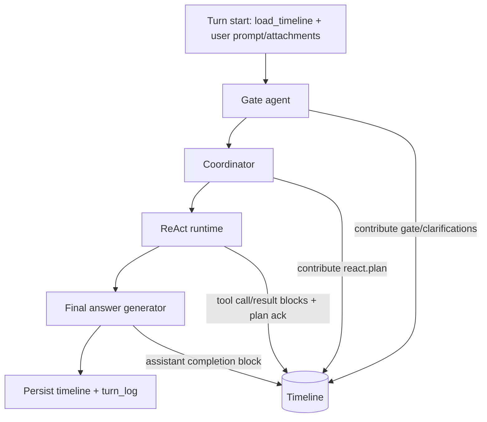

# End‑to‑end flow (react v2)

This document provides a high‑level view of the turn lifecycle and how agents interact
with the timeline.

## ASCII diagram

```
┌────────────────────────────────────────────────────────────────────────────┐
│ Turn start                                                                 │
│  - BaseWorkflow.start_turn                                                   │
│  - ctx_browser.load_timeline() -> Timeline.load/persist                      │
│  - contribute user prompt + attachments                                      │
└───────────────┬────────────────────────────────────────────────────────────┘
                │
                ▼
┌────────────────────────────────────────────────────────────────────────────┐
│ Gate agent                                                                  │
│  - timeline.render(include_sources=false, include_announce=false)            │
│  - emits gate block (+ clarifications) into timeline                         │
└───────────────┬────────────────────────────────────────────────────────────┘
                │
                ▼
┌────────────────────────────────────────────────────────────────────────────┐
│ Coordinator                                                                 │
│  - timeline.render(include_sources=true, include_announce=true)              │
│  - emits plan (react.plan JSON block)                                        │
└───────────────┬────────────────────────────────────────────────────────────┘
                │
                ▼
┌────────────────────────────────────────────────────────────────────────────┐
│ ReAct runtime                                                                │
│  - decision loop uses timeline.render(include_sources=true, include_announce=true)
│  - each tool call contributes:                                               │
│      • react.tool.call                                                      │
│      • react.tool.result (+ artifacts blocks)                               │
│      • react.notice on protocol/errors                                      │
│  - plan acknowledgements add:                                                │
│      • react.plan.ack (text)                                                 │
│      • updated react.plan (JSON snapshot)                                    │
└───────────────┬────────────────────────────────────────────────────────────┘
                │
                ▼
┌────────────────────────────────────────────────────────────────────────────┐
│ Final answer generation                                                      │
│  - timeline.render(include_sources=true, include_announce=false)             │
│  - assistant completion contributed into timeline                            │
└───────────────┬────────────────────────────────────────────────────────────┘
                │
                ▼
┌────────────────────────────────────────────────────────────────────────────┐
│ Turn end                                                                     │
│  - persist timeline                                                          │
│  - write turn_log (current‑turn blocks only)                                 │
└────────────────────────────────────────────────────────────────────────────┘
```

## Mermaid diagram


