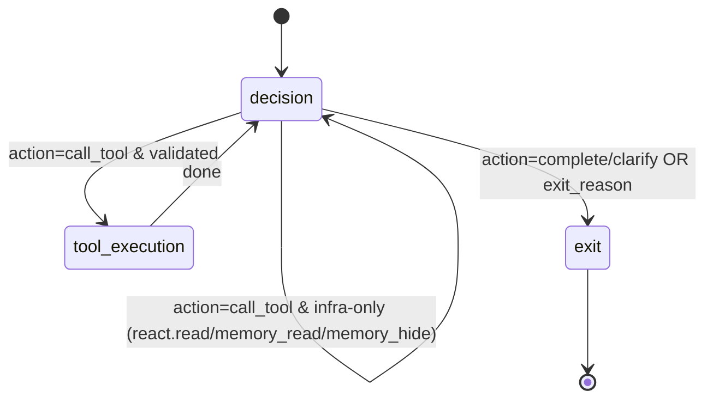

# ReAct v2 State Machine

This describes the **v2** runtime loop and its control gates.
It matches the current `react/v2/runtime.py` implementation.

---

## High‑Level Loop

The ReAct loop is a state machine with these nodes:
- `decision`
- `tool_execution`
- `exit`

Each iteration starts at `decision` and typically follows:

```
decision -> tool_execution -> decision
```

The loop exits when `exit_reason` is set or the iteration/budget is exhausted.

---

## Mermaid Diagram



Notes:
- Infra tools (`react.read`, `react.memory_read`, `react.memory_hide`) are handled in‑loop and return to `decision` without a tool_execution pass.
- Tool call protocol validation happens inside the decision node (no separate protocol state).

---

## Decision Node (Core Rules)

Decision output is validated and may be rejected when:
- `action` is invalid
- `tool_call.tool_id` is missing for `call_tool`
- invalid strategy for the current budget state

If invalid, a **protocol violation block** is contributed and the loop returns to `decision`.

### Completion rules
Decision may exit with `action=complete` only when:
- all plan steps are acknowledged (✓ or ✗), and
- a completion summary is provided.

If it exits prematurely, the runtime sets a protocol violation and retries.

## Plan Acknowledgement Notes
The decision must acknowledge plan progress in `notes`:
- **DONE**: `✓ [n] <step>`
- **FAILED**: `✗ [n] <step> — <reason>`
- **IN PROGRESS**: `→ [n] <step> (in progress)` (does not change status)

Acknowledgements are appended to the turn progress log as `react.decision` blocks.
These blocks are visible to the decision on subsequent rounds so it can track prior notes.

---

## Budget + Iteration Gates

The loop uses `BudgetStateV2`:
- `exploration_budget` / `exploitation_budget`
- `explore_used` / `exploit_used`
- `max_iterations`
- `decision_rounds_used`

Hard stop:
- if `decision_rounds_used >= max_iterations` ⇒ exit with `max_iterations`

The budget snapshot is exposed to the decision agent in the timeline’s active state block.

---

## Compaction in the Loop

Compaction can happen **inside the loop** when `timeline(...)` is requested:
- if context size exceeds limits, the browser compacts and inserts a `conv.range.summary`
- the loop retries with `force_sanitize=True` on context‑limit errors

Compaction emits hooks (optional):
- `on_before_compaction` (start status)
- `on_after_compaction` (finish status + stats)

---

## Tool Execution Path

For `action=call_tool`:
1) `decision` validates tool call structure.
2) `tool_execution` executes the tool.
3) Results are converted into contribution blocks (`react.tool.call` / `react.tool.result`).

Artifacts are registered as files (kind=file or kind=display) and stored in the outdir.

---

## Exit Reasons

Common exit reasons:
- `complete`
- `clarify`
- `max_iterations`
- `protocol_violation`
- `tool_error`

---

## Where Context Lives

All context is provided by `ContextBrowser.timeline(...)`:
- history blocks
- current user blocks
- in‑turn progress blocks
- optional sources pool / announce (tail, uncached)

See:
- `context-layout.md`
- `context-progression.md`
- `react-context-README.md`
