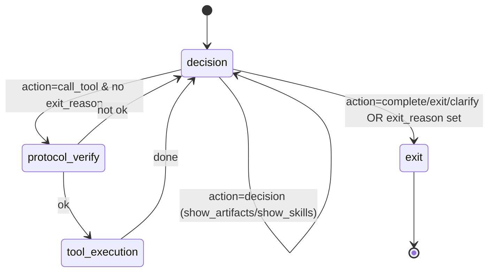
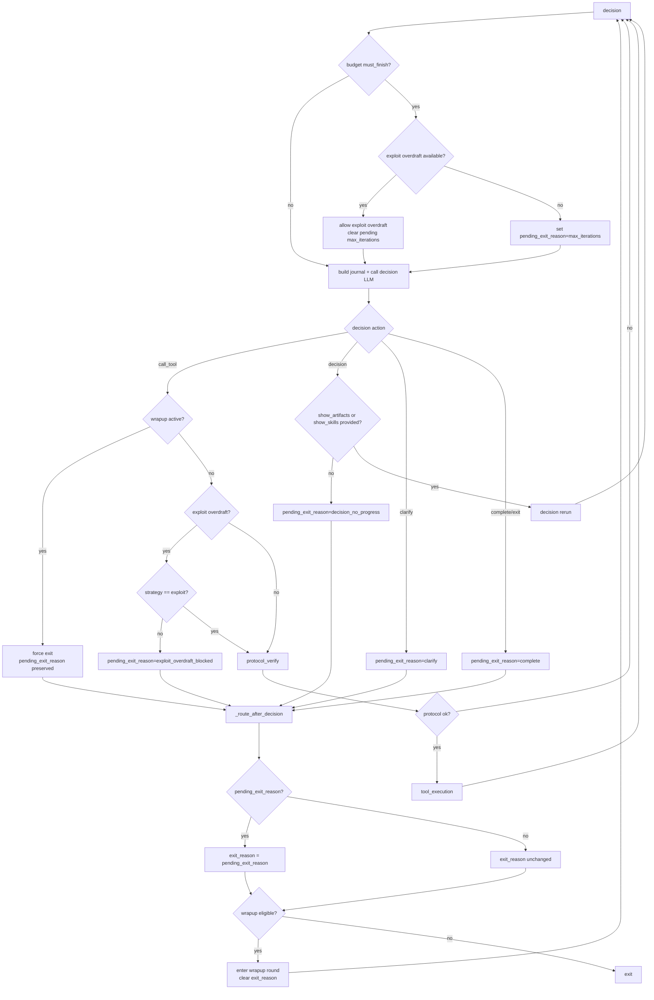

# ReAct State Machine

This document describes the ReAct runtime flow, the control states, and the budget gates.

## High-Level Flow

The ReAct loop is a state machine with four main nodes:

- decision
- protocol_verify
- tool_execution
- exit

The loop always starts at `decision`. Each iteration can traverse:

```
decision -> protocol_verify -> tool_execution -> decision
```

When a terminal condition is met, the state machine routes to `exit`.

## Mermaid Diagram



## Detailed Mermaid Diagram



## Core State and Routing Fields

The main per-turn state is `ReactState`. The fields below are most relevant for routing:

- `last_decision`: the most recent decision JSON.
- `exit_reason`: final exit reason (set only in `_route_after_decision`).
- `pending_exit_reason`: exit intent set inside `_decision_node`.
- `wrapup_round_used`: whether the single wrapup pass has been consumed.
- `is_wrapup_round`: indicates the current round is wrapup.
- `allow_exploit_overdraft`: set when global rounds are exhausted but exploit rounds remain.

### Exit Resolution (Centralized)

Only `_route_after_decision` sets `exit_reason`. It promotes `pending_exit_reason`
and then applies the wrapup gate.

This prevents silent exits after a decision with `action=call_tool`.

## Budget Model

Budgets are tracked in `BudgetState` and are exposed to the decision LLM as
`BUDGET_STATE` in the session journal.

### Global Budget

Tracked via `GlobalBudget`:

- `max_decision_rounds` / `decision_rounds_used`
- `max_tool_calls` / `tool_calls_used`
- `max_explore_rounds` / `explore_rounds_used`
- `max_exploit_rounds` / `exploit_rounds_used`
- `max_render_rounds` / `render_rounds_used`
- `max_decision_reruns` / `decision_reruns_used`
- `ctx_reads` / `context_reads_used`

Hard gate: if `remaining_decision_rounds <= 0` **or** `remaining_tool_calls <= 0`,
the runtime is considered exhausted (`must_finish`).

### Per-Stage Budget

Each contract slot has a stage budget (advisory):

- `max_explore`
- `max_exploit`
- `render`
- `ctx_reads`

Stage budgets are used to guide the decision LLM and to compute exploit overdraft
eligibility.

## Budget Snapshot Format

`format_budget_for_llm` prints a single line for global and (optionally) stage:

```
BUDGET_STATE: global(decisions left D/T, tools left C/T, explore left E/T, exploit left X/T, render left R/T, decision_reruns left r/R, context_reads left c/C)
        stage[slot_id](explore left e/E, exploit left x/X, render left r/R, context_reads left c/C)
```

Optional flags:

- `wrapup active` when the current round is the wrapup pass.
- `exploit_overdraft u/t` when exploit overdraft is active.

## Wrapup Round

Wrapup is a single additional decision round to map existing artifacts to pending slots.

It activates only in `_route_after_decision` when:

- `exit_reason` is set, and
- there are pending slots, and
- there exist unmapped *mappable* artifacts.

Mappable artifacts are those:

- not `artifact_kind="search"`, and
- have no `error`, and
- have non-null `value`.

If wrapup triggers:

- `is_wrapup_round = True`
- `wrapup_round_used = True`
- `exit_reason` and `pending_exit_reason` are cleared
- control returns to `decision`

During wrapup, any `call_tool` action is forced to exit (mapping only).

## Exploit Overdraft

If global rounds are exhausted but exploit rounds remain, the system permits
one or more exploit-only rounds:

- `allow_exploit_overdraft = True`
- `exploit_overdraft_used` increments once per round
- only `strategy="exploit"` + `action="call_tool"` is allowed

If the model proposes a non-exploit tool call during overdraft, the round exits
with `pending_exit_reason="exploit_overdraft_blocked"`.

## Decision Node Summary

The decision node:

- emits a decision,
- validates strategy and tool call format,
- updates `pending_exit_reason` when it must stop (no direct exit here),
- logs the decision,
- and returns state for routing.

## Protocol Verify and Tool Execution

`protocol_verify` validates tool call shape. If invalid:

- tool call is blocked
- the round returns to `decision`

`tool_execution` runs the selected tool and registers artifacts.

## Exit Reasons

Typical reasons:

- `complete`
- `clarify`
- `max_iterations`
- `context_reads_exhausted`
- `decision_no_progress`
- `decision_reruns_exhausted`
- `wrapup_no_decision_rerun`
- `exploit_overdraft_blocked`
- `incomplete_contract` (final analysis override)
