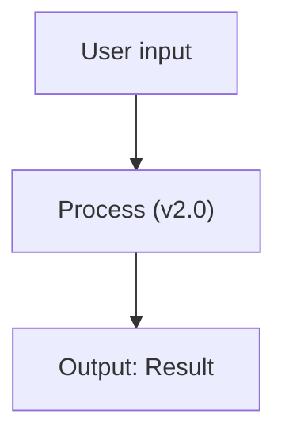
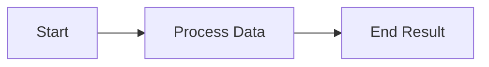
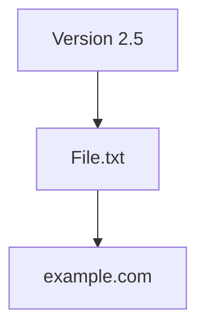
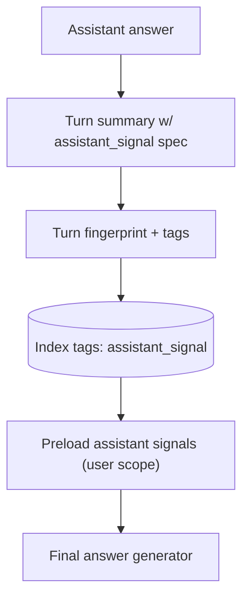
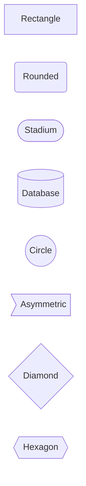

# Mermaid Diagram Syntax

## Overview
Mermaid diagrams fail to render when syntax rules are violated. This skill teaches the critical syntax requirements and common error patterns that break rendering.

## Signs of Broken Mermaid

**Visual indicators the diagram won't render:**
- Parser error messages in the output
- Blank diagram area where chart should appear
- Red error text or "Syntax Error" notices
- Diagram displays as plain text instead of rendering

**Common root causes:**
1. Unquoted labels containing special characters
2. Missing quotes around multi-word text
3. Special characters not properly escaped
4. Invalid arrow or node syntax
5. Incorrect subgraph structure

## Critical Quoting Rules

### ALWAYS Quote When Label Contains:
- **Spaces**: `A["Multi word label"]` not `A[Multi word label]`
- **Parentheses**: `B["Data (filtered)"]` not `B[Data (filtered)]`
- **Periods**: `C["Process v2.1"]` not `C[Process v2.1]`
- **Colons**: `D["Status: Active"]` not `D[Status: Active]`
- **Commas**: `E["Input, Output"]` not `E[Input, Output]`
- **Brackets**: `F["Tags [optional]"]` not `F[Tags [optional]]`
- **Special chars**: `&`, `<`, `>`, `#`, `@`, etc.

### Quote Syntax:
```mermaid
graph TB
  A["Quoted text"]      %% Double quotes for safety
  B[SimpleText]         %% No quotes needed for alphanumeric
```

**Rule:** When in doubt, always use double quotes `"..."` around labels.

## Common Syntax Errors

### ❌ ERROR 1: Unquoted Special Characters
```mermaid
graph TB
  A[User input] --> B[Process (v2.0)]     %% BROKEN: parens and period
  B --> C[Output: Result]                  %% BROKEN: colon
```

**Why it breaks:** Parentheses, periods, and colons are Mermaid syntax tokens. Without quotes, parser treats them as structure, not content.

### ✅ FIXED:


---

### ❌ ERROR 2: Missing Quotes on Multi-Word Labels
```mermaid
graph LR
  Start --> Process Data --> End Result   %% BROKEN: spaces break parsing
```

**Why it breaks:** Spaces separate node IDs from labels. Without quotes, "Process Data" is interpreted as three separate tokens.

### ✅ FIXED:


---

### ❌ ERROR 3: Dots/Periods in Labels
```mermaid
graph TB
  A[Version 2.5] --> B[File.txt]          %% BROKEN: periods
  B --> C[example.com]                     %% BROKEN: domain with dots
```

**Why it breaks:** Periods can conflict with subgraph or style syntax.

### ✅ FIXED:


---

### ❌ ERROR 4: Complex Example (Multiple Errors)
```mermaid
graph TB
  A[Assistant answer] --> TS[Turn summary w/ assistant_signal spec]
  TS --> FP[Turn fingerprint + tags]
  FP --> IDX[(Index tags: assistant_signal)]
  IDX --> PRE[Preload assistant signals (user scope)]
  PRE --> FA[Final answer generator]
```

**Problems identified:**
- Line 2: `w/` contains slash (borderline, but risky)
- Line 3: `+` symbol unquoted
- Line 4: `:` colon unquoted
- Line 5: `(user scope)` has parentheses and space unquoted

**Why it might render anyway:** Simple flowcharts are forgiving, but this fails in stricter parsers or with more complex syntax.

### ✅ FIXED:


**Note:** Database cylinder shape `[(` requires labels in quotes if they contain special chars.

## Node Shape Syntax Reference



**Critical:** Shape brackets must match exactly. `[(` requires `)]`, `((` requires `))`.

## Arrow Syntax

**Valid arrows:**
- `-->` Solid arrow
- `-.->` Dotted arrow
- `==>` Thick arrow
- `--x` Cross ending
- `--o` Circle ending
- `---|Text|` Arrow with label (text must be quoted if special chars)

**Invalid:**
- `->` (too short, use `-->`)
- `--->` (too long, use `-->`)
- `-- >` (space breaks syntax)

## Validation Checklist

Before finalizing a Mermaid diagram:

1. **Quote check**: Any label with spaces, punctuation, or symbols? → Add `"..."`
2. **Shape check**: Node shapes properly opened and closed? (e.g., `[(...)],` not `[(..)]`)
3. **Arrow check**: Using valid arrow syntax? (`-->` not `->`)
4. **Syntax check**: Diagram type declared? (`graph TB`, `sequenceDiagram`, etc.)
5. **Test mentally**: Could any text be confused with Mermaid keywords?

## Quick Fixes

**Problem:** Diagram won't render
**Fix:** Quote ALL labels with double quotes, even simple ones

**Problem:** "Syntax error" on specific line
**Fix:** Check that line for unquoted special characters (`:`, `.`, `()`, spaces)

**Problem:** Node shape looks wrong
**Fix:** Verify shape bracket pairs match: `[(` needs `)]`, `((` needs `))`

## Best Practices

1. **Default to quotes**: Use `"..."` around all labels unless 100% certain they're safe
2. **Test incrementally**: Build complex diagrams step-by-step, test each addition
3. **Keep simple**: Avoid deeply nested subgraphs or overly complex structures
4. **Use clear IDs**: Node IDs should be alphanumeric (A, B1, NodeA) without special chars
5. **Plan for readability in PNG**: If the diagram is destined for PNG, keep labels concise
   and prefer fewer nodes per branch; large dense graphs should be split across multiple diagrams.

## Remember

- **Quotes are cheap**: Overquoting doesn't hurt, underquoting breaks diagrams
- **Special chars are poison**: `:`, `.`, `()`, `[]`, spaces all require quotes
- **Shape syntax is strict**: `[(` and `)]` must pair correctly
- **When broken**: Start by quoting every label, then simplify if needed
