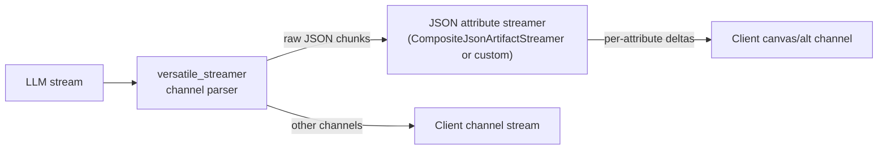

# Channeled Streamer (Versatile Streamer)

This document describes the SDK channeled streamer implemented in
`kdcube_ai_app/apps/chat/sdk/streaming/versatile_streamer.py` and how to use it.

## Motivation

Some agents need to emit multiple logical outputs in a single LLM stream
(e.g., a public answer plus a JSON sidecar, or a thinking/answer/followup trio).
The channeled streamer provides:

- A strict, tag-based protocol for multi-part streaming.
- Per-channel format controls (markdown/html/json/text).
- Per-channel citation replacement while preserving raw text in storage.
- Optional composite streaming for managed JSON artifacts.

This avoids ad-hoc parsing and ensures the client sees the correct channel
content as it streams.

## Output Protocol (Required)

The model must wrap each channel in XML-like tags:

```
<channel:thinking> ... </channel:thinking>
<channel:answer> ... </channel:answer>
<channel:followup> {"followups": [...]} </channel:followup>
```

- Channel names are case-insensitive but must match the configured
  `ChannelSpec.name` values.
- Only tags defined in the protocol should be emitted by the model.
- The streamer ignores any content outside a channel tag.

## Core Mechanism

`stream_with_channels(...)` performs a streaming parse with these steps:

1. Scan for `<channel:name>` open tags.
2. Stream text until the matching `</channel:name>` close tag.
3. For each channel chunk, apply:
   - Usage-tag stripping (optional).
   - Citation replacement (optional, format-specific).
   - Per-channel emit routing with its own index counter.
4. Flush any pending citations on channel close to avoid cross-channel leakage.

The streamer is designed to be safe with citation tokens split across chunk
boundaries. It uses a stateful citation tokenizer per channel so `[[S:n]]`
never leaks to the client when replacement is enabled.

## Citation Replacement

Citation replacement is per channel and controlled by `ChannelSpec.replace_citations`.

- For `markdown` and `text`: replaces `[[S:n]]` with links.
- For `html`: replaces inline citation tokens with HTML `<sup class="cite" ...>`
  (via the citations subsystem).
- For `json`/`yaml`: no replacement by default.

Important behavior:

- The streamer does NOT modify the stored raw output; it only modifies what is
  sent to the client during streaming when replacement is enabled.
- Replacement uses a per-channel stateful buffer to ensure tokens spanning
  chunks are fully replaced.

## Composite (Managed JSON) Streaming

For managed JSON artifacts, `CompositeJsonArtifactStreamer` can be enabled:

- Set `composite_cfg` and `composite_channel` in `stream_with_channels`.
- The raw JSON content is parsed and streamed to `composite_marker` (default
  `canvas`) rather than emitted as raw text to the client.

This allows incremental rendering of managed JSON artifacts while preserving
standard channel streaming for other content.

Note: `CompositeJsonArtifactStreamer` currently supports **top-level JSON keys**
only. Nested paths like `a.b` or `a.c[0]` are not streamed unless the streamer
is extended to understand nested JSON paths.

## JSON Channel → Per-Attribute Streaming

You can use a JSON channel as a *source* stream and fan it out into
per-attribute deltas on a separate stream. The pattern is:

1) The model emits a JSON channel (e.g., `<channel:answer> { ... } </channel:answer>`).
2) The channeled streamer routes those raw JSON chunks into a secondary
   streamer (e.g., `CompositeJsonArtifactStreamer` or a custom JSON attribute
   streamer).
3) The secondary streamer parses incrementally and emits per-attribute deltas
   to a different marker/channel (e.g., `canvas`), while the raw JSON can be
   suppressed from the user stream if desired.

This is the same architecture used by `CompositeJsonArtifactStreamer` for
managed JSON artifacts. You can apply it to any JSON channel by attaching a
custom streamer for that channel in `stream_with_channels`.

### Value Proposition

- **Stable client UI**: the client receives granular updates for specific
  fields without waiting for the full JSON to close.
- **Channel isolation**: attribute deltas go to a separate marker/channel
  (e.g., `canvas`), while the raw JSON stays hidden or is only stored.
- **Consistent parsing**: one place handles incremental JSON parsing and
  downstream rendering.

### Flow Diagram



### Example (Pseudo-Code)

```python
from kdcube_ai_app.apps.chat.sdk.streaming.versatile_streamer import ChannelSpec, stream_with_channels
from kdcube_ai_app.apps.chat.sdk.streaming.artifacts_channeled_streaming import CompositeJsonArtifactStreamer

channels = [
    ChannelSpec(name="answer", format="json", replace_citations=False, emit_marker="answer"),
    ChannelSpec(name="usage", format="json", replace_citations=False, emit_marker="answer"),
]

results = await stream_with_channels(
    svc=svc,
    messages=[system_msg, user_msg],
    role="answer.generator.regular",
    channels=channels,
    emit=emit_delta,
    agent="my.agent",
    artifact_name="my.json.artifact",
    composite_cfg={"artifactA": "path.to.schema"},
    composite_channel="answer",    # feed JSON channel to composite streamer
    composite_marker="canvas",     # emit per-attribute deltas to canvas
)
```

### When to Use

- You need partial rendering of a JSON artifact while it is still streaming.
- You want a strict separation between stored JSON and client-visible deltas.
- You have complex JSON payloads that benefit from live, field-by-field UI updates.

## API Reference (Simplified)

### ChannelSpec

```
ChannelSpec(
    name: str,
    format: str,               # markdown|html|json|text
    model: Optional[pydantic],
    replace_citations: bool = True,
    strip_usage: bool = True,
    emit_marker: Optional[str] = None,
)
```

### stream_with_channels

```
await stream_with_channels(
    svc: ModelServiceBase,
    messages: List[Any],
    role: str,
    channels: List[ChannelSpec],
    emit: ChannelEmitFn,
    agent: str,
    artifact_name: Optional[str] = None,
    sources_list: Optional[List[Dict[str, Any]]] = None,
    max_tokens: int = 8000,
    temperature: float = 0.3,
    debug: bool = False,
    composite_cfg: Optional[Dict[str, str]] = None,
    composite_channel: Optional[str] = None,
    composite_marker: str = "canvas",
) -> Dict[str, ChannelResult]
```

`ChannelResult` contains:
- `raw`: concatenated raw channel content.
- `obj`: parsed `pydantic` model if provided, else `None`.
- `used_sources`: list of SIDs detected in raw channel content.

## Usage Example

```
channels = [
    ChannelSpec(
        name="answer",
        format="markdown",
        replace_citations=True,
        emit_marker="answer",
    ),
    ChannelSpec(
        name="usage",
        format="json",
        replace_citations=False,
        emit_marker="answer",
    ),
]

results = await stream_with_channels(
    svc=svc,
    messages=[system_msg, user_msg],
    role="answer.generator.regular",
    channels=channels,
    emit=_emit_wrapper,
    agent="my.agent",
    artifact_name="report",
    sources_list=sources_list,
)

answer_raw = results["answer"].raw
usage_raw = results["usage"].raw
```

See also: `test_versatile_streamer.py` for illustrative, executable examples.

## Common Use Cases

- **Answer + usage sidecar**: stream a user-visible answer plus a JSON list
  of source IDs used.
- **Thinking + answer + followups**: multi-stage responses with user-facing
  reasoning and a structured followup block.
- **Managed JSON artifacts**: stream JSON to canvas while still emitting text
  channels for user-facing content.
- **Multi-format output**: mix markdown in one channel and JSON in another.

## Notes and Caveats

- Channel tags are mandatory. Without them, no channel output will be emitted.
- Do not emit nested channel tags; they are not supported.
- For channels with `replace_citations=True`, the streamer expects
  `sources_list` to be provided, otherwise it will leave citations unchanged.
- The streamer assumes the model obeys the protocol; malformed tag sequences
  may cause content to be dropped or routed incorrectly.
