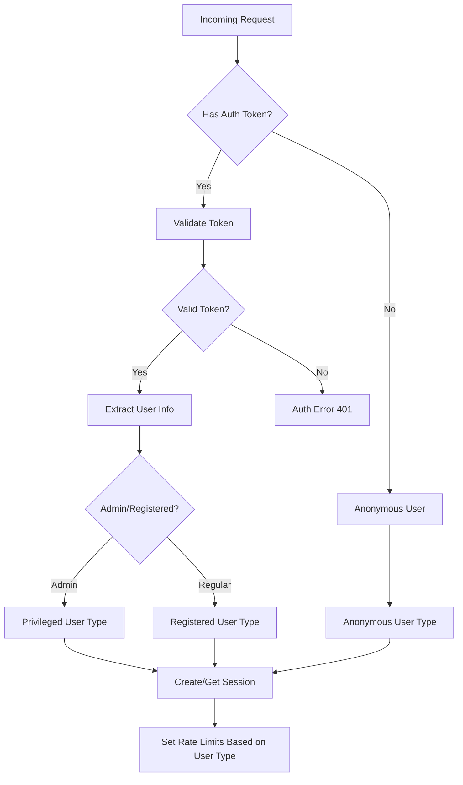
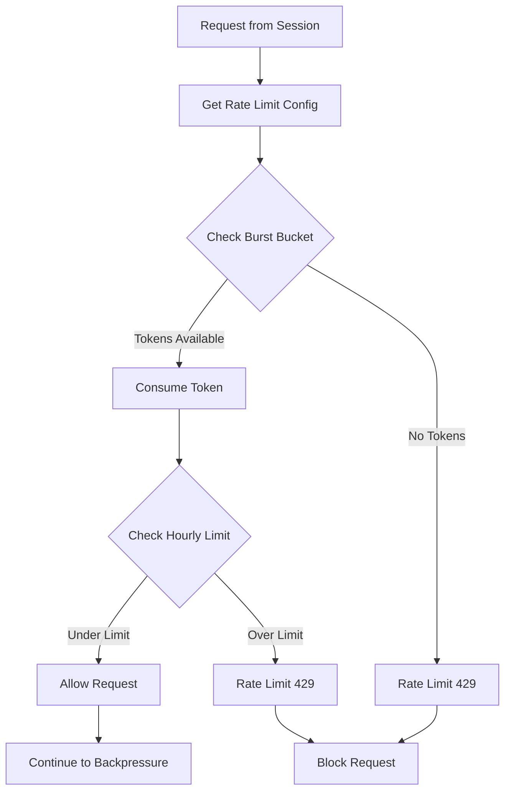
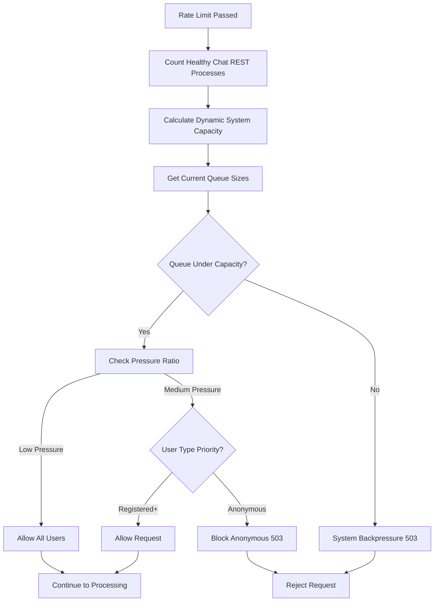
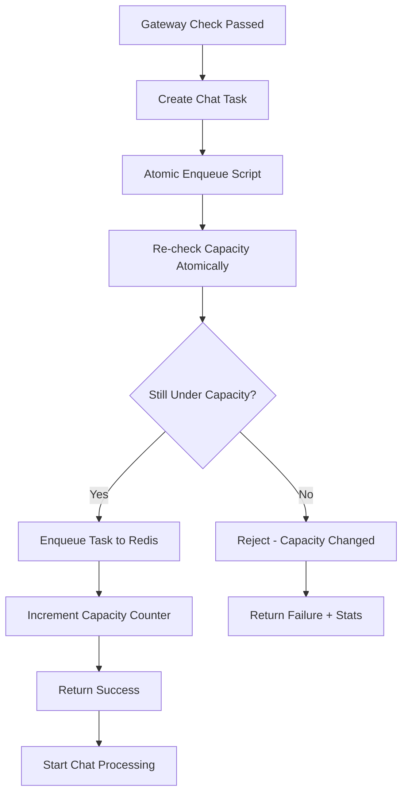
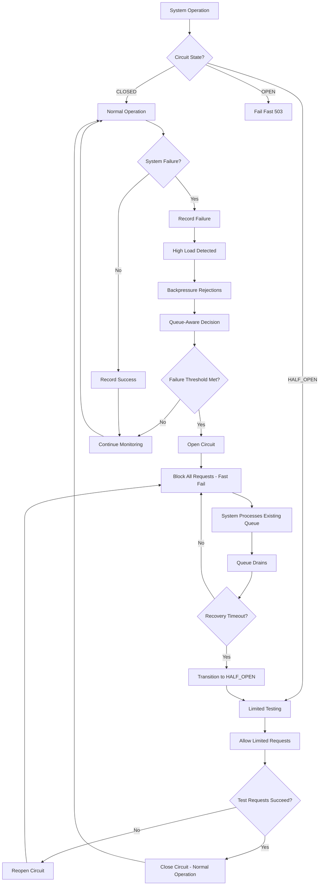
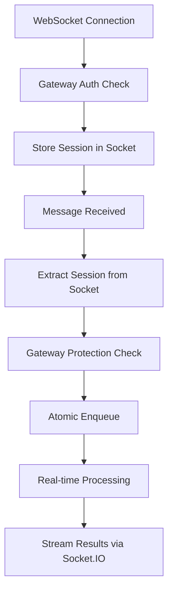

# Gateway Architecture Guide

## Overview

The gateway is a **multi-layered security and capacity management system** that protects the chat service from overload while providing different service levels for different user types. It features **dual-level backpressure protection** with both immediate gateway checks and atomic enqueue-time verification.

## 🏗️ Architecture Components

### Core Gateway Flow
```
Incoming Request → Authentication → Rate Limiting → Backpressure → Queue → Atomic Enqueue → Processing
                      ↓              ↓               ↓           ↓        ↓              ↓
               Circuit Breakers   Session Mgmt   Throttling   Monitoring  "By Fact"    Chat Processing
                                                                         Backpressure
```

### Key Components

1. **🔐 Authentication Layer** - Who are you?
2. **🚦 Rate Limiting Layer** - How fast can you go?
3. **🌊 Immediate Backpressure Layer** - Is the system healthy? (Gateway-level check)
4. **📦 Atomic Enqueue Layer** - Can we actually queue this? ("By fact" verification)
5. **⚡ Circuit Breakers** - Fail-fast protection across all layers
6. **📊 Monitoring & Analytics** - System observability

## 🔄 Dual-Level Backpressure Protection

### Level 1: Immediate Gateway Check
- **When**: Right after authentication/authorization in the gateway
- **Purpose**: Fast rejection to prevent unnecessary processing
- **Scope**: REST endpoints (`/landing/chat`) and WebSocket handlers (`/socket.io/chat`)
- **Implementation**: `AtomicBackpressureManager.check_capacity()`

### Level 2: Atomic Enqueue Verification
- **When**: During actual task enqueueing (the "by fact" check)
- **Purpose**: Ensure queue capacity hasn't changed between gateway check and enqueue
- **Scope**: Both REST and WebSocket - any actual chat task creation
- **Implementation**: `AtomicChatQueueManager.enqueue_chat_task_atomic()`

This dual approach prevents race conditions where the system state changes between the initial check and actual enqueueing.

## 🔄 Request Processing Flow

### Step 1: Authentication & Session Management


**User Types & Privileges:**
- **Anonymous**: Strict limits, lowest priority
- **Registered**: Higher limits, medium priority
- **Privileged**: Highest limits, top priority, can bypass throttling on admin endpoints

### Step 2: Rate Limiting (Token Bucket)


**Rate Limit Configuration:**
```yaml
Anonymous Users:
  burst_limit: 5 requests in 60 seconds
  hourly_limit: 50 requests per hour

Registered Users:
  burst_limit: 20 requests in 60 seconds  
  hourly_limit: 500 requests per hour

Privileged Users:
  burst_limit: 100 requests in 60 seconds
  hourly_limit: unlimited (-1)
```

### Step 3: Immediate Backpressure Management


**Key Features:**
- **Dynamic Capacity Calculation**: Uses actual healthy chat REST processes from heartbeats
- **Process-Aware Scaling**: Capacity = `healthy_processes × concurrent_per_process × (queue_multiplier + effective_ratio)`
- **User-Type Priority**: Higher priority users can access system under higher pressure

### Step 4: Atomic Enqueue with "By Fact" Verification


**Atomic Script Benefits:**
- **Race Condition Prevention**: Capacity check + enqueue in single Redis operation
- **Real-Time Accuracy**: Uses actual queue sizes at enqueue time
- **Circuit Breaker Integration**: Rejections count toward circuit breaker thresholds

### Step 5: Circuit Breakers


**Circuit Breaker Types:**
- **Authentication CB**: Protects against auth service failures
- **Rate Limiter CB**: Protects against rate limiter system failures
- **Backpressure CB**: Protects against queue/processing system failures (queue-aware recovery)

### Step 6: WebSocket Integration
WebSockets receive the **same protection** as REST endpoints:



**WebSocket-Specific Features:**
- **Connection-time Gateway Check**: Full gateway processing during socket connection
- **Message-level Protection**: Each chat message goes through complete gateway flow
- **Atomic Enqueue Integration**: Same "by fact" backpressure as REST endpoints
- **Real-time Error Feedback**: Rate limit/backpressure errors sent via socket events

## 📊 Dynamic Capacity Calculation

### Process-Aware Capacity Scaling
```python
# System calculates capacity from actual running processes
healthy_chat_processes = count_healthy_processes(service_type="chat", service_name="rest")
actual_capacity = healthy_processes * concurrent_per_process * capacity_calculation

# Handles process failures gracefully:
# 3 processes configured, 2 healthy = capacity based on 2
# 1 process down = automatic capacity reduction
```

### Capacity Formula
```python
# Per instance calculation
concurrent_per_process = 5  # MAX_CONCURRENT_CHAT
processes_per_instance = 1  # CHAT_APP_PARALLELISM  
capacity_buffer = 0.2       # 20% safety buffer
queue_multiplier = 2.0      # 2x processing capacity for queue

# Effective capacity calculation
processing_capacity = healthy_processes * concurrent_per_process
effective_capacity = int(processing_capacity * (1 - capacity_buffer))
queue_capacity = int(processing_capacity * queue_multiplier)
total_capacity = effective_capacity + queue_capacity
```

### Pressure Thresholds
```python
# Dynamic thresholds based on actual capacity
anonymous_threshold = total_capacity * 0.6    # 60%
registered_threshold = total_capacity * 0.8   # 80%  
hard_limit = total_capacity * 0.95           # 95%

# Handles scaling automatically:
# More processes = higher thresholds
# Fewer processes = lower thresholds
```

## 🚨 **Circuit Breaker Philosophy**

**Circuit breakers protect against system failures, not policy enforcement:**

```python
# ✅ Should trigger circuit breaker:
- Database connection failures
- Service timeouts  
- 500 internal server errors
- Authentication service down
- Backpressure rejections (system overload)
- Atomic enqueue failures

# ❌ Should NOT trigger circuit breaker:
- 429 Rate limiting (POLICY enforcement)
- 401/403 Auth errors (POLICY enforcement)
```

### Enhanced Backpressure Circuit Breaker
- **Queue-Aware Recovery**: Considers actual queue pressure for faster recovery
- **Dual-Level Integration**: Responds to both gateway-level and enqueue-level rejections
- **Graceful Degradation**: Fast circuit opening under sustained pressure
- **Intelligent Recovery**: Faster recovery when queue pressure decreases

## 🔧 Configuration Management

### Centralized Configuration
All gateway settings managed through `GatewayConfiguration`:

```python
# Process-aware capacity configuration
service_capacity:
  concurrent_requests_per_process: 5    # MAX_CONCURRENT_CHAT
  processes_per_instance: 1             # CHAT_APP_PARALLELISM
  avg_processing_time_seconds: 25.0     # For throughput calculations

# Dynamic backpressure thresholds
backpressure:
  capacity_buffer: 0.2                  # 20% safety buffer  
  queue_depth_multiplier: 2.0           # 2x processing for queue
  anonymous_pressure_threshold: 0.6     # Block anonymous at 60%
  registered_pressure_threshold: 0.8    # Block registered at 80%
  hard_limit_threshold: 0.95           # Hard limit at 95%
```

### Configuration Profiles
- **Development**: Permissive settings, higher limits
- **Testing**: Moderate settings for testing scenarios
- **Production**: Conservative settings, enhanced protection
- **Load Test**: High capacity settings for load testing

## 🔄 WebSocket vs REST Equivalence

| Feature | REST Endpoint | WebSocket Handler |
|---------|---------------|-------------------|
| Authentication | ✅ Gateway check | ✅ Gateway check at connect |
| Rate Limiting | ✅ Per request | ✅ Per message |
| Immediate Backpressure | ✅ Gateway level | ✅ Gateway level |
| Atomic Enqueue | ✅ "By fact" check | ✅ "By fact" check |
| Circuit Breakers | ✅ All types | ✅ All types |
| Error Responses | HTTP status codes | Socket.IO events |
| Session Management | Request state | Socket session |

## 📈 Monitoring & Observability

### Real-Time Metrics
- **Process Health**: Live tracking of chat REST processes via heartbeats
- **Queue Pressure**: Real-time capacity utilization across all user types
- **Circuit Breaker Status**: State and health of all circuit breakers
- **Throttling Events**: Comprehensive tracking of all rejections

### Capacity Transparency
- **Configured vs Actual**: Shows expected vs detected process counts
- **Dynamic Thresholds**: Live calculation of pressure thresholds
- **Health Ratios**: Process health and capacity utilization metrics
- **Performance Warnings**: Automatic detection of capacity issues

This architecture ensures **consistent protection** across all entry points (REST and WebSocket) while providing **real-time adaptation** to actual system capacity and **comprehensive observability** for operations teams.