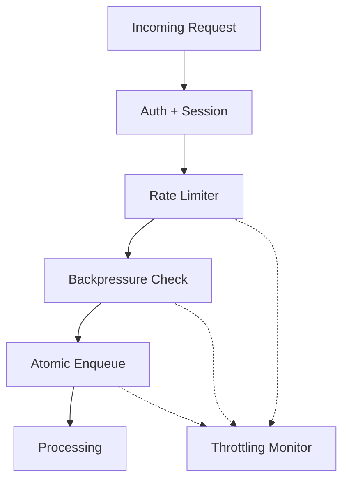
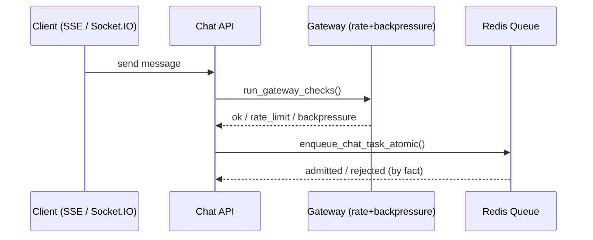
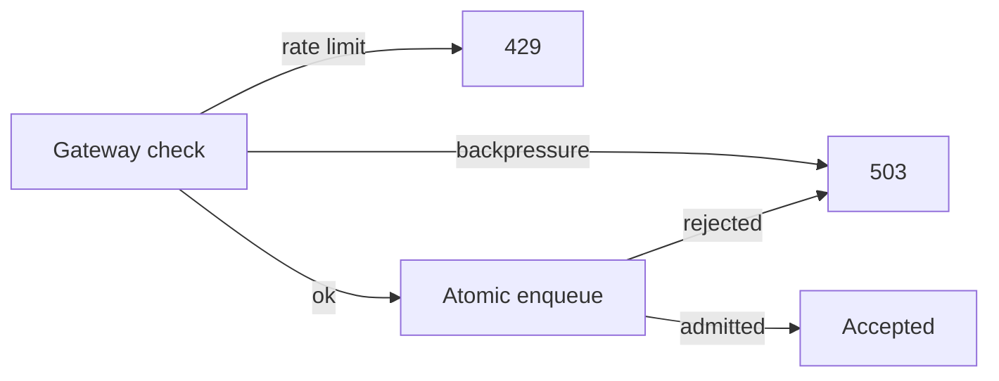

# Gateway & Admission Control (Current)

This document describes **how the gateway actually runs today** in this codebase and how to configure it.

---

## 1) What the gateway does

The gateway provides:
- **Session resolution** (auth → user/session/user_type)
- **Rate limiting** (per user type, burst + hourly)
- **Backpressure** (queue/health‑based admission control)
- **Circuit breakers** (fail‑fast on system failures)
- **Atomic enqueue gating** (admit/deny at enqueue time)



---

## 2) Where it is enforced today

### HTTP middleware (session by default)
The HTTP middleware in `apps/chat/api/web_app.py` resolves the session and applies
**policy‑based throttling/backpressure**.

- **Default**: REST is **session‑only** (bypass throttling/backpressure).
- **Guarded REST**: exact heavy endpoints are classified as `CHAT_INGRESS` and **are gated**.

Key files:
- [web_app.py](../../apps/chat/api/web_app.py)
- [gateway_policy.py](../../apps/middleware/gateway_policy.py)
- [gateway.py](../../apps/middleware/gateway.py)

### Chat ingress (full gateway checks)
Chat ingestion **does** run full gateway protection:
- **SSE** `/sse/chat` via `run_gateway_checks(...)`
- **Socket.IO** `chat_message` via `run_gateway_checks(...)`

After admission, the task is enqueued via **atomic enqueue** with backpressure:
- `AtomicChatQueueManager.enqueue_chat_task_atomic(...)`

Key files:
- [chat_core.py](../../apps/chat/api/ingress/chat_core.py)
- [sse/chat.py](../../apps/chat/api/sse/chat.py)
- [socketio/chat.py](../../apps/chat/api/socketio/chat.py)
- [backpressure.py](./backpressure.py)

---

## 3) Admission flow (today)





---

## 4) How to enable gateway protection for REST APIs

Currently, REST APIs are **session‑only** by default. To apply gateway limits:

Option A (recommended): **update the policy**
- Edit [gateway_policy.py](../../apps/middleware/gateway_policy.py)
- Classify the REST endpoints you want as `CHAT_INGRESS` or add a new class
- Set `bypass_throttling=False` and `bypass_gate=False`

Option B: **apply checks per‑endpoint**
- Use `gateway_adapter.require(...)` or `run_gateway_checks(...)` explicitly

When adding REST throttling, use **higher/burstier limits** so client APIs can call
internal endpoints without being dropped.

### Activation note (current code)
- The policy includes an **explicit guarded REST pattern list** in
  [gateway_policy.py](../../apps/middleware/gateway_policy.py).
- To activate or tune it, set `guarded_rest_patterns` in `GATEWAY_CONFIG_JSON` (or update via `/admin/gateway/update-config`).

Current guarded endpoints (exact patterns):
- `/resources/link-preview`
- `/resources/by-rn`
- `/conversations/{tenant}/{project}/{conversation_id}/fetch`
- `/conversations/{tenant}/{project}/turns-with-feedbacks`
- `/conversations/{tenant}/{project}/feedback/conversations-in-period`
- `/integrations/bundles/{tenant}/{project}/operations/{operation}`

---

## 5) Configuration

Gateway configuration is centralized in:
- [config.py](./config.py)
- [resolvers.py](../../apps/chat/api/resolvers.py)

Key environment variables:
- `GATEWAY_PROFILE` (development|testing|production|load_test)
- `GATEWAY_PRESET` (optional preset name)
- `GATEWAY_CONFIG_JSON` (full config override; recommended)
- `REDIS_URL`
- `INSTANCE_ID`, `TENANT_ID`, `DEFAULT_PROJECT_NAME`
- `MAX_CONCURRENT_CHAT`, `CHAT_APP_PARALLELISM`
- `AVG_PROCESSING_TIME_SECONDS`

Note:

Admin endpoints for config validation/update:
- `POST /admin/gateway/validate-config`
- `POST /admin/gateway/update-config`
- `POST /admin/gateway/reset-config`

See: [README-monitoring-observability.md](../../apps/chat/api/monitoring/README-monitoring-observability.md)

**Config persistence + propagation**
- Gateway config is stored in Redis (per tenant/project) using the KV cache abstraction.
- Update events are published to a **tenant/project‑scoped channel**, and replicas
  subscribe and apply changes at runtime.
- The config is **tenant/project‑scoped** via Redis key prefixing and channel names.
- Each service instance **applies only its own tenant/project config** (from env),
  but it can **publish updates for any tenant/project** via the admin API.
- On startup, the service **loads Redis config first** (if present) and falls back to env defaults.

Redis keys/channels (per tenant/project):
- `"<tenant>:<project>:kdcube:config:gateway:current"`
- `"<tenant>:<project>:kdcube:config:gateway:update"`

Subscriber wiring:
- Chat API subscribes on startup in [web_app.py](../../apps/chat/api/web_app.py).

### Update-config payload (current)
`POST /admin/gateway/update-config`

```json
{
  "tenant": "tenant-a",
  "project": "project-a",
  "service_capacity": {
    "concurrent_per_process": 5,
    "processes_per_instance": 1,
    "avg_processing_time_seconds": 25
  },
  "backpressure": {
    "capacity_buffer": 0.2,
    "queue_depth_multiplier": 2.0,
    "anonymous_pressure_threshold": 0.6,
    "registered_pressure_threshold": 0.8,
    "hard_limit_threshold": 0.95
  },
  "rate_limits": {
    "anonymous": { "hourly": 50, "burst": 5, "burst_window": 60 },
    "registered": { "hourly": 500, "burst": 20, "burst_window": 60 },
    "paid": { "hourly": 1000, "burst": 50, "burst_window": 60 },
    "privileged": { "hourly": -1, "burst": 100, "burst_window": 60 }
  }
}
```

Notes:
- `tenant`/`project` are optional; if omitted, the update applies to the local service tenant/project.
- Role limits are **per role** and can include any role key the system recognizes.

### GATEWAY_CONFIG_JSON (example)
```json
{
  "tenant_id": "tenant-a",
  "project_id": "project-a",
  "guarded_rest_patterns": [
    "^/resources/link-preview$",
    "^/resources/by-rn$",
    "^/conversations/[^/]+/[^/]+/[^/]+/fetch$",
    "^/conversations/[^/]+/[^/]+/turns-with-feedbacks$",
    "^/conversations/[^/]+/[^/]+/feedback/conversations-in-period$",
    "^/integrations/bundles/[^/]+/[^/]+/operations/[^/]+$",
    "^/api/cb/conversations/[^/]+/[^/]+$",
    "^/api/opex/total$"
  ],
  "service_capacity": {
    "concurrent_requests_per_process": 5,
    "processes_per_instance": 1,
    "avg_processing_time_seconds": 25
  },
  "backpressure": {
    "capacity_buffer": 0.2,
    "queue_depth_multiplier": 2.0,
    "anonymous_pressure_threshold": 0.6,
    "registered_pressure_threshold": 0.8,
    "hard_limit_threshold": 0.95
  },
  "rate_limits": {
    "anonymous": { "hourly": 120, "burst": 10, "burst_window": 60 },
    "registered": { "hourly": 600, "burst": 30, "burst_window": 60 },
    "paid": { "hourly": 2000, "burst": 60, "burst_window": 60 },
    "privileged": { "hourly": -1, "burst": 200, "burst_window": 60 }
  }
}
```

### .env example
```dotenv
GATEWAY_CONFIG_JSON='{
  "tenant_id": "tenant-a",
  "project_id": "project-a",
  "guarded_rest_patterns": [
    "^/resources/link-preview$",
    "^/resources/by-rn$",
    "^/conversations/[^/]+/[^/]+/[^/]+/fetch$",
    "^/conversations/[^/]+/[^/]+/turns-with-feedbacks$",
    "^/conversations/[^/]+/[^/]+/feedback/conversations-in-period$",
    "^/integrations/bundles/[^/]+/[^/]+/operations/[^/]+$",
    "^/api/cb/conversations/[^/]+/[^/]+$",
    "^/api/opex/total$"
  ],
  "service_capacity": {
    "concurrent_requests_per_process": 5,
    "processes_per_instance": 1,
    "avg_processing_time_seconds": 25
  },
  "backpressure": {
    "capacity_buffer": 0.2,
    "queue_depth_multiplier": 2.0,
    "anonymous_pressure_threshold": 0.6,
    "registered_pressure_threshold": 0.8,
    "hard_limit_threshold": 0.95
  },
  "rate_limits": {
    "anonymous": { "hourly": 120, "burst": 10, "burst_window": 60 },
    "registered": { "hourly": 600, "burst": 30, "burst_window": 60 },
    "paid": { "hourly": 2000, "burst": 60, "burst_window": 60 },
    "privileged": { "hourly": -1, "burst": 200, "burst_window": 60 }
  }
}'
```

### Common client boot requests (example patterns)
Use these if you want client-side boot calls to count toward the gateway limits.

```json
{
  "guarded_rest_patterns": [
    "^/integrations/bundles/[^/]+/[^/]+/operations/[^/]+$",
    "^/api/cb/conversations/[^/]+/[^/]+$",
    "^/api/opex/total$"
  ]
}
```

### Reset-config payload (current)
`POST /admin/gateway/reset-config`

```json
{
  "tenant": "tenant-a",
  "project": "project-a",
  "dry_run": true
}
```

Notes:
- If `tenant`/`project` are omitted, the local service resets itself.
- If `dry_run=true`, no Redis write or publish occurs.
- Otherwise, this writes env defaults into Redis and publishes an update event.

---

## 6) Notes on backpressure

Two checks are used:
- **Gateway check**: `BackpressureManager.check_capacity(...)`
- **Atomic enqueue**: `AtomicChatQueueManager.enqueue_chat_task_atomic(...)`

This prevents race conditions where system pressure changes between check and enqueue.
