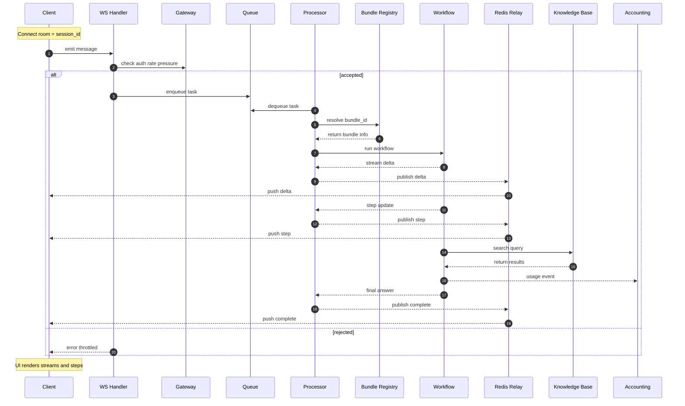
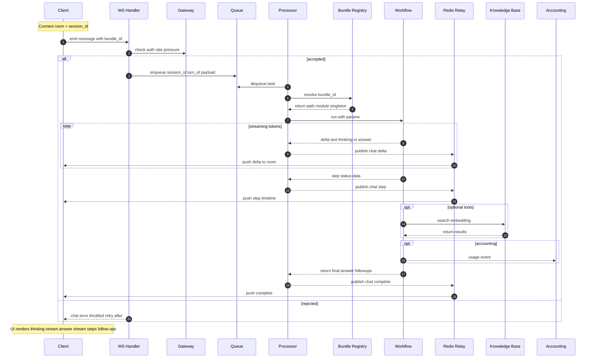

# Agentic App Bundles — Developer Guide (WS-only, multi-bundle runtime)

Build your chatbot logic as a **bundle** and run it inside the chat runtime with **live streaming**, **step timelines**, and **follow-ups** — without touching infra or UI plumbing.

* **Prototype fast:** WebSocket, queue, auth, sessions, storage, accounting — already wired.
* **Multi-bundle:** register many bundles and select one per message.
* **Streaming & steps:** token streaming + step events out-of-the-box.
* **Follow-ups:** clickable suggestions for “next actions.”
* **Accounting:** SDK LLM/Embedding calls are auto-tracked per tenant/project/user/service type; add your own breakdown with `with_accounting(...)`.

> **Transport:** There is **no blocking REST** response path. All answers stream **asynchronously over WebSocket**; workers may run on a different process/host and route results back to your socket via Redis relay.

---

## Quickstart — Clone → Compose → Chat

1. **Register your bundle(s)** via env:

```bash
export AGENTIC_BUNDLES_JSON='{
  "default_bundle_id": "demo.hello",
  "bundles": {
    "demo.hello": {
      "id": "demo.hello",
      "name": "Hello Demo",
      "path": "/bundles/hello",    # host-mounted dir
      "module": "agentic_app",     # file inside that dir
      "singleton": false
    }
  }
}'
```

2. **Start services** (all-in-one):

```bash
# backend (chat, redis, worker, kb, etc.)
docker compose --profile backend --env-file ./.env.backend up -d

# frontend demo UI (optional)
docker compose --profile frontend up -d
```

3. **Send a message (WebSocket only).**
   Open a Socket.IO connection to `/socket.io` and emit a payload like:

```jsonc
{
  "message": "hello world",
  "config": {
    "agentic_bundle_id": "demo.hello",
    "selected_model": "gpt-4o"              // optional; used by SDK helpers if provided
  },
  "chat_history": []
}
```

You’ll receive a stream of **events** (`chat.start`, `chat.step`, `chat.delta`, `chat.complete`, `chat.error`) on the same socket **session**.

---

## Bundle Anatomy

A bundle is a Python module/package that exports a **decorated workflow class**:

```
my_bundle/
├── agentic_app.py     # ← your workflow (required)
└── __init__.py        # (optional) BUNDLE_ID, helpers
```

Supported forms: directory, single `.py`, or wheel/zip (then set `module`).

---

## Minimal “Hello Workflow” (copy–paste)

```python
# my_bundle/agentic_app.py
import asyncio, time
from typing import Dict, Any
from kdcube_ai_app.infra.plugin.agentic_loader import agentic_workflow, agentic_initial_state
from kdcube_ai_app.apps.chat.emitters import ChatCommunicator
from kdcube_ai_app.apps.chat.sdk.inventory import Config

BUNDLE_ID = "demo.hello"

@agentic_initial_state(name=f"{BUNDLE_ID}.init", priority=100)
def initial_state(payload: Dict[str, Any]) -> Dict[str, Any]:
    return {
        "user_message": payload.get("user_message"),
        "final_answer": None,
        "error_message": None,
        "execution_id": f"exec_{int(time.time()*1000)}",
        "start_time": time.time(),
        "step_logs": [],
        "followups": []
    }

@agentic_workflow(name=BUNDLE_ID, version="1.0.0", priority=100)
class HelloWorkflow:
    def __init__(self, config: Config, communicator: ChatCommunicator, streaming: bool = True):
        self.config = config
        self.comm = communicator
        self.streaming = streaming

    async def run(self, **params) -> Dict[str, Any]:
        text = (params.get("text") or "").strip()

        # Step: workflow start
        await self.comm.step(step="workflow_start", status="started",
                             title="Starting", data={"message": text})

        # Stream "thinking" (optional side panel)
        ti = -1
        for tok in ["Planning… ", "Answer ", "short. "]:
            ti += 1
            await self.comm.delta(text=tok, index=ti, marker="thinking")
            await asyncio.sleep(0.02)

        # Stream the user-facing answer
        ai = -1
        for tok in ["Hello! ", "You wrote: ", f"“{text}”."]:
            ai += 1
            await self.comm.delta(text=tok, index=ai, marker="answer")
            await asyncio.sleep(0.02)

        # Step: answer generated
        await self.comm.step(step="answer_generator", status="completed",
                             title="Answer ready", data={"len": len(text)})

        # Follow-ups
        followups = [
            "Save the answer to notes.",
            "Export conversation to markdown."
        ]
        await self.comm.step(step="followups", status="completed",
                             title="Suggested next actions",
                             data={"items": followups})

        # Step: complete
        await self.comm.step(step="workflow_complete", status="completed", title="Done")

        return {
            "final_answer": f"Hello! You wrote: “{text}”.",
            "followups": followups,
            "error_message": None
        }
```

---

## Runtime Contract

### Constructor

```python
def __init__(self, config: Config, communicator: ChatCommunicator, streaming: bool = True)
```

* `config`: resolved app config (models, embedder, kb endpoints, etc. if provided).
* `communicator`: emit **steps** and **token deltas** to the client.
* `streaming`: you can use this flag to gate token streaming.

### Entry point

```python
async def run(self, **params) -> Dict[str, Any]:
    # params may include: text, attachments, etc.
```

**Return** a JSON-serializable dict. Common keys:

```jsonc
{
  "final_answer": "string",             // REQUIRED
  "error_message": null,
  "followups": ["…", "…"],              // optional
  "step_logs": [],                      // optional
  "execution_id": "exec_…",             // optional
  "start_time": 1730000000.0            // optional
}
```

---

## Emitting Streams & Steps

### Token deltas

* `marker="answer"` — visible chat response (main bubble)
* `marker="thinking"` — optional side stream for rationale/plan

```python
await self.comm.delta(text=chunk, index=i, marker="answer")
await self.comm.delta(text=chunk, index=i, marker="thinking")
```

> Increase `index` monotonically **per marker**.

### Step updates

Call at the start and end of meaningful phases:

```python
await self.comm.step(step="rag_retrieval", status="started", title="Searching KB")
# ...
await self.comm.step(step="rag_retrieval", status="completed",
                     data={"hits": 7, "latency_ms": 123})
```

**Common step names** (UI knows these):
`workflow_start`, `summarize`, `classifier`, `query_writer`, `rag_retrieval`, `reranking`, `answer_generator`, `followups`, `workflow_complete`.

### Follow-ups (suggestions)

Emit as a **step** so the UI renders chips:

```python
await self.comm.step(step="followups", status="completed", data={"items": [
  "Сформувати короткий підсумок.",
  "Експортувати у Markdown.",
  "Продовжити аналіз."
]})
```

**Style (recommended):** imperative, one action each, ≤120 chars, period at the end; 0–3 items.

### Custom events (optional)

If you need extras for your UI, you can emit a **custom chat event** (and still mirror a `step`):

```python
await self.comm.emit_enveloped({
  "type": "chat.my_widget",
  "event": {"step": "my_widget", "status": "completed", "title": "Widget Data"},
  "data": {"series": [1,2,3]}
})
```

---

## Attachments

Bundles can receive attachments sent from the chat UI; they arrive in `run(**params)` (e.g., file name, MIME type, handle). Resolve content via your storage/KB tools as needed.

> If you want this doc to show a concrete attachment schema + helper, share the final payload shape and I’ll add it.

---

## SDK & Accounting (optional but recommended)

Use the SDK helpers for LLMs/Embeddings to get **auto-accounting**:

* Usage is recorded per **tenant/project/user/session** and **service type** (`llm`, `embedding`).
* Storage layout:

```
accounting/<tenant>/<project>/<YYYY.MM.DD>/<service_type>/<component_name>/usage_<timestamp>-<eventId>.json
```

Add extra breakdown with:

```python
from kdcube_ai_app.infra.accounting import with_accounting

with with_accounting("my.bundle.phase", metadata={"phase":"rerank","k":50}):
    # your LLM/embedding/tool code here
    pass
```

(You can also use decorators like `@track_llm()` / `@track_embedding()` if calling providers directly.)

---

## Multi-bundle Registry (how the runtime finds you)

Provide bundles via `AGENTIC_BUNDLES_JSON`. Two accepted shapes:

```bash
# flat
export AGENTIC_BUNDLES_JSON='{
  "demo.hello": {"id":"demo.hello","path":"/bundles/hello","module":"agentic_app","singleton":false}
}'
```

```bash
# wrapped (with default)
export AGENTIC_BUNDLES_JSON='{
  "default_bundle_id": "demo.hello",
  "bundles": {
    "demo.hello": {"id":"demo.hello","path":"/bundles/hello","module":"agentic_app","singleton":false}
  }
}'
```

The runtime hot-reloads this registry across workers and clears loader caches on change.

---

## Event Loop & Routing (how WS-only async works)

1. **Client → WS:** the browser/app sends `{ message, config, … }` over Socket.IO.
2. **Gateway:** auth + rate limits + backpressure; the request is **enqueued**.
3. **Worker:** the queue processor **loads your bundle** and calls `run(...)`.
4. **Streaming:** your bundle calls `communicator.delta/step`; these are published to Redis and **relayed** to the **socket “room” = session\_id**.
5. **Complete:** a final `chat.complete` is emitted with your return payload.

> Because execution may occur on another worker/host, the original HTTP/WS handler does not block waiting for a reply. All progress and results are delivered asynchronously to the same socket session via the relay.

awesome—here are two drop-in Mermaid diagrams for the README.

### 1) Architecture (WS-only async flow)



---

**Event types your bundle produces (and default UI consumes):**

* `chat.start` (platform)
* `chat.step` (your phases/timeline)
* `chat.delta` (your token stream; `marker="answer"|"thinking"`)
* `chat.followups` (optional custom; many UIs just read `step: "followups"`)
* `chat.complete` (platform)
* `chat.error` (platform)

---

### 🔁 Reload note (dev cycle)

Bundles are **imported into the running chat runtime** and cached per worker.

* **Code changes** in a bundle **require a process restart** so Python modules are re-imported.
* **Registry updates** (adding/removing bundles, switching default) can be hot-applied via the admin API, but they **do not reload code** already imported.

**Docker Compose quick commands**

```bash
# restart runtime so bundle code is picked up
docker compose restart chat

# rebuild when dependencies changed
docker compose up -d --build chat
```


## Troubleshooting

* **“No decorated workflow found.”**
  Ensure your class is decorated with `@agentic_workflow(...)` and its module is importable.

* **Deltas don’t appear.**
  `await` every `comm.delta(...)`; increment `index` per stream (`answer` vs `thinking`).

* **Timeline is empty.**
  Emit `step(..., status="started")` and `step(..., status="completed")` for each phase.

* **Follow-ups not visible.**
  Emit a `followups` **step** with `data={"items":[...]}` (the UI expects `items`).

* **Wheel/zip fails to load.**
  Set `module` to the inner module path that exports your decorated workflow.

---
