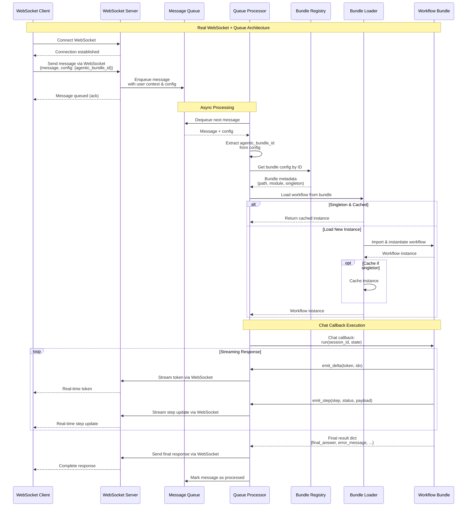
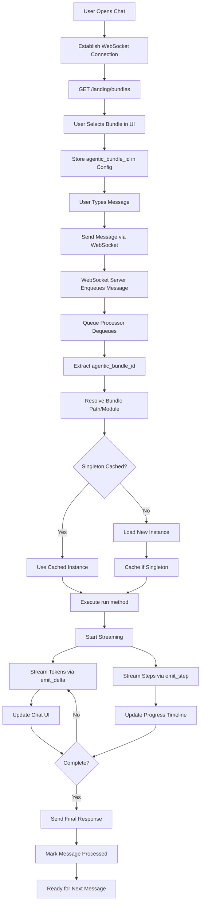

# Agentic App Bundles — Integration Guide (Multi-bundle runtime)

This guide shows how to plug **your** agentic app (LangGraph/LangChain/etc.) into the host chat service as a **bundle** — now with **multiple bundles** selectable at message time via **WebSocket + Queue** architecture.

You'll learn:
* The required **directory layout**
* The **decorators** that mark your workflow
* The **workflow interface** you should implement
* How to **stream** tokens and emit **step** updates over WebSocket
* The **multi-bundle registry** (env + admin API + Redis broadcast)
* How clients **choose a bundle** per message over WebSocket
* The **WebSocket → Queue → Processor → Chat Callback** flow
* A copy-paste **Hello World** bundle

> **Important:** A decorator is the **only way** to mark a workflow for discovery. If nothing is decorated, the loader won't find you.

---

## Architecture Overview



> The **processor** is responsible for applying `bundles.update` broadcasts and, when a shared registry store is configured, persisting the resulting snapshot; the environment variable (`AGENTIC_BUNDLES_JSON`) remains a seed/reset source.
> 
---

## 1) What's a "bundle"?

A bundle is a small Python package (or single file, or wheel/zip) the host imports dynamically. It contains your workflow (class or factory), optional RAG/tools glue, etc.

**Example layout:**
```
my_cool_bundle/
├── __init__.py
├── agentic_app.py        # ← your decorated workflow
├── inventory.py          # optional: local service/model glue
└── integrations/
    ├── __init__.py
    └── rag.py            # some submodule
```

Supported forms:
* **Package dir** with `__init__.py`
* **Single file** `.py`
* **Wheel/Zip** (`.whl` or `.zip`) — requires a **module name** inside the archive

---

## 2) Multi-bundle registry (env)

The host keeps a **registry** of bundles.
At startup the registry is built either from **environment** (`AGENTIC_BUNDLES_JSON`) 
or from a configured **registry store** (e.g. Redis) — the code supports both. 
At runtime the **processor** maintains an in-memory view and will persist updates back to the registry 
store when one is configured.

Define bundles in env as JSON (either shape works):

```bash
# flat (legacy) shape: id -> entry
export AGENTIC_BUNDLES_JSON='{
  "kdcube.demo.1": {
    "id": "kdcube.demo.1",
    "name": "KDCubeDemo.1",
    "path": "/bundles/custom_apps",
    "module": "default_app.agentic_app",
    "singleton": false,
    "description": "Agentic App: Default App"
  },
  "contextmgmt.experiment": { "...": "..." }
}'
```

```bash
# wrapped shape with default
export AGENTIC_BUNDLES_JSON='{
  "default_bundle_id": "kdcube.demo.1",
  "bundles": {
    "kdcube.demo.1": { "...": "..." },
    "contextmgmt.experiment": { "...": "..." }
  }
}'
```

**Fields**

* `id` — unique key
* `path` — absolute path in the container (e.g. `/bundles/...`)
* `module` — required for `.whl`/`.zip`, or when pointing to a parent dir
* `singleton` — prefer one instance per process
* `name`, `description` — for UI
* `default_bundle_id` (optional if using wrapped shape). If omitted, the **first entry** is used as default.

> If you’re running multi-process / multi-node, configure a shared registry store. The processor will sync to it on 
> startup, apply updates received via broadcast, and persist the resulting snapshot.

---

## 3) Choosing a bundle per message (WebSocket)

Clients choose a bundle via `agentic_bundle_id` inside the message **config** sent over WebSocket:

```jsonc
{
  "message": "help me analyze this dataset",
  "config": {
    "selected_model": "gpt-4o",
    "selected_embedder": "openai-text-embedding-3-small",
    "kb_search_endpoint": "http://kb/api/kb",
    "agentic_bundle_id": "data-analyzer"   // ← choose here
  }
}
```

If omitted, the host uses what's defined in bundles snapshot defined as `default_bundle_id`.

**Message Flow:**
1. Client sends message via **WebSocket** connection
2. WebSocket server **enqueues** the message with config
3. **Queue processor** dequeues and handles the message asynchronously
4. Processor extracts `agentic_bundle_id` and loads the appropriate bundle
5. **Chat callback** (`run` method) executes the workflow with streaming back over WebSocket

---

## 4) How the loader finds you (decorators)

Import the decorators from the host loader:

```py
from kdcube_ai_app.infra.plugin.agentic_loader import (
    agentic_workflow,          # decorate a CLASS
    agentic_workflow_factory,  # decorate a FACTORY function
    agentic_initial_state,     # optional: initial state builder
)
```

### `@agentic_workflow` (class)
```py
@agentic_workflow(
    name="general-chat-workflow",
    version="1.0.0",
    priority=150,   # highest priority wins if multiple present
)
class MyWorkflow:
    ...
```

### `@agentic_workflow_factory` (function)
```py
@agentic_workflow_factory(
    name="my-workflow-factory",
    version="1.0.0",
    priority=200,   # beats lower-priority class if both exist
    singleton=True  # preferred default (env can still force it)
)
def create_workflow(config, step_emitter=None, delta_emitter=None):
    return MyWorkflow(config, step_emitter, delta_emitter)
```

> The loader picks the single **winner** with highest `priority` (tie → factory wins).

### `@agentic_initial_state` (optional)
```py
@agentic_initial_state(name="my-initial-state", priority=100)
def create_initial_state(user_message: str) -> dict:
    return {
        "user_message": user_message,
        "final_answer": None,
        "error_message": None,
        # ... add your own fields
    }
```

---

## 5) Workflow interface contract

Your decorated workflow **must** be constructible as:

```py
def __init__(self, config: Config, step_emitter=None, delta_emitter=None): ...
```

**IMPORTANT:** Currently, only the `run` method is used as the entrypoint:

```py
async def run(self, session_id: str, conversation_id: str, state: dict) -> dict:
    """
    Main entrypoint called by the queue processor
    
    Args:
        session_id: Unique session/thread identifier for conversation persistence
        state: Initial state dict (from create_initial_state or previous state)
    
    Returns:
        dict: Final state with at minimum 'final_answer' and 'error_message' fields
    """
```

The **queue processor** will pass:
* `delta_emitter(chunk: str, idx: int)` — token streaming back over WebSocket
* `step_emitter(step: str, status: "started"|"completed"|"error", payload: dict)` — timeline updates over WebSocket

### Config Object Structure

Your workflow receives a `Config` object with these key properties:

```py
class Config:
    selected_model: str              # e.g., "gpt-4o"
    openai_api_key: str
    claude_api_key: str
    selected_embedder: str           # e.g., "openai-text-embedding-3-small"
    embedding_model: str
    custom_embedding_endpoint: str
    kb_search_url: str
    log_level: str
    provider: str                    # "openai", "anthropic", etc.
    has_classifier: bool
    # ... and many more configuration options
```

---

## 6) Streaming & step events

**Token Streaming**
```py
idx = -1
for token in tokens:
    idx += 1
    await self.emit_delta(token, idx)
```

**Step Updates**
```py
await self.emit_step("query_writer", "started", {"message": "Generating queries"})
# do work...
await self.emit_step("query_writer", "completed", {"query_count": 5})
# on error:
await self.emit_step("query_writer", "error", {"error": str(e)})
```

Suggested step names the UI understands:
`workflow_start`, `classifier`, `query_writer`, `rag_retrieval`, `reranking`, `answer_generator`, `workflow_complete`

---

## 7) Return shape (JSON-serializable)

Return a plain dict (no LangChain objects) from your `run` method:

Required:
* `final_answer: str`
* `error_message: Optional[str]`

Useful optional fields:
* `is_our_domain: Optional[bool]`
* `classification_reasoning: Optional[str]`
* `retrieved_docs: Optional[List[dict]]`
* `reranked_docs: Optional[List[dict]]`
* `step_logs: List[dict]`
* `performance_metrics: dict`
* `execution_id: str`, `start_time: float`

---

## 8) Admin & runtime control (multi-bundle)

### 8.1 Read registry (chat users)
```
GET /landing/bundles
```
Returns the current registry snapshot for the running scope (optionally tenant/project aware).

**Response**
```json
{
  "default_bundle_id": "smart-assistant",
  "bundles": {
    "smart-assistant": {
      "id": "smart-assistant",
      "name": "Smart Assistant",
      "path": "/bundles/smart_assistant",
      "module": "app_backend.agentic_app",
      "singleton": true,
      "description": "General-purpose AI assistant for Q&A and tasks"
    },
    "data-analyzer": { "...": "..." },
    "demo-hello": { "...": "..." }
  }
}
```

### 8.2 Manage registry (super-admin)
```
POST /admin/integrations/bundles
Content-Type: application/json
```

**Body**

```jsonc
{
  "op": "merge",             // "merge" (upsert these ids) or "replace" (set exactly to these)
  "bundles": {
    "kdcube.demo.1": {
      "id": "kdcube.demo.1",
      "name": "Hello World Demo",
      "path": "/opt/agentic-bundles/demo_hello-1.0.0.whl",
      "module": "demo_hello.agentic_app",
      "singleton": false,
      "description": "Toy bundle for smoke tests"
    }
  },
  "default_bundle_id": "kdcube.demo.1"  // optional: also set default
}
```

**Behavior**

* Web app applies the change to its **in-memory registry** and **broadcasts** a `bundles.update` message.
* The **processor** listens for this broadcast, applies the change, mirrors to process env (best-effort), **persists** the full snapshot to the configured registry store (if any), and clears loader caches so new requests see the update.

> **Delete**: send `op: "replace"` with only the **remaining** ids. The processor will persist that new snapshot.

### 8.3 Reset registry from `.env` (super-admin)

```
POST /admin/integrations/bundles/reset-env
```

Forces a reset using `AGENTIC_BUNDLES_JSON` as the **source**. 
The effect is broadcast; processors apply it and persist the snapshot to the registry store (if configured).

---

## 9) Hot-reload via config broadcast

Updates propagate via a config broadcast that all processors subscribe to. Both payload shapes are accepted:

* **Channel:** `kdcube:config:bundles:update`
* **Message shape (JSON):**
```json
{
  "tenant": "t1",
  "project": "p1",
  "op": "merge",
  "ts": 1730000000,
  "registry": {
    "default_bundle_id": "kdcube.demo.1",
    "bundles": { "...": "..." }
  },
  "actor": "admin@example.com"
}
```

**Receiver behavior (each processor):**

1. Update in-memory registry.
2. Mirror to process env (best-effort).
3. **Persist** the resulting snapshot to the registry store (if configured).
4. Clear loader caches; **new** requests use the new mapping.

---

## 10) UI integration (WebSocket + Config widget)

* The **Config** widget calls `GET /landing/bundles` to list bundles; users pick one per chat (stored as `agentic_bundle_id` in their local config).
* If the user has **super-admin**, the widget shows **Manage Bundles** (add/edit/delete, set default) and calls `POST /admin/bundles`.
* The **Chat** component sends the chosen `agentic_bundle_id` in the `config` field with each message over **WebSocket**; the queue processor resolves it to `{path, module, singleton}` and loads the workflow via the chat callback.

---

## 11) Minimal bundle you can copy

`my_cool_bundle/__init__.py`
```py
# optional: version, exports
BUNDLE_ID = "hello-world-bundle"
```

`my_cool_bundle/agentic_app.py`
```py
import time
import asyncio
from typing import Optional, Dict, Any
from kdcube_ai_app.infra.plugin.agentic_loader import (
    agentic_workflow,
    agentic_initial_state,
)
from kdcube_ai_app.apps.chat.emitters import StepEmitter, DeltaEmitter
from kdcube_ai_app.apps.chat.inventory import Config

# Import from your bundle's __init__.py
try:
    from . import BUNDLE_ID
except ImportError:
    BUNDLE_ID = "hello-world-bundle"

@agentic_initial_state(name=f"{BUNDLE_ID}-initial-state", priority=100)
def create_initial_state(user_message: str) -> dict:
    return {
        "user_message": user_message,
        "final_answer": None,
        "error_message": None,
        "execution_id": f"exec_{int(time.time()*1000)}",
        "start_time": time.time(),
        "step_logs": [],
    }

@agentic_workflow(name=f"{BUNDLE_ID}", version="1.0.0", priority=100)
class HelloWorkflow:
    def __init__(self, config: Config,
                 step_emitter: Optional[StepEmitter] = None,
                 delta_emitter: Optional[DeltaEmitter] = None):
        self.config = config
        self.emit_step = step_emitter or (lambda *a, **k: asyncio.sleep(0))
        self.emit_delta = delta_emitter or (lambda *a, **k: asyncio.sleep(0))

    async def run(self, session_id: str, conversation_id: str, state: dict) -> Dict[str, Any]:
        """
        Main entrypoint called by queue processor
        """
        await self.emit_step("workflow_start", "started", {"message": "Starting..."})
        
        user_message = state.get("user_message", "")
        answer = f"Hello! You said: '{user_message}'"
        
        # Simulate streaming
        idx = -1
        for token in ["Hello", "! ", "You ", "said: ", f"'{user_message}'"]:
            idx += 1
            await self.emit_delta(token, idx)
            await asyncio.sleep(0.1)  # Simulate processing time
        
        await self.emit_step("answer_generator", "completed", {"answer_length": len(answer)})
        await self.emit_step("workflow_complete", "completed", {"message": "Done"})
        
        # Update state and return
        state.update({
            "final_answer": answer,
            "error_message": None
        })
        
        return state
```

You can find langgraph-based reference bundle(s) [here](../../apps/chat/default_app).
---

## 12) Config your host (env)
See [.env](../../../../../deployment/manual/sample_env/.env) for example.

---

## 13) Quick tests

Examples consider you use hardcoded auth where only an access token is needed.

For oauth, use the ai app platform client [TBD documenting] which ensures the proper auth headers.
**List bundles**
```bash
curl -H "Authorization: Bearer <token>" \
  http://localhost:8000/landing/bundles
```

**Set default + add/modify a bundle (super-admin)**
```bash
curl -X POST -H "Authorization: Bearer <admin-token>" -H "Content-Type: application/json" \
  -d '{
    "op":"merge",
    "bundles":{
      "demo-hello":{
        "id":"demo-hello",
        "name":"Hello World Demo", 
        "path":"/opt/agentic-bundles/demo_hello-1.0.0.whl",
        "module":"demo_hello.agentic_app",
        "singleton":false
      }
    },
    "default_bundle_id":"smart-assistant"
  }' \
  http://localhost:8000/admin/integrations/bundles

# delete via replace
curl -X POST -H "Authorization: Bearer <admin-token>" -H "Content-Type: application/json" \
  -d '{
    "op":"replace",
    "bundles": {
      "kdcube.demo.1": {
        "id":"kdcube.demo.1",
        "name":"KDCubeDemo.1",
        "path":"/bundles/custom_apps",
        "module":"default_app.agentic_app",
        "singleton":false
      }
    },
    "default_bundle_id":"kdcube.demo.1"
  }' \
  http://localhost:8000/admin/integrations/bundles

# reset from .env
curl -X POST -H "Authorization: Bearer <admin-token>" \
  http://localhost:8000/admin/integrations/bundles/reset-env
```  

**Send a chat message using a specific bundle**
```javascript
// WebSocket message format:
{
  "message": "say hi",
  "config": {
    "selected_model": "gpt-4o",
    "selected_embedder": "openai-text-embedding-3-small", 
    "agentic_bundle_id": "demo-hello"
  }
}
// HTTP message format: TBD
```

---

## 14) End-to-End Flow Diagram



---

## 15) FAQ & troubleshooting

**Loader says "No decorated workflow found …"**
Ensure your `path` and `module` point to the **module that contains the decorator**, and that the decorator actually runs on import (no `if __name__ == "__main__"` guards, no import-time exceptions).

**Wheel/zip doesn't load**
Provide `module` (e.g., `my_pkg.agentic_app`). Wheels/zips can't be auto-discovered without it.

**Multiple decorated items**
The loader picks the one with highest `priority` (tie → factory wins).

**Singleton vs non-singleton**
* Decorator `singleton=True` marks preference.
* Env can **force** via per-entry `singleton` in the registry.
* The loader maintains an instance cache when singleton is active.

**Hot-reload didn't apply**
Check Redis pub/sub connectivity. Verify a message was published on `kdcube:config:bundles:update`. The server updates env, clears loader caches, and new requests should use the new registry.

**Returning non-JSON types**
Only return primitives, lists, and dicts. Convert pydantic/LangChain objects to dicts/strings.

**WebSocket connection issues**
Ensure your WebSocket connection is properly established before sending messages. The server will queue messages and process them asynchronously.

**Streaming not working**
Make sure you're calling `emit_delta` and `emit_step` with `await` in your workflow. These methods send real-time updates back over the WebSocket connection.

---

With this setup you can host **many agentic apps** side-by-side, allow users to **pick a bundle per chat message**, 
and **admin** can add/replace/set default bundles across the fleet with Redis-based hot-reload — all over a scalable **WebSocket + Queue** architecture.