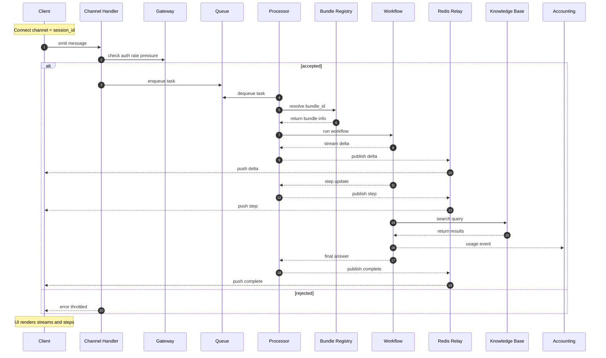

# Agentic App Bundles — Developer Guide (multi-bundle, channel-agnostic runtime)

This repo is the platform + Chat SDK for building **AI agents and chatbots** with streaming, tools, memory, and artifact storage.  
You package logic as a **bundle** and run it inside the chat runtime with **live streaming**, **step timelines**, and **follow-ups** — without touching infra or UI plumbing.

* **Prototype fast:** channel, queue, auth, sessions, storage, accounting — already wired.
* **Multi-bundle:** register many bundles and select one per message.
* **Streaming & steps:** token streaming + step events out-of-the-box.
* **Follow-ups:** clickable suggestions for “next actions.”
* **Accounting:** SDK LLM/Embedding calls are auto-tracked per tenant/project/user/service type; add your own breakdown with `with_accounting(...)`.

> **Transport:** There is **no blocking REST** response path. All answers stream **asynchronously over the active channel** (Socket.IO, SSE, or integration relay). Workers may run on a different process/host and route results back to your client channel via Redis relay. The channel is negotiated by the client; it can be an intermediate relay feeding external integrations (Telegram, Slack, etc.).

---

## Quickstart — Clone → Compose → Chat

**Bundle authors (AI agent/chatbot quickstart):**  
[Bundle Authoring Guide (Chat SDK)](../../apps/chat/sdk/examples/bundles/first-ai-bundle-README.md)

1. **Register your bundle(s)** via env:

```bash
export AGENTIC_BUNDLES_JSON='{
  "default_bundle_id": "demo.hello",
  "bundles": {
    "demo.hello": {
      "id": "demo.hello",
      "name": "Hello Demo",
      "path": "/bundles/hello",    # host-mounted dir
      "module": "agentic_app",     # file inside that dir
      "singleton": false
    }
  }
}'
```

2. **Start services** (all-in-one):

```bash
# backend (chat, redis, worker, kb, etc.)
docker compose --profile backend --env-file ./.env.backend up -d

# frontend demo UI (optional)
docker compose --profile frontend up -d
```

3. **Send a message (via your active channel).**
   Use the channel opened by the client (Socket.IO or SSE) and send a payload like:

```jsonc
{
  "message": "hello world",
  "config": {
    "agentic_bundle_id": "demo.hello",
    "selected_model": "gpt-4o"              // optional; used by SDK helpers if provided
  },
  "chat_history": []
}
```

You’ll receive a stream of **events** (`chat.start`, `chat.step`, `chat.delta`, `chat.complete`, `chat.error`) on the same session channel.

---

## Bundle Anatomy

A bundle is a Python module/package that exports a **decorated workflow class**:

```
my_bundle/
├── agentic_app.py     # ← your workflow (required)
└── __init__.py        # (optional) BUNDLE_ID, helpers
```

Supported forms: directory, single `.py`, or wheel/zip (then set `module`).

See also:
- [Bundle Authoring Guide (Chat SDK)](../../apps/chat/sdk/examples/bundles/first-ai-bundle-README.md)
- [Example bundles](../../apps/chat/sdk/examples/bundles/README.md)

---

## Minimal “Hello Workflow” (copy–paste)

```python
# my_bundle/agentic_app.py
import asyncio, time
from typing import Dict, Any
from kdcube_ai_app.infra.plugin.agentic_loader import agentic_workflow
from kdcube_ai_app.apps.chat.sdk.solutions.chatbot.entrypoint import BaseEntrypoint

BUNDLE_ID = "demo.hello"

@agentic_workflow(name=BUNDLE_ID, version="1.0.0", priority=100)
class HelloWorkflow(BaseEntrypoint):
    async def execute_core(self, *, state: Dict[str, Any], thread_id: str, params: Dict[str, Any]) -> Dict[str, Any]:
        text = (params.get("text") or "").strip()

        # Step: workflow start
        await self.comm.step(step="workflow_start", status="started",
                             title="Starting", data={"message": text})

        # Stream "thinking" (optional side panel)
        ti = -1
        for tok in ["Planning… ", "Answer ", "short. "]:
            ti += 1
            await self.comm.delta(text=tok, index=ti, marker="thinking")
            await asyncio.sleep(0.02)

        # Stream the user-facing answer
        ai = -1
        for tok in ["Hello! ", "You wrote: ", f"“{text}”."]:
            ai += 1
            await self.comm.delta(text=tok, index=ai, marker="answer")
            await asyncio.sleep(0.02)

        # Step: answer generated
        await self.comm.step(step="answer_generator", status="completed",
                             title="Answer ready", data={"len": len(text)})

        # Follow-ups
        followups = [
            "Save the answer to notes.",
            "Export conversation to markdown."
        ]
        await self.comm.step(step="followups", status="completed",
                             title="Suggested next actions",
                             data={"items": followups})

        # Step: complete
        await self.comm.step(step="workflow_complete", status="completed", title="Done")

        return {
            "final_answer": f"Hello! You wrote: “{text}”.",
            "followups": followups,
            "error_message": None
        }
```

---

## Runtime Contract

### Constructor (BaseEntrypoint)

```python
def __init__(self, config, pg_pool=None, redis=None, comm_context=None, event_filter=None, ctx_client=None)
```

* `config`: resolved app config (models, embedder, kb endpoints, etc. if provided).
* `comm_context`: task context used to build the ChatCommunicator.
* `pg_pool` / `redis`: optional DB pools for SDK subsystems.
* `ctx_client`: optional ContextRAGClient (if you already have one).

### Entry point (no economics)

```python
async def execute_core(self, *, state: Dict[str, Any], thread_id: str, params: Dict[str, Any]) -> Dict[str, Any]:
    # params may include: text, attachments, etc.
```

`BaseEntrypoint.run(...)` is already implemented and calls:
`pre_run_hook(...)` → `execute_core(...)` → `run_accounting(...)` → `post_run_hook(...)`.

**Return** a JSON-serializable dict. Common keys:

```jsonc
{
  "final_answer": "string",             // REQUIRED
  "error_message": null,
  "followups": ["…", "…"],              // optional
  "step_logs": [],                      // optional
  "execution_id": "exec_…",             // optional
  "start_time": 1730000000.0            // optional
}
```

### Entry point (with economics)

If you want standard rate limiting / budgets / accounting, inherit from
`BaseEntrypointWithEconomics` and implement `execute_core(...)`:

```python
from kdcube_ai_app.apps.chat.sdk.solutions.chatbot.entrypoint_with_economic import BaseEntrypointWithEconomics

@agentic_workflow(name=BUNDLE_ID, version="1.0.0", priority=100)
class HelloWorkflow(BaseEntrypointWithEconomics):
    async def execute_core(self, *, state, thread_id: str, params: dict):
        # main bundle logic (return result dict)
        return {"final_answer": "Hello", "followups": []}

    async def pre_run_hook(self, *, state, econ_ctx: dict) -> None:
        return None

    async def post_run_hook(self, *, state, result: dict, econ_ctx: dict) -> None:
        return None
```


### Configuration overrides (optional)

If your bundle wants to enforce SDK defaults (role models / embedding),
set `configuration` on the class. `BaseEntrypoint` applies these in `__init__`.

```python
class HelloWorkflow(BaseEntrypoint):
    configuration = {
        "role_models": {
            "solver": "gpt-4o",
            "tool.generator.default": "gpt-4o-mini"
        },
        "embedding": {
            "provider": "openai",
            "model": "text-embedding-3-large"
        }
    }

    async def execute_core(self, *, state, thread_id, params):
        ...
```

### Optional SDK services (ConvIndex / KBClient / ctx_client)

`BaseEntrypoint` exposes helpers so bundles can opt into SDK services without boilerplate:

```python
conv_idx = await self.get_conv_index()   # None if pg_pool is not provided
kb = await self.get_kb_client()          # None if pg_pool is not provided
ctx = await self.get_ctx_client()        # builds ContextRAGClient from conv_idx + store
```

If you already have a `ContextRAGClient`, pass it into the constructor as `ctx_client`.

---

## Emitting Streams & Steps


### Emitting events (recommended emitter)

`BaseEntrypoint` exposes `self.comm` (a `ChatCommunicator`).
If you prefer typed payloads, wrap it with SDK emitters:

```python
from kdcube_ai_app.apps.chat.sdk.comm.emitters import AIBEmitters

emit = AIBEmitters(self.comm)
await emit.step(step="workflow_start", status="started", title="Kickoff")
await emit.delta(text="Hello ", index=0, marker="answer")
```

Both approaches publish into the same Redis relay + channel stream.

### Token deltas

* `marker="answer"` — visible chat response (main bubble)
* `marker="thinking"` — optional side stream for rationale/plan
* `marker="subsystem"` — widget streams tied to a subsystem (see widget docs)
* `marker="canvas"` — inline artifacts for a client canvas panel (if enabled)
* `marker="timeline_text"` — compact timeline log lines (used by the react solver)

```python
await self.comm.delta(text=chunk, index=i, marker="answer")
await self.comm.delta(text=chunk, index=i, marker="thinking")
```

> Increase `index` monotonically **per marker**.

### Subsystem markers (widgets)

Subsystem streams are used by built-in widgets (code exec, web search, etc.). They are deltas with
`marker="subsystem"` and additional metadata such as `sub_type`, `format`, `artifact_name`, and IDs.

See:
- `kdcube_ai_app/apps/chat/sdk/runtime/solution/widgets/code-exec-widget-README.md`
- `kdcube_ai_app/apps/chat/sdk/runtime/solution/widgets/exec.py`

Example (code exec stream):

```python
await self.comm.delta(
    text=chunk,
    index=i,
    marker="subsystem",
    format="text",
    artifact_name="code_exec.code",
    sub_type="code_exec.code",
    execution_id="exec_123",
)
```

### Canvas marker (inline artifacts)

If your client enables a canvas panel, emit `marker="canvas"` deltas with a `format` and `artifact_name`
so the UI can render the artifact in the canvas stream (e.g., LLM tool-generated artifacts).

### Step updates

Call at the start and end of meaningful phases:

```python
await self.comm.step(step="rag_retrieval", status="started", title="Searching KB")
# ...
await self.comm.step(step="rag_retrieval", status="completed",
                     data={"hits": 7, "latency_ms": 123})
```

**Common step names** (UI knows these):
`workflow_start`, `summarize`, `classifier`, `query_writer`, `rag_retrieval`, `reranking`, `answer_generator`, `followups`, `workflow_complete`.

### Timeline text (optional)

Some workflows emit short timeline strings using `marker="timeline_text"` (see `react.py`).
This is useful for compact, inline decision logs in the timeline panel.

Example:

```python
await self.comm.delta(
    text="Decision: clarify",
    index=0,
    marker="timeline_text",
    format="markdown",
    artifact_name="timeline_text.react.decision.0",
    completed=False,
)
```

### Follow-ups (suggestions)

Emit as a **step** so the UI renders chips:

```python
await self.comm.step(step="followups", status="completed", data={"items": [
  "Сформувати короткий підсумок.",
  "Експортувати у Markdown.",
  "Продовжити аналіз."
]})
```

**Style (recommended):** imperative, one action each, ≤120 chars, period at the end; 0–3 items.

### Custom events (optional)

If you need extras for your UI, use `comm.event(...)` with a typed route
(filters use the route to allow/deny events):

```python
await self.comm.event(
    agent="my.bundle",
    type="chat.followups",
    step="followups",
    status="completed",
    title="Suggested follow-ups",
    data={"items": ["Option A", "Option B"]},
    route="chat.followups",
)
```

---

## Attachments

Bundles can receive attachments sent from the chat UI; they arrive in `execute_core(..., params)` (e.g., file name, MIME type, handle). Resolve content via your storage/KB tools as needed.

> If you want this doc to show a concrete attachment schema + helper, share the final payload shape and I’ll add it.

---

## SDK & Accounting (optional but recommended)

Use the SDK helpers for LLMs/Embeddings to get **auto-accounting**:

* Usage is recorded per **tenant/project/user/session** and **service type** (`llm`, `embedding`).
* Storage layout:

```
accounting/<tenant>/<project>/<YYYY.MM.DD>/<service_type>/<component_name>/usage_<timestamp>-<eventId>.json
```

Add extra breakdown with:

```python
from kdcube_ai_app.infra.accounting import with_accounting

with with_accounting("my.bundle.phase", metadata={"phase":"rerank","k":50}):
    # your LLM/embedding/tool code here
    pass
```

(You can also use decorators like `@track_llm()` / `@track_embedding()` if calling providers directly.)

---

## Multi-bundle Registry (how the runtime finds you)

Provide bundles via `AGENTIC_BUNDLES_JSON`. Two accepted shapes:

```bash
# flat
export AGENTIC_BUNDLES_JSON='{
  "demo.hello": {"id":"demo.hello","path":"/bundles/hello","module":"agentic_app","singleton":false}
}'
```

```bash
# wrapped (with default)
export AGENTIC_BUNDLES_JSON='{
  "default_bundle_id": "demo.hello",
  "bundles": {
    "demo.hello": {"id":"demo.hello","path":"/bundles/hello","module":"agentic_app","singleton":false}
  }
}'
```

### Git bundles (private or public)

You can define a bundle by Git instead of a fixed path:

```bash
export AGENTIC_BUNDLES_JSON='{
  "default_bundle_id": "demo.git",
  "bundles": {
    "demo.git": {
      "id": "demo.git",
      "git_url": "https://github.com/org/my-bundle.git",
      "git_ref": "main",
      "git_subdir": "bundle",
      "module": "my_bundle.entrypoint",
      "singleton": false
    }
  }
}'
```

**Git fields**:
`git_url` (required), `git_ref` (optional branch/tag/commit), `git_subdir` (optional path inside repo).

**Where it is cloned**:  
`HOST_BUNDLES_PATH` → `AGENTIC_BUNDLES_ROOT` → `/bundles` (fallback).

---

## Git credentials (private repos)

For private repos, you must provide credentials in the runtime environment:

**SSH (recommended)**
- `GIT_SSH_KEY_PATH` — path to private key
- `GIT_SSH_KNOWN_HOSTS` — optional known_hosts file
- `GIT_SSH_STRICT_HOST_KEY_CHECKING` — `yes|no`

Example:

```bash
export GIT_SSH_KEY_PATH=/secrets/id_rsa
export GIT_SSH_KNOWN_HOSTS=/secrets/known_hosts
export GIT_SSH_STRICT_HOST_KEY_CHECKING=yes
```

**HTTPS token**
- use a token in the URL:
  `https://<token>@github.com/org/repo.git`

**Shallow clone (optional)**
- `BUNDLE_GIT_SHALLOW=1` → depth=50
- or `BUNDLE_GIT_CLONE_DEPTH=<N>`

**Always pull (optional)**
- `BUNDLE_GIT_ALWAYS_PULL=1` forces refresh on every bundle resolve.

The runtime hot-reloads this registry across workers and clears loader caches on change.

**Admin UI fields**
- `path` (local bundle path) or `git_url` (clone from Git)
- `git_ref` (branch/tag/commit)
- `git_subdir` (optional path inside repo)

**Bundle fields (summary)**

| Field | Meaning |
| --- | --- |
| `id` | Bundle id used in routing/registry |
| `path` | Filesystem path to bundle root |
| `module` | Python entrypoint module |
| `singleton` | Reuse workflow instance |
| `version` | Bundle version (content hash) |
| `git_url` | Git repo URL |
| `git_ref` | Branch/tag/commit |
| `git_subdir` | Subdirectory inside repo |
| `git_commit` | Current HEAD commit |

**Source of truth**
- If `git_url` is set → git is the source of truth and `path` is derived.
- Otherwise `path` is the source of truth.

**Git bundle path derivation**

```
<bundles_root>/<bundle_id>__<git_ref>/<git_subdir?>
```

If `git_ref` is omitted:

```
<bundles_root>/<bundle_id>/<git_subdir?>
```

**Atomic updates (safe for in‑flight requests)**

```
<bundles_root>/<bundle_id>__<git_ref>__<timestamp>/<git_subdir?>
```

Controlled by:
- `BUNDLE_GIT_ATOMIC=1`
- `BUNDLE_GIT_KEEP`
- `BUNDLE_GIT_TTL_HOURS`

---

## Event Loop & Routing (channel-agnostic async flow)

1. **Client → Channel:** the browser/app sends `{ message, config, … }` over its active channel (Socket.IO or SSE).
2. **Gateway:** auth + rate limits + backpressure; the request is **enqueued**.
3. **Worker:** the queue processor **loads your bundle** and calls `BaseEntrypoint.run(...)` (which invokes `execute_core(...)`).
4. **Streaming:** your bundle calls `communicator.delta/step`; these are published to Redis and **relayed** to the client channel (Socket.IO room = session_id, SSE stream id, or integration relay).
5. **Complete:** a final `chat.complete` is emitted with your return payload.

> Because execution may occur on another worker/host, the original handler does not block waiting for a reply. All progress and results are delivered asynchronously to the same client channel via the relay.

awesome—here are two drop-in Mermaid diagrams for the README.

### 1) Architecture (channel-agnostic async flow)



---

**Event types your bundle produces (and default UI consumes):**

* `chat.start` (platform)
* `chat.step` (your phases/timeline)
* `chat.delta` (token stream; `marker="answer"|"thinking"|"subsystem"|"canvas"|"timeline_text"`)
* `chat.event` (custom event payloads for widgets or integrations)
* `chat.files` (file artifacts for the workspace/files panel)
* `chat.citations` (citations stream for the answer)
* `chat.turn.summary` (turn summary)
* `chat.conversation.title` (conversation title updates)

### Conversation events and filters

Some events are routed through `chat.step` and filtered by default. If you emit
custom typed events (for example follow-ups), include a `route` so filters can allow it.

Default allowlist for non-privileged users includes:

* `chat.conversation.title`
* `chat.followups`
* `chat.files`
* `chat.citations`
* `chat.turn.summary`

See: `kdcube_ai_app/apps/chat/doc/comm-system.md` for the full contract and filter behavior.

### File events (workspace/files panel)

File artifacts are emitted as `chat.files` events. These are typically produced by tooling
and workspace helpers (see `solution_workspace.py`), but bundles may emit them directly:

```python
await self.comm.event(
    agent="my.bundle",
    type="chat.files",
    step="files",
    status="completed",
    title="Generated Files",
    route="chat.files",
    data={
        "items": [
            {
                "artifact_id": "file:report.md",
                "name": "report.md",
                "mime": "text/markdown",
                "path": "turn_123/files/report.md",
                "size": 12034,
            }
        ]
    },
)
```

Reference: `kdcube_ai_app/apps/chat/sdk/runtime/solution/solution_workspace.py`.
* `chat.followups` (optional custom; many UIs just read `step: "followups"`)
* `chat.complete` (platform)
* `chat.error` (platform)

---

### 🔁 Reload note (dev cycle)

Bundles are **imported into the running chat runtime** and cached per worker.

* **Code changes** in a bundle **require a process restart** so Python modules are re-imported.
* **Registry updates** (adding/removing bundles, switching default) can be hot-applied via the admin API, but they **do not reload code** already imported.

**Docker Compose quick commands**

```bash
# restart runtime so bundle code is picked up
docker compose restart chat

# rebuild when dependencies changed
docker compose up -d --build chat
```


## Troubleshooting

* **“No decorated workflow found.”**
  Ensure your class is decorated with `@agentic_workflow(...)` and its module is importable.

* **Deltas don’t appear.**
  `await` every `comm.delta(...)`; increment `index` per stream (`answer` vs `thinking`).

* **Timeline is empty.**
  Emit `step(..., status="started")` and `step(..., status="completed")` for each phase.

* **Follow-ups not visible.**
  Emit a `followups` **step** with `data={"items":[...]}` (the UI expects `items`).

* **Wheel/zip fails to load.**
  Set `module` to the inner module path that exports your decorated workflow.

---
